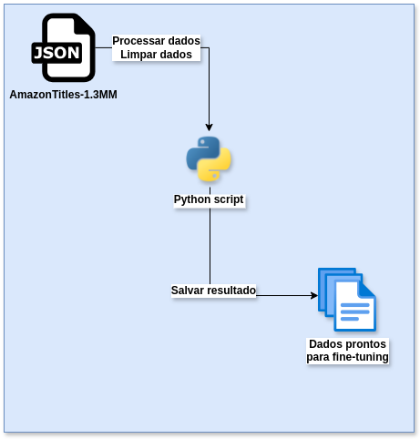
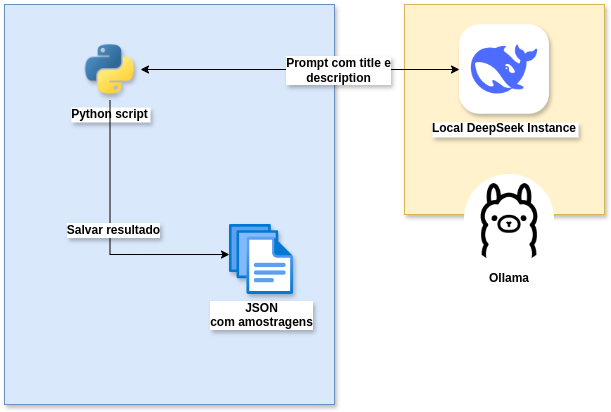
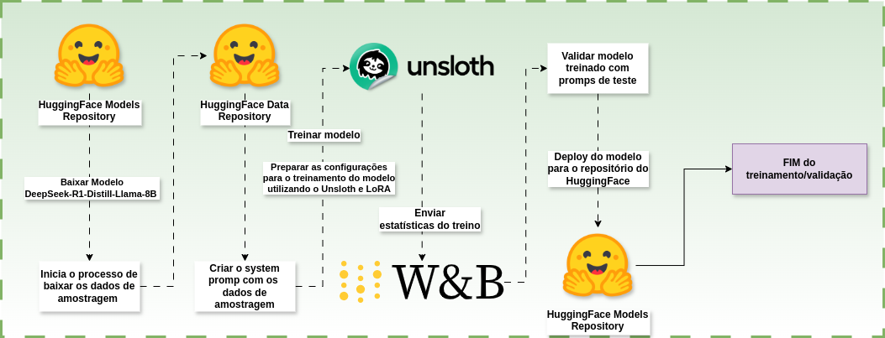
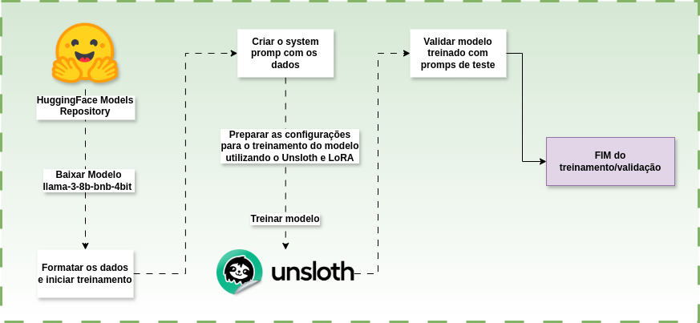
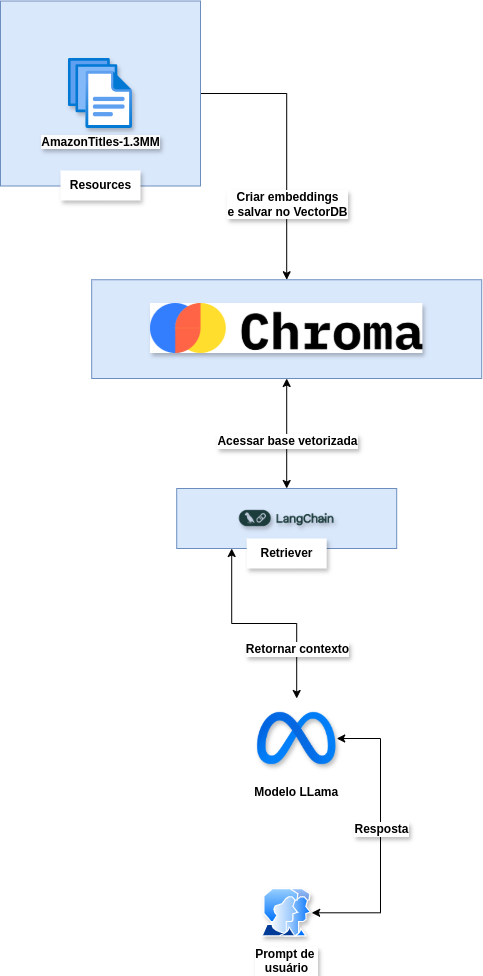

# Tech Challenge - Pós-Tech SOAT - FIAP
# Fase 3 - Fine-tuning de modelo DeepSeek

## Alunos:

- André Mattos - RM358905
- Aurelio Thomasi Jr - RM358104
- Leonardo Ramires - RM358190
- Lucas Arruda - RM358628
- Pedro Marins - RM356883

## Evidências do projeto

- Link para o repositório:
- Link para o vídeo de apresentação:
- Link para o modelo Llama treinado: [Llama 3.8B BNB 4bit](https://huggingface.co/ACMattosHE/lora_model_llama-3-8b-bnb-4bit)
- Link para o modelo DeepSeek treinado: [Deep Seek R1 Products](https://huggingface.co/rickwalking/DeepSeek-R1-Products)
- Link para o dataset: [Amazon Titles Reasoning](https://huggingface.co/datasets/rickwalking/amazon-titles-reasoning)

## Descrição

Este trabalho tem como objetivo criar um modelo de LLM, utilizando a técnica de fine-tuning, para gerar respostas mais coerentes. O trabalho consiste em um treinamento utilizando o dataset chamado AmazonTitles-1.3MM, que contém 1.3 milhão de títulos e descrições de produtos da Amazon.

O projeto foi dividido em duas abordagens diferentes:

1. **Fine tuning local: utilizando o modelo llama-3-8b-bnb-4bit**
Este fine tuning foi realizado localmente, utilizando o ambiente de desenvolvimento de em um ambiente com as seguintes características:

- Sistema Operacional: Windows 11
- GPU: NVIDIA GeForce RTX 4060
- RAM: 16GB
- CPU: Intel Core i7-13700H
- Python: 3.12.6
- CUDA: 12.6 e cuDNN 9.8

2. **Fine tuning com o Google Colab: Utilizando o modelo DeepSeek-R1-Distill-Llama-8B**
O fine-tuning deste modelo foi realizado utilizando um notebook do Google Colab, com as seguintes características:

- GPU: NVIDIA Tesla T4
- RAM: 16GB
- Python: 3.11
- CUDA: 12.4

## Modelos utilizados

- [DeepSeek-R1-Distill-Llama-8B](https://huggingface.co/DeepSeek/DeepSeek-R1-Distill-Llama-8B)
- [llama-3-8b-bnb-4bit](https://huggingface.co/unsloth/llama-3-8b-bnb-4bit)

O modelo Llama é um modelo recente e simples, foi uma escolha de modelo para ser treinado localmente pois é um modelo eficiente em termos de memória e desempenho. A ideia foi escolher um modelo que fosse compatível com este cenário de recursos limitados e compatível com GPUs de médio porte.
Este fine-tuning teve como objetivo principal um treinamento que fosse capaz de gerar respostas referentes a descrição de um produto, utilizando o título como contexto.
Adicionalmente, esta solução também utiliza o RAG (Retrieval-Augmented Generation) para gerar respostas mais coerentes e contextuais.

O modelo DeepSeek é um modelo mais robusto e complexo, esta versão específica do modelo foi treinado de forma unsupervised, o que significa que o modelo foi treinado para gerar respostas mais coerentes e contextuais. Porém, dependendo da tarefa e configuração de temperatura, o modelo pode gerar respostas inconsistentes e repetições sem sentido.
Neste caso, o fine-tuning foi realizado com o objetivo de criar um modelo de assistente de vendas da Amazon, que seja capaz de responder perguntas sobre produtos, as perguntas em sua maioria, utilizam o título e características do produto como contexto.

## Preparação do dataset e instruções de fine-tuning

Ambos os modelos usaram o mesmo dataset, o AmazonTitles-1.3MM, que contém 1.3 milhão de títulos e descrições de produtos da Amazon.
Porém, a abordagem para preparar o dataset foi diferente para cada processo de fine-tuning.

### Preparação do dataset para o treino do modelo Llama



*Figura 1: Script de pré-processamento do dataset para o treino do modelo Llama*

O dataset foi preparado para treino, realizando uma limpeza dos dados, removendo textos que não fossem relevantes para o treinamento. Por exemplo, foram removidos todos os registros que não continham títulos ou descrições e foram removidos caracteres especiais e espaços em branco. Limitando a 5000 registros para o treinamento, por motivo de limitações de recursos computacionais.

O formato dos dados processados e prontos para o treinamento do modelo Llama é o seguinte:

```json
{
    "product": "título do produto",
    "description": "descrição do produto"
}
```

O treinamento do fine-tuning consistiu em utilizar um prompt específico para retornar a descrição do produto. Utilizando padrão alpaca de prompt:

```
Below is an instruction that describes a task, paired with an input that
provides further context. Write a response that appropriately completes
the request.

### Instruction:
{}

### Input:
{}

### Response:
{}
"""
```

A instrução foi:
```
GET THE DESCRIPTION OF THIS PRODUCT
```

### Preparação do dataset para o treino do modelo DeepSeek



*Figura 2: Script de pré-processamento do dataset para o treino do modelo DeepSeek*

O dataset sofreu uma limpeza semelhante ao modelo Llama, porém, o pré-processamento foi realizado de forma diferente. Foi gerado um novo datset chamado de dados de amostragem, que contém 2000 referências a produtos e descrições de 2000 registros do dataset original.
Porém, o formato dos dados sofreu uma grande alteração, pois o modelo DeepSeek utiliza um formato de prompt específico para o treinamento. O formato dos dados de amostragem é o seguinte:

```
{
    "Question": "Pergunta de um usuário sobre um produto da Amazon",
    "Complex_CoT": "Cadeia de raciocínio complexa para responder a pergunta do usuário. O modelo deve responder a pergunta do usuário de forma completa, utilizando o título e a descrição do produto como contexto.",
    "Response": "Resposta final para a pergunta do usuário"
}
```

Pelo contexto de uso do DeepSeek para servir como um assistente de vendas da Amazon, foi necessário gerar um dataset de amostragem com perguntas e respostas de usuários, que fossem contextuais e coerentes para cada produto escolhido.
O seguinte prompt foi utilizado para gerar o dataset de amostragem:

```
    You are a helpful assistant that generates data for fine-tuning DeepSeek model.
    You will be given a product title and context (description).
    You need to generate a question, reasoning, and answer based on the product title and context.
    The format should be as follows:
    Question: <question>
    Complex_CoT: <reasoning>
    Response: <answer>
    Your response should be a JSON object in the format above, assuming that an user is looking for a product on Amazon.
    Your response to this request should only include the JSON result, no description should be added.
    The question should be a question that an user would ask to find the product on Amazon.
    The reasoning should be a detailed reasoning for the question, with all the steps and the final answer.
    The answer should be the answer to the question.

    Here is the product title and context:
    Title: {json_data['title']}
    Context: {json_data['context']}
```

O dataset de amostragem foi gerado e enviado para um repositório do Hugging Face, que pode ser acessado através do seguinte link: [Amazon Titles Reasoning](https://huggingface.co/datasets/rickwalking/amazon-titles-reasoning).

Após a geração deste dataset de amostragem, a instrução de fine-tuning foi:

```
Below is an instruction that describes a task, paired with an input that provides further context.
Write a response that appropriately completes the request.
Before answering, think carefully about the question and create a step-by-step chain of thoughts to ensure a logical and accurate response.

### Instruction:
You are a Amazon products expert with advanced knowledge in books, cellphones, eletronics, media, and more.
Please answer the customer question.

### Question:
{}

### Response:
<think>
{}
</think>
{}
```

### Conclusão sobre as diferenças

As abordagens de instruções são diferentes, o que impacta diretamente no resultado final dos modelos, que também possuem objetivos diferentes, mesmo usando o mesmo dataset. Porém, podemos observar que é possível utilizar um mesmo dataset para treinar modelos diferentes e também com objetivos diferentes, e em ambos os casos, conseguir obter resultados satisfatórios.

## Configurações para fine-tuning

O fine-tuning foi realizado com instruções diferentes para cada modelo, o que pode ter impactado no resultado final dos modelos. Além disso, configurações diferentes foram utilizadas para o fine-tuning, alguns exemplos são:

- **Configuração de temperatura**: O modelo DeepSeek necessita de uma temperatura mais alta por padrão(0.7), o que pode gerar respostas menos coerentes e a possibilidade de mais alucinações. O modelo Llama, por outro lado, foi treinado com uma temperatura (0.2) mais baixa, o que pode gerar respostas mais dentro do padrão do dataset que foi utilizado para o treinamento.
- **Configuração de max_steps**: Por limitações de tempo e recursos, o modelo Llama foi treinado com um limite de 60 passos, enquanto o modelo DeepSeek foi treinado com 270 passos. Isso pode impactar no Training Loss do fine-tuning.
- **Configuração de epochs**: Ambos modelos foram treinados com 2 epochs.

Comparação entre o Training Loss:
- DeepSeek:
**0.684500 de loss**

- Llama:
**1.6957 de loss**

Por ter acesso a uma GPU mais pontente e diferenças de configurações, o modelo DeepSeek foi treinado por mais tempo e pode ter um resultado melhor dentro do seu contexto de utilização. Porém, o modelo Llama possui acesso ao retriever do dataset original, o que pode registrar um resultado melhor, pois o modelo possui acesso a mais informações e contexto para gerar respostas mais coerentes.

## Execução do fine-tuning



*Figura 3: Execução do fine-tuning do modelo DeepSeek*



*Figura 4: Execução do fine-tuning do modelo Llama*

A execução do fine-tuning foi realizada em ambientes diferentes, o modelo DeepSeek foi treinado em um notebook do Google Colab, enquanto o modelo Llama foi treinado localmente. A diferença de ambiente de execução impactou no tempo de execução do fine-tuning, o modelo DeepSeek foi treinado em 34 minutos, enquanto o modelo Llama foi treinado em 2 horas e 30 minutos.

A diferença de tempo de execução consiste em limitações de hardware do treinamento local, enquanto o treinamento do Google Colab foi realizado pela GPU T4.

## RAG no modelo Llama



*Figura 5: Execução do RAG no modelo Llama*

O modelo Llama foi treinado com um RAG, o que permite que o modelo possa acessar o dataset original e gerar respostas mais coerentes e contextuais. O RAG foi implementado utilizando a biblioteca LangChain e a o banco de dados vectorial Chroma.

Os passos para o criação do RAG são os seguintes:

1. Criação dos embeddings a partir dos dados do dataset
2. Criação do vector store (utilizando o Chroma como vector store)
3. Criação do retriever (utilizando o LangChain para criar o retriever)
4. Criação do prompt (Um prompt de orientações para o modelo)

Isso é um ponto que o modelo DeepSeek não possui, dando uma vantagem em respostas para o modelo Llama. Pois o RAG é capaz de gerar um contexto direto do dataset original, além de não ter uma necessidade de utilização de recursos para o treinamento do modelo.
Também, é possível observar que em caso de mudança dos dados, o RAG permite uma alteração sem a necessidade de treinar o modelo novamente, o que é uma vantagem em relação ao modelo DeepSeek.

## Conclusão

O fine-tuning foi realizado com sucesso, os modelos foram treinados e os resultados foram satisfatórios. O modelo Llama foi treinado com um limite de 1250 passos, enquanto o modelo DeepSeek foi treinado com 270 passos.
De acordo com os testes realizados, ambas abordagens possuem um resultado satisfatório para o cada problema que foi proposto. Podemos afirmar o seguinte:

- Apesar do modelo Llama ter sido treinado com limites, o RAG foi capaz de gerar respostas coerentes e contextuais para o problema proposto.
- O modelo DeepSeek teve um Training Loss menor, e está próximo de um resultado ideal para ser um assistente de vendas da Amazon.

Ambos os modelos podem melhorar ainda mais, com um treinamento mais longo e um dataset maior, o resultado final pode ser melhor.

Mais detalhes sobre cada tipo de procedimento dos modelos, podem ser encontrados nos arquivos README específicos de cada projeto.

- [README do modelo Llama](https://github.com/acmattos/ia4devs/tree/main/module_03/04_tech_challenge)
- [README do modelo DeepSeek](https://github.com/acmattos/ia4devs/tree/main/module_03_deep_seek)
