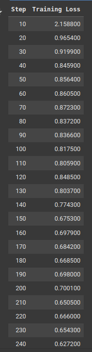

# Tech Challenge - Pós-Tech SOAT - FIAP
# Fase 3 - Fine-tuning de modelo DeepSeek

## Alunos:

- André Mattos - RM358905
- Aurelio Thomasi Jr - RM358104
- Leonardo Ramires - RM358190
- Lucas Arruda - RM358628
- Pedro Marins - RM356883

## Evidências do projeto

- Link para o repositório:
- Link para o vídeo de apresentação:
- Link para o modelo treinado: [Deep Seek R1 Products](https://huggingface.co/rickwalking/DeepSeek-R1-Products)
- Link para o dataset: [Amazon Titles Reasoning](https://huggingface.co/datasets/rickwalking/amazon-titles-reasoning)

## Descrição

Este projeto tem como objetivo criar um fine-tuning utilizando o modelo DeepSeek. Para realização do fine-tuning, foi utilizado um dataset chamado "AmazonTitles-1.3MM" que contém 1.3 milhão de títulos e descrições de produtos da Amazon.

Destes 1.3 milhão de registros, foi selecionado 2000 registros para um processo de amostragem. Este processo foi realizado para adicionar um contexto que fosse compatível com o modelo DeepSeek, para realizar o fine-tuning.
Um tratamento foi feito para que os dados fossem compatíveis com o modelo DeepSeek e também para adicionar um contexto ao trabalho. 

### Contexto

A criação de um assistente virtual de compras é algo que pode ser muito útil para o usuário, pois o mesmo poderá ajudar em praticamente todas as etapas de uma compra na Amazon. Este assistente virtual deverá ser capaz de responder perguntas sobre os produtos, fornecer recomendações e até tirar dúvidas sobre o produto que está sendo visto pelo usuário.

Ter dados que contém título e descrição são uma ótima oportunidade para a criação de um assistente LLM, também possibilitando que clientes tirem dúvidas sem a necessidade de contatar o atendimento humano.

### Processo de amostragem


*Figura 1: Processo de amostragem*

O processo de amostragem consiste em selecionar os 2000 (pode ser configurado) registros que serão utilizados para o fine-tuning. Os registros selecionados devem ter as seguintes características:

- Título não pode ser vazio
- Descrição não pode ser vazia

Após serem selecionados, os registros foram tratados para se tornarem compatíveis com o fine-tuning do modelo DeepSeek. Então foi utilizado um modelo local(utilizando o Ollama) do DeepSeek para realizar a transformação dos dados para o formato do modelo. O prompt para geração dos dados para cada registro na lista de registros selecionados foi o seguinte:

```
    You are a helpful assistant that generates data for fine-tuning DeepSeek model.
    You will be given a product title and context (description).
    You need to generate a question, reasoning, and answer based on the product title and context.
    The format should be as follows:
    Question: <question>
    Complex_CoT: <reasoning>
    Response: <answer>
    Your response should be a JSON object in the format above, assuming that an user is looking for a product on Amazon.
    Your response to this request should only include the JSON result, no description should be added.
    The question should be a question that an user would ask to find the product on Amazon.
    The reasoning should be a detailed reasoning for the question, with all the steps and the final answer.
    The answer should be the answer to the question.

    Here is the product title and context:
    Title: {json_data['title']}
    Context: {json_data['context']}
```

Como pode ser visto, para cada registro recebido, foi gerado um JSON com o formato de pergunta, complex_cot e resposta. Isto foi possível graças aos seguintes modules de script python:
- `main.py` - Entrypoint do projeto.
- `modules/open_raw_data.py` - Este module é responsável por abrir o arquivo JSON com os dados brutos. O arquivo AmazonTitles-1.3MM.
- `modules/handle_process_inputs.py` - Este module é responsável por tratar os dados recebidos e gerar um JSON com o formato de pergunta, complex_cot e resposta.
- `modules/process_product.py` - Este module é responsável por processar o JSON gerado e retornar JSON com o formato de question, complex_cot e response.
- `modules/deep_seek.py` - Este module é responsável por chamar o modelo local do DeepSeek e retornar o JSON com o formato de question, complex_cot e response.
- `modules/save_results.py` - Este module é responsável por salvar todos os registros gerados em um arquivo JSON.

Após todo processamento dos dados, o resultado final foi enviado para um repositório no [Hugging Face](https://huggingface.co/datasets/rickwalking/amazon-titles-reasoning).

### Dados para treinamento

O modelo DeepSeek possuí um formato de dados próprio para realizar o fine-tuning, que é o seguinte:

```
{
    "Question": "Pergunta de um usuário sobre um produto da Amazon",
    "Complex_CoT": "Cadeia de raciocínio complexa para responder a pergunta do usuário. O modelo deve responder a pergunta do usuário de forma completa, utilizando o título e a descrição do produto como contexto.",
    "Response": "Resposta final para a pergunta do usuário"
}
```

O dataset de amostragem está pronto para ser utilizado para o fine-tuning do modelo DeepSeek.

## Tecnologias

- Python - Linguagem de programação utilizada para a criação do projeto.
- PyTorch - Biblioteca de machine learning utilizada para o fine-tuning do modelo DeepSeek.
- Transformers - Biblioteca de machine learning utilizada para o fine-tuning do modelo DeepSeek.
- Hugging Face - Repositório de datasets utilizado para o fine-tuning do modelo DeepSeek.
- AmazonTitles-1.3MM - Dataset utilizado para o fine-tuning do modelo DeepSeek.
- DeepSeek - Modelo de machine learning utilizado para o fine-tuning.
- Ollama - O Ollama é uma ferramenta que permite rodar modelos LLM localmente.
- Google Colab - Plataforma de notebook utilizada para o fine-tuning do modelo DeepSeek.
- Unsloth - Ferramenta utilizada para o treinamento do modelo DeepSeek
- Wandb - Ferramenta chamada Weights and Biases, que é uma ferramenta de monitoramento do treinamento do modelo DeepSeek, mostrando estatisticas e gŕaficos após o treinamento.

### O treinamento do modelo DeepSeek


*Figura 2: Treinamento do modelo DeepSeek*

O treinamento do modelo DeepSeek foi realizado em um notebook do Google Colab, com a utilização da GPU T4 para que o treinamento fosse mais rápido, o resultado foi um treinamento que durou em torno de 33 minutos.
O treinamento foi realizado com o dataset de amostragem, que foi gerado anteriormente pelo script de criação de dados.
A ferramenta Unsloth foi utilizada para realizar o treinamento do modelo, com as seguintes configurações:

- Modelo: unsloth/DeepSeek-R1-Distill-Llama-8B
- Dataset: amazon-titles-reasoning
- Número máximo de tokens: 2048
- Épocas de treinamento: 2
- Log de steps: de 10 em 10
- Sem limite de steps para o treinamento

A aplicação do LoRA foi realizada para o treinamento do fine-tuning. Permitindo um ganho de performance e redução de custo e tempo de treinamento. O LoRA realiza uma adaptação dinâmica dos pesos do modelo, adotando uma abordagem de treinamento de camadas específicas.
Em outras palavras, é como se o LLM fosse uma fábrica complexa, onde o LoRA permite reconstruir partes da fábrica consiga fabricar um novo produto, sem ter que reconstruir toda a fábrica. Esta nova parte da fábrica será responsável por fabricar o novo produto, neste caso, é o contexto adicional que foi adicionado durante o fine-tuning, com o intuito de melhorar a resposta do modelo para o usuário que está com dúvidas sobre algum produto.

### Resultado do treinamento do modelo (Training Loss)



*Figura 3: Training Loss*

O comportamento o training loss é o seguinte:

- Início: Queda acentuada de 2.15 para 0.96 (primeiros 20 steps)
- Meio: Estabilização entre 0.8-0.9 (steps 30-120)
- Final: Redução gradual até 0.68 (steps 120-270)

O treinamento demonstrou excelente convergência, reduzindo o loss consideravelmente. A estabilidade dos valores finais e a ausência de overfitting indicam que o modelo está bem adaptado para atuar como assistente virtual de compras da Amazon, validando a eficácia da abordagem LoRA utilizada.

para mais detalhes sobre o treinamento, acesse as estatisticas [aqui](https://wandb.ai/rickwalking1272-n-a/huggingface/runs/443an42a?nw=nwuserrickwalking1272).

### Comparação de respostas (Antes do fine-tuning e após o fine-tuning)

Abaixo estão as respostas geradas pelo modelo antes do fine-tuning e após o fine-tuning, com o auxílio da ferramenta Wandb (Weights and Biases).

#### Antes do fine-tuning

Foi utilizado um promp sobreo contexto de um produto da Amazon. O modelo neste momento não possuí nenhum contexto adicional para responder a pergunta. Então, o modelo deve responder de forma genérica.

```
Is 'Worship with Don Moen' available on VHS??
```

E o reasoning foi o seguinte:

```
Okay, so I need to figure out if "Worship with Don Moen" is available on VHS. First, I should consider what VHS is. VHS, or Video Home System, was a popular format for video cassettes before DVD and Blu-ray. Many older movies and videos were released on VHS, but with the rise of digital formats, VHS has become less common.

Now, the question is about a specific product: "Worship with Don Moen." I don't recognize this title immediately, so I should think about what it might be. "Worship" suggests it's related to religious or spiritual content, possibly a video or a series of videos featuring Don Moen, who might be a musician, speaker, or religious leader.

I need to determine if such a product exists on VHS. Since VHS is a physical medium, I should check sources where VHS tapes are sold. Online marketplaces like eBay often have listings for VHS tapes. I can search there using the title "Worship with Don Moen" to see if any listings come up.

Alternatively, I can check if the product is available on other platforms like Amazon. However, since the question is specifically about VHS, I should focus on that. If I search eBay, I can filter the search to show only VHS listings. If there are results, that means the product is available on VHS. If not, it might not be available in that format anymore.

I should also consider the likelihood of the product being available. Don Moen might have released this on other formats like DVD or Blu-ray, which are more common now. The availability on VHS depends on the demand and how popular the product is. If it's a niche or older product, it might still be available on VHS, but if it's more recent, it's probably only on newer formats.

In summary, to determine if "Worship with Don Moen" is available on VHS, I should check online marketplaces where VHS tapes are sold, such as eBay, and search for the title there. If listings are found, the answer is yes; if not, it might not be available on VHS anymore.
```

E a resposta foi a seguinte:

```
Worship with Don Moen" is not available on VHS. While it may be available on other formats like DVD or Blu-ray, VHS listings for this product are no longer common, indicating that it is likely only accessible through newer digital formats
```

#### Após o fine-tuning

Após o fine-tuning, foi utilizado o mesmo prompt anterior, mas agora com o contexto adicional que foi adicionado durante o fine-tuning, é esperado que o modelo responda de forma mais assertiva e coerente, com objetivo de ajudar o usuário a encontrar o produto que o cliente está procurando.

```
Is 'Worship with Don Moen' available on VHS??
```

O reasoning foi o seguinte:

```
The product title is 'Worship with Don Moen,' and the context mentions that it is a VHS tape. Therefore, the answer would be yes.
```

A resposta foi a seguinte:

```
Yes
```

No notebook do fine-tuning, é possível encontrar perguntas e respostas adicionais de acordo com o contexto fornecido. Mostrando que o modelo agora é capaz de responder de forma objetiva a perguntas de usuários sobre diferentes produtos da Amazon.

### Conclusão

O fine-tuning do modelo DeepSeek foi um sucesso, com uma redução grande no loss e uma melhoria significativa nas respostas geradas. O modelo agora é capaz de gerar respostas mais precisas e coerentes, validando a eficácia da abordagem LoRA utilizada. Este modelo agora pode atuar como um assistente virtual de compras da Amazon, com uma capacidade de respostas mais assertivas com o contexto fornecido.
