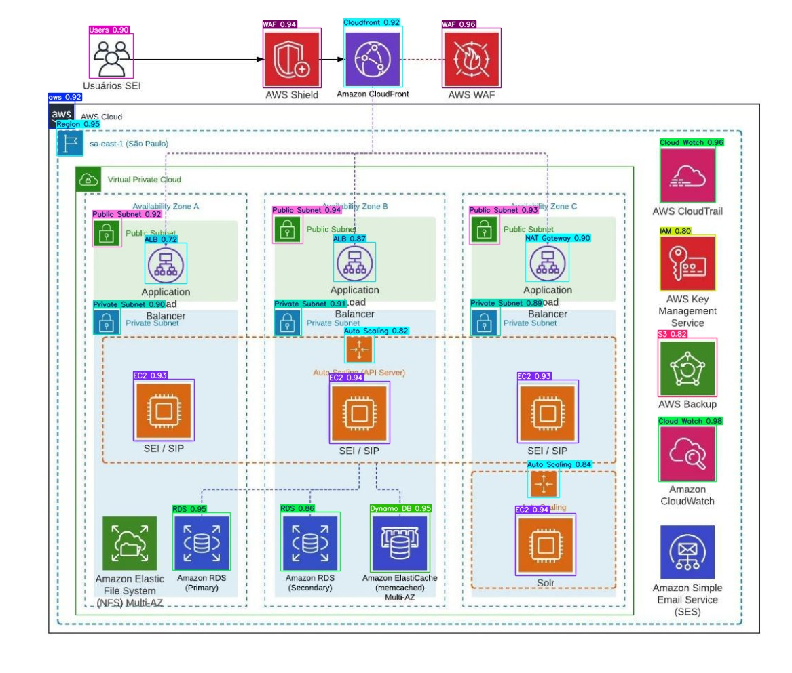
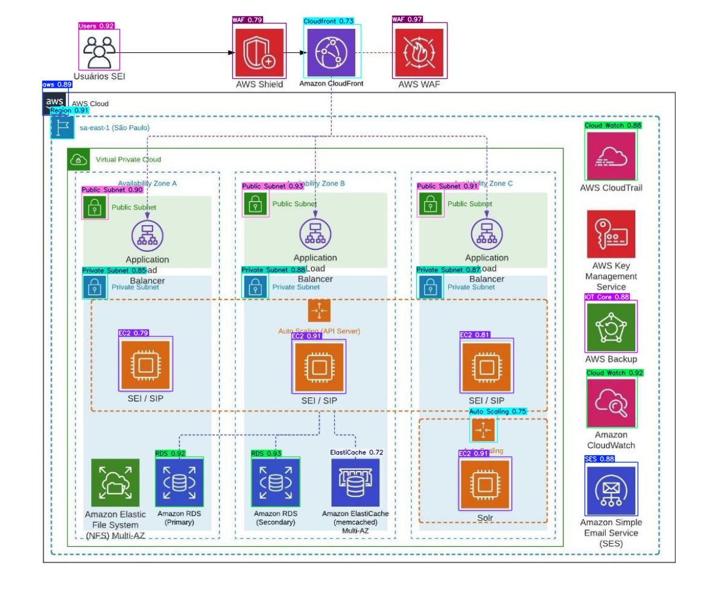
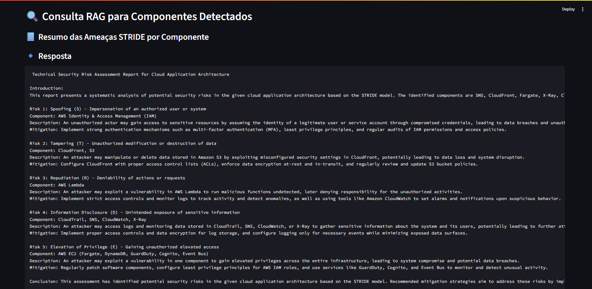
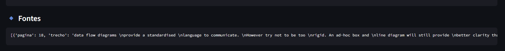

# 🎓 Hackaton (Tech Challenge) - Pós-Tech - IA For Devs - FIAP
# 📹 Fase 5 - Modelagem de Ameaças Utilizando IA

## 👥 Alunos

- André Mattos - RM358905
- Aurelio Thomasi Jr - RM358104
- Leonardo Ramires - RM358190
- Lucas Arruda - RM358628
- Pedro Marins - RM356883

## 📋 Evidências do projeto 

- Link para o repositório:[Repositorio Git](https://github.com/acmattos/ia4devs/tree/main/module_05/05_hackaton)
- Link para o vídeo de apresentação: [Video Apresentação](https://www.youtube.com/watch?v=BHEPSVD2e0s) 

## 📚 Bibliotecas utilizadas 

- Principais bibliotecas:
  - **OpenCV (cv2)**: Biblioteca utilizada para manipulação de imagens.
  - **ultralytics**: Biblioteca utilizada para treinamento e manipulação do 
                     modelo Yolo11.
  - **Markdown**: Biblioteca para geração de relatórios básicos em formato 
                  Markdown e HTML.
  - **N8N**: Biblioteca utilizada para criação de workflows de automação.
  - **Flask**: Biblioteca utilizada para criação de API.

- Bibliotecas/ferramentas de suporte:
  - **Pytorch**: Biblioteca base para manipulação do modelo: 
                 [https://pytorch.org/get-started/locally/]
  - **Yolo**: Modelo utilizado pelo ultralytics na detecção de ícones AWS: 
              [yolov11s.pt](data/model/yolo11s.pt).
  - **Ollama**: Biblioteca para uso dos modelos de LLM do Ollama
              [https://ollama.com/download/windows]
  - **Telegram**: Plataforma de mensagens instantâneas, utilizada para interação com o usuário.
  - **Digital Ocean**: Plataforma de hospedagem de aplicações, utilizada para hospedar a API.
  - **N8N**: Plataforma de automação de workflows, utilizada para orquestrar as etapas do agente.

## Preparação do Modelo de IA 

Para realizar a detecção de diagramas de arquitetura, precisamos preparar um 
modelo para isto. A primeira etapa foi encontrar um dataset que nos ajudasse a 
treinar o modelo. Nossa busca levou ao dataset 
[AWS Icon Detector](https://universe.roboflow.com/aws-icons/aws-icon-detector/dataset), 
que parecia promissor, mas necessitava de alguns ajustes. 

O principal problema com este dataset é não possuir nenhum exemplo para 
validação. Outro grande problema é a disparidade entre os exemplos. Algumas 
classes possuem poucos exemplos como:   

- `ACM`, com 3 para treinar e 1 para teste, 

contrastando com   

- `Lambda`, com 316 para treino e 10 para teste  

ou   

- `EC2`, com 213 para treino e 40 para teste.  

Temos muitos casos, como 
- `Analytics Services`, que possui apenas 1 exemplo para treino e mais nenhum 
  para teste.

Você pode verificar como o dataset original se distribui pelos diretórios de 
treino e teste, executando o seguinte script:

```bash
py dataset_report_samples_per_split.py 
```

A execução do script, no 
[dataset **original**](https://universe.roboflow.com/aws-icons/aws-icon-detector/dataset/),
mostra os seguintes valores por classe: 

```bash
Classe                     |    id | Train | Valid | Test
ACM                        |     0 |     3 |     0 |    1
ALB                        |     1 |    32 |     0 |    5
AMI                        |     2 |     4 |     0 |    0
API-Gateway                |     3 |   163 |     0 |    0
Active Directory Service   |     4 |     1 |     0 |    1
Airflow_                   |     5 |     2 |     0 |    0
Amplify                    |     6 |     8 |     0 |    0
Analytics Services         |     7 |     1 |     0 |    0
AppFlow                    |     8 |     1 |     0 |    0
Appsync                    |     9 |     5 |     0 |    0
Athena                     |    10 |    10 |     0 |    1
Aurora                     |    11 |    14 |     0 |    7
Auto Scaling               |    12 |    34 |     0 |    8
Auto Scaling Group         |    13 |     8 |     0 |    0
Automated Tests            |    14 |     6 |     0 |    0
Availability Zone          |    15 |     4 |     0 |    0
Backup                     |    16 |     2 |     0 |    0
Build Environment          |    17 |     3 |     0 |    0
CDN                        |    18 |     2 |     0 |    1
CUR                        |    19 |     3 |     0 |    0
Call Metrics               |    20 |     1 |     0 |    0
Call Recordings            |    21 |     1 |     0 |    0
Certificate Manager        |    22 |     7 |     0 |    1
Client                     |    23 |     7 |     0 |    0
Cloud Connector            |    24 |     2 |     0 |    0
Cloud Map                  |    25 |     1 |     0 |    0
Cloud Search               |    26 |     3 |     0 |    1
Cloud Trail                |    27 |    16 |     0 |    3
Cloud Watch                |    28 |    70 |     0 |    7
CloudFormation Stack       |    29 |    15 |     0 |    1
CloudHSM                   |    30 |     1 |     0 |    1
CloudWatch Alarm           |    31 |    11 |     0 |    0
Cloudfront                 |    32 |    52 |     0 |    9
CodeBuild                  |    33 |    21 |     0 |    1
CodeCommit                 |    34 |     8 |     0 |    1
CodeDeploy                 |    35 |     1 |     0 |    1
CodePipeline               |    36 |    20 |     0 |    0
Cognito                    |    37 |    51 |     0 |    1
Comprehend                 |    38 |     5 |     0 |    0
Config                     |    39 |     6 |     0 |    6
Connect                    |    40 |     1 |     0 |    0
Connect Contact Lens       |    41 |     1 |     0 |    0
Container                  |    42 |    68 |     0 |    1
Control Tower              |    43 |     1 |     0 |    0
Customer Gateway           |    44 |     7 |     0 |    0
DSI                        |    45 |     4 |     0 |    0
Data Pipeline              |    46 |     2 |     0 |    0
DataSync                   |    47 |     2 |     0 |    0
Deploy Stage               |    48 |     2 |     0 |    0
Direct Connect             |    50 |    14 |     0 |   11
Docker Image               |    52 |    13 |     0 |    2
Dynamo DB                  |    53 |   144 |     0 |   19
EBS                        |    54 |     8 |     0 |    4
EC2                        |    55 |   213 |     0 |   40
EFS                        |    56 |     9 |     0 |    5
EFS Mount Target           |    57 |     8 |     0 |    9
EKS                        |    58 |    15 |     0 |    0
ELB                        |    59 |    77 |     0 |   13
Edge Location              |    61 |     4 |     0 |    3
ElastiCache                |    62 |    21 |     0 |    5
Elastic Container Registry |    63 |    25 |     0 |    0
Elastic Container Service  |    64 |    38 |     0 |    2
Elastic Search             |    65 |    12 |     0 |    1
Elemental MediaConvert     |    66 |     3 |     0 |    1
Email                      |    68 |     3 |     0 |    1
Endpoint                   |    69 |     2 |     0 |    0
Event Bus                  |    70 |     1 |     0 |    0
EventBridge                |    71 |     3 |     0 |    5
Experiment Duration        |    72 |     1 |     0 |    0
Experiments                |    73 |     1 |     0 |    0
Fargate                    |    74 |    41 |     0 |    0
Fault Injection Simulator  |    75 |     3 |     0 |    0
Flask                      |    77 |     3 |     0 |    0
GameLift                   |    79 |     2 |     0 |    0
Git                        |    80 |     1 |     0 |    0
Github                     |    81 |    11 |     0 |    0
Glue                       |    83 |    10 |     0 |    2
Glue DataBrew              |    84 |     2 |     0 |    0
Grafana                    |    85 |     1 |     0 |    0
GuardDuty                  |    86 |     4 |     0 |    5
IAM                        |    87 |    27 |     0 |    9
IAM Role                   |    88 |    16 |     0 |    7
IOT Core                   |    89 |     7 |     0 |    1
Image                      |    90 |     6 |     0 |    0
Image Builder              |    91 |     1 |     0 |    0
Ingress                    |    92 |     1 |     0 |    0
Instances                  |    94 |     2 |     0 |    0
Internet                   |    95 |    41 |     0 |    8
Internet Gateway           |    96 |    19 |     0 |    4
Jenkins                    |    97 |     2 |     0 |    0
Key Management Service     |    98 |    13 |     0 |    3
Kibana                     |    99 |     1 |     0 |    0
Kinesis Data Streams       |   100 |    21 |     0 |    4
Kubernetes                 |   101 |     1 |     0 |    0
Lambda                     |   102 |   316 |     0 |   10
Lex                        |   103 |     1 |     0 |    0
MQ                         |   104 |     9 |     0 |    0
Machine Learning           |   105 |     4 |     0 |    0
Macie                      |   106 |     5 |     0 |    4
Marketplace                |   107 |     2 |     0 |    0
Memcached                  |   108 |     2 |     0 |    2
Mobile Client              |   109 |    28 |     0 |    4
Mongo DB                   |   110 |     6 |     0 |    0
MySQL                      |   111 |     1 |     0 |    0
NAT Gateway                |   112 |    36 |     0 |    8
Neptune                    |   113 |     3 |     0 |    0
Network Adapter            |   114 |     1 |     0 |    0
Notebook                   |   116 |     1 |     0 |    0
Order Controller           |   117 |     1 |     0 |    0
Organization Trail         |   118 |     1 |     0 |    4
Parameter Store            |   119 |     2 |     0 |    0
Pinpoint                   |   120 |     1 |     0 |    0
PostgreSQL                 |   121 |     1 |     0 |    0
Private Link               |   122 |     7 |     0 |    0
Private Subnet             |   123 |   101 |     0 |   10
Prometheus                 |   124 |     1 |     0 |    0
Public Subnet              |   125 |    82 |     0 |   18
Quarkus                    |   126 |     1 |     0 |    0
Quicksight                 |   127 |     4 |     0 |    0
RDS                        |   128 |    70 |     0 |   14
React                      |   129 |     1 |     0 |    0
Redis                      |   130 |    11 |     0 |    1
Redshift                   |   131 |     6 |     0 |    1
Region                     |   132 |    28 |     0 |    2
Rekognition                |   133 |     2 |     0 |    0
Results                    |   134 |     1 |     0 |    0
Route 53                   |   135 |     2 |     0 |    1
Route53                    |   136 |    65 |     0 |    9
S3                         |   137 |   225 |     0 |   24
SAR                        |   138 |     1 |     0 |    0
SDK                        |   139 |    31 |     0 |    1
SES                        |   140 |    12 |     0 |    2
SNS                        |   141 |    30 |     0 |    3
SQS                        |   142 |    21 |     0 |    2
Sagemaker                  |   144 |    27 |     0 |    0
Secret Manager             |   145 |     4 |     0 |    1
Security Group             |   146 |     1 |     0 |    1
Security Hub               |   147 |     1 |     0 |    5
Server                     |   148 |    19 |     0 |   12
Service Catalog            |   149 |     6 |     0 |    0
Shield                     |   150 |     3 |     0 |    1
Slack                      |   152 |     2 |     0 |    0
Stack                      |   154 |     2 |     0 |    0
Step Function              |   155 |     3 |     0 |    3
SwaggerHub                 |   157 |     1 |     0 |    0
Systems Manager            |   158 |     3 |     0 |    2
TV                         |   159 |     1 |     0 |    0
Table                      |   160 |    19 |     0 |    0
Task Runner                |   161 |     1 |     0 |    0
Terraform                  |   162 |     3 |     0 |    0
Text File                  |   163 |     9 |     0 |    0
Textract                   |   164 |     1 |     0 |    0
Transcribe                 |   165 |     1 |     0 |    0
Transfer Family            |   166 |     6 |     0 |    0
Transit Gateway            |   167 |     2 |     0 |    0
Translate                  |   168 |     3 |     0 |    0
Trusted Advisor            |   169 |     2 |     0 |    0
Twilio                     |   170 |     1 |     0 |    0
Users                      |   171 |    95 |     0 |   13
VDA                        |   172 |     1 |     0 |    0
VP Gateway                 |   173 |     4 |     0 |    1
VPC Router                 |   174 |    11 |     0 |    6
VPN Connection             |   175 |     5 |     0 |    1
WAF                        |   176 |    14 |     0 |    1
Web Clients                |   177 |    36 |     0 |    7
Websites                   |   178 |     4 |     0 |    0
X-Ray                      |   179 |    12 |     0 |    0
aws                        |   180 |   136 |     0 |   13
cache Worker               |   181 |     2 |     0 |    0
```

Como pode ser notado, muitas classes não possuem testes e outras apenas 1 ou 
dois exemplos para treinamento.   
Mas será que estes são os únicos problemas do dataset? O script abaixo faz 
algumas análises úteis:

```bash
py dataset_validation.py
```

Verificamos que o `nc` corresponde ao total de classes declaradas. No momento, 
temos 210 imagens e 210 labels.
Não há nomes de classes duplicados, `nc`, imagens sem labels ou mesmo labels sem 
imagens. O resultado do script pode ser visto abaixo:

```bash
── Passo 1: contagens ───────────────────────────────────────────────────────
nc declarado:       182
len(names):         182
total imagens:      210
total labels:       210
✅ nc == len(names)
✅ #imagens == #labels

── Passo 2: duplicatas em names ─────────────────────────────────────────────
✅ Nenhuma duplicata em names

── Passo 3: consistência labels x names x imagens ──────────────────────────
✅ Todos os class_id em labels têm names associados

✅ Todas as imagens têm .txt correspondente
✅ Todos os labels têm imagem correspondente

✅ Todas as classes em names têm pelo menos 1 exemplo
```

Se decidirmos treinar o modelo com o dataset incompleto (isto é, com 
`valid/images` e `valid/labels` vazios), notaremos duas coisas:

```bash
[1]
WARNING Box and segment counts should be equal, but got len(segments) = 502, 
len(boxes) = 3108. To resolve this only boxes will be used and all segments will 
be removed. To avoid this please supply either a detect or segment dataset, not 
a detect-segment mixed dataset.
albumentations: Blur(p=0.01, blur_limit=(3, 7)), MedianBlur(p=0.01, 
blur_limit=(3, 7)), ToGray(p=0.01, method='weighted_average', 
num_output_channels=3), CLAHE(p=0.01, clip_limit=(1.0, 4.0), tile_grid_size=(8, 8))
[2]
Traceback (most recent call last):
  File "D:\ia4devs\module_05\05_hackaton\.venv\Lib\site-packages\ultralytics\data\base.py", 
  line 178, in get_img_files
    assert im_files, f"{self.prefix}No images found in {img_path}. {FORMATS_HELP_MSG}"
           ^^^^^^^^
AssertionError: val: No images found in D:\ia4devs\module_05\05_hackaton\data\dataset\aws\valid\images. 
Supported formats are:
images: {'heic', 'jpg', 'pfm', 'dng', 'mpo', 'bmp', 'jpeg', 'png', 'tiff', 'webp', 'tif'}
videos: {'mov', 'mkv', 'gif', 'asf', 'ts', 'm4v', 'mpeg', 'webm', 'wmv', 'mpg', 'mp4', 'avi'}
```

[1] - Temos um aviso de que alguns rótulos nos arquivos de `label` estão 
inadequados. O formato de segmentação foi encontrado e o yolo vai descartar 
estas marcações.

[2] - O diretório `valid` deve conter imagens e labels.

Para corrigir [1], precisamos rodar o script:

```bash 
py dataset_fix_labels.py
```

Para que ele detecte e corrija os rótulos inadequados. O resultado final será 
visto a seguir:

```bash
Fixed segments in: index101_jpg.rf.86ebe1a7bcfdd3fa92ef93ba5bfd2d19.txt
Fixed segments in: index108_png.rf.c04ccc21c4ad1c3f1ca51903606f7f0c.txt
Fixed segments in: index121_png.rf.71f9a36ddec18e197b04cc9cfc9e33c0.txt
Fixed segments in: index126_png.rf.a27b004ecd3aaae4b1d3a4747b69d613.txt
Fixed segments in: index136_png.rf.fd69f2a7634f5d83d4b09ace2ed4e8cd.txt
Fixed segments in: index137_jpg.rf.4a31794a0730be847e886f42f0fb7c94.txt
Fixed segments in: index154_jpg.rf.77cf8cc45b8a14d6fe9ea46e7f476f96.txt
Fixed segments in: index156_png.rf.b5d9270f67fd558d8e9036f3dfd575c0.txt
Fixed segments in: index161_png.rf.6c17459407b2e312e7adcc5649873ef9.txt
Fixed segments in: index177_png.rf.0cbfadbf1c1f8a322c3fcc7dd55e46a2.txt
Fixed segments in: index190_png.rf.ff2f24ed464240039309195bf0a73958.txt
Fixed segments in: index200_png.rf.3e34f6ab90231de27051ce831507656f.txt
Fixed segments in: index60_png.rf.1e092d82c19763160ffbb6b2fdbf68fe.txt
Fixed segments in: index62_png.rf.a1dc5d4beaf0dce66f55b97b7218aa5a.txt
Fixed segments in: index67_png.rf.6101eff034895460da133f0a0c7bb7e9.txt
Fixed segments in: index69_png.rf.f31ae1094002aac0abf4942427ce17c3.txt
Fixed segments in: index72_png.rf.946082aea49f9d39dbfc714ab9a7becf.txt
Fixed segments in: index76_jpg.rf.acd014a7447bfd032a059df9a3c42ed2.txt
Fixed segments in: index78_jpg.rf.41ff895dc95a8301b653232b1f6076f7.txt
Fixed segments in: index79_jpg.rf.4546d4d5cf54f6ddfb791a379783d3af.txt
Fixed segments in: index80_jpg.rf.ff8325243baab715ecc57e8b2816b32c.txt
Fixed segments in: index82_png.rf.59d98bc77a90b37701036d534176c12b.txt
Fixed segments in: index86_png.rf.1f930ebaa16216d58c45b42eed1980ff.txt
Fixed segments in: index87_png.rf.340a2720a19109394b7209a44a0a0560.txt
Fixed segments in: index93_png.rf.1b8824bdce863db0c370aa9e08dc6025.txt
Fixed segments in: index96_png.rf.50a8179a165b9e4dfa62dadcb03a7601.txt
Fixed segments in: index97_png.rf.c7f0f49920f42b2c1ff635062a6db557.txt
Total files fixed: 27/189
Fixed segments in: index32_png.rf.1f5e0fbbf9b24e978afe47ad026cd451.txt
Fixed segments in: index40_png.rf.c25d82eaf131a966b05189d26ad5bcba.txt
Fixed segments in: index42_png.rf.fe55375b35dcd8d5acb87b455aefe16a.txt
Fixed segments in: index43_jpg.rf.57e2088b019cbe2301f88be96faa8caf.txt
Fixed segments in: index45_png.rf.b8216c6948f9c7338bbc2d54c154b512.txt
Fixed segments in: index46_png.rf.a43f82f889300675176613a33f4e8168.txt
Fixed segments in: index5_png.rf.88b49ae013835d02145d6c80bce061fd.txt
Fixed segments in: index6_jpg.rf.f5a1f31d53e0577b2a9745e1f9b4f77b.txt
Total files fixed: 8/21
Total files fixed: 0/0
```

Para corrigir [2], precisamos rodar o script:

```bash 
py dataset_rebalance_oversample.py
```

O script faz basicamente três coisas — geração de exemplos via oversampling, 
realocação para garantir ao menos um número mínimo de amostras em `valid` e em 
`test`, sempre mantendo sincronizados os arquivos de imagem e os de label.
Na fase 1, o script garante, no mínimo, `MIN_TRAIN` instâncias de cada classe em 
`train`, duplicando (com oversampling de forma round-robin) pelas `bases` 
disponíveis. A cada nova imagem criada, também incrementa o contador e adiciona 
o novo `basename` ao conjunto.
Na fase 2, garante pelo menos `MIN_VALID` instâncias em `valid`, movendo pares 
`imagem+label` de `train` (preferência) ou `test`.
Na fase 3, assegura pelo menos `MIN_TEST` instâncias em `test`, movendo pares 
`imagem+label` de `train` (preferência) ou `valid`.

Abaixo, um log de exemplo da execução do script:

```bash
=== Phase 1: Oversampling → TRAIN ===

Class   0: train has 70, target 70 → need 0
  → OK, não precisa oversample

Class   1: train has 48, target 70 → need 22
  → usando fonte train para oversample

(...)

Class 181: train has 2, target 70 → need 68
  → usando fonte train para oversample

=== Phase 2: Rebalance → VALID ===

Class   0: valid has 0, min 15 → need 15
  → movendo de train para valid
    Moved IMAGE  index93_png.rf.1b8824bdce863db0c370aa9e08dc6025_os_5 from train → valid
    Moved LABEL  index93_png.rf.1b8824bdce863db0c370aa9e08dc6025_os_5 from train → valid
  → movendo de train para valid
    Moved IMAGE  index79_jpg.rf.4546d4d5cf54f6ddfb791a379783d3af_os_24 from train → valid
    Moved LABEL  index79_jpg.rf.4546d4d5cf54f6ddfb791a379783d3af_os_24 from train → valid
  → movendo de train para valid
    Moved IMAGE  index93_png.rf.1b8824bdce863db0c370aa9e08dc6025_os_20 from train → valid
    Moved LABEL  index93_png.rf.1b8824bdce863db0c370aa9e08dc6025_os_20 from train → valid
  → movendo de train para valid
    Moved IMAGE  index151_jpg.rf.9e63372d562634afb9a7d4bcef7c59f6_os_58 from train → valid
    Moved LABEL  index151_jpg.rf.9e63372d562634afb9a7d4bcef7c59f6_os_58 from train → valid
  → movendo de train para valid
    Moved IMAGE  index151_jpg.rf.9e63372d562634afb9a7d4bcef7c59f6_os_16 from train → valid
    Moved LABEL  index151_jpg.rf.9e63372d562634afb9a7d4bcef7c59f6_os_16 from train → valid
  → movendo de train para valid
    Moved IMAGE  index151_jpg.rf.9e63372d562634afb9a7d4bcef7c59f6_os_19 from train → valid
    Moved LABEL  index151_jpg.rf.9e63372d562634afb9a7d4bcef7c59f6_os_19 from train → valid
  → movendo de train para valid
    Moved IMAGE  index79_jpg.rf.4546d4d5cf54f6ddfb791a379783d3af_os_57 from train → valid
    Moved LABEL  index79_jpg.rf.4546d4d5cf54f6ddfb791a379783d3af_os_57 from train → valid
  → movendo de train para valid
    Moved IMAGE  index79_jpg.rf.4546d4d5cf54f6ddfb791a379783d3af_os_9 from train → valid
    Moved LABEL  index79_jpg.rf.4546d4d5cf54f6ddfb791a379783d3af_os_9 from train → valid
  → movendo de train para valid
    Moved IMAGE  index93_png.rf.1b8824bdce863db0c370aa9e08dc6025_os_11 from train → valid
    Moved LABEL  index93_png.rf.1b8824bdce863db0c370aa9e08dc6025_os_11 from train → valid
  → movendo de train para valid
    Moved IMAGE  index93_png.rf.1b8824bdce863db0c370aa9e08dc6025_os_56 from train → valid
    Moved LABEL  index93_png.rf.1b8824bdce863db0c370aa9e08dc6025_os_56 from train → valid
  → movendo de train para valid
    Moved IMAGE  index79_jpg.rf.4546d4d5cf54f6ddfb791a379783d3af_os_0 from train → valid
    Moved LABEL  index79_jpg.rf.4546d4d5cf54f6ddfb791a379783d3af_os_0 from train → valid
  → movendo de train para valid
    Moved IMAGE  index79_jpg.rf.4546d4d5cf54f6ddfb791a379783d3af_os_36 from train → valid
    Moved LABEL  index79_jpg.rf.4546d4d5cf54f6ddfb791a379783d3af_os_36 from train → valid
  → movendo de train para valid
    Moved IMAGE  index151_jpg.rf.9e63372d562634afb9a7d4bcef7c59f6_os_55 from train → valid
    Moved LABEL  index151_jpg.rf.9e63372d562634afb9a7d4bcef7c59f6_os_55 from train → valid
  → movendo de train para valid
    Moved IMAGE  index79_jpg.rf.4546d4d5cf54f6ddfb791a379783d3af_os_27 from train → valid
    Moved LABEL  index79_jpg.rf.4546d4d5cf54f6ddfb791a379783d3af_os_27 from train → valid
  → movendo de train para valid
    Moved IMAGE  index79_jpg.rf.4546d4d5cf54f6ddfb791a379783d3af_os_48 from train → valid
    Moved LABEL  index79_jpg.rf.4546d4d5cf54f6ddfb791a379783d3af_os_48 from train → valid

(...)

Class 181: valid has 0, min 15 → need 15
  → movendo de train para valid
  → movendo de train para valid
  → movendo de train para valid
  → movendo de train para valid
  → movendo de train para valid
    Moved IMAGE  index161_png.rf.6c17459407b2e312e7adcc5649873ef9_os_29 from train → valid
    Moved LABEL  index161_png.rf.6c17459407b2e312e7adcc5649873ef9_os_29 from train → valid
  → movendo de train para valid
  → movendo de train para valid
  → movendo de train para valid
  → movendo de train para valid
  → movendo de train para valid
  → movendo de train para valid
  → movendo de train para valid
    Moved IMAGE  index161_png.rf.6c17459407b2e312e7adcc5649873ef9_os_61 from train → valid
    Moved LABEL  index161_png.rf.6c17459407b2e312e7adcc5649873ef9_os_61 from train → valid
  → movendo de train para valid
  → movendo de train para valid
  → movendo de train para valid

=== Phase 3: Rebalance → TEST ===

Class   0: test has 1, min 15 → need 14
  → movendo 'index79_jpg.rf.4546d4d5cf54f6ddfb791a379783d3af_os_60' de train para test
    Moved IMAGE  index79_jpg.rf.4546d4d5cf54f6ddfb791a379783d3af_os_60 from train → test
    Moved LABEL  index79_jpg.rf.4546d4d5cf54f6ddfb791a379783d3af_os_60 from train → test
  → movendo 'index93_png.rf.1b8824bdce863db0c370aa9e08dc6025_os_28' de train para test
    Moved IMAGE  index93_png.rf.1b8824bdce863db0c370aa9e08dc6025_os_28 from train → test
    Moved LABEL  index93_png.rf.1b8824bdce863db0c370aa9e08dc6025_os_28 from train → test
  → movendo 'index93_png.rf.1b8824bdce863db0c370aa9e08dc6025' de train para test
  → movendo 'index79_jpg.rf.4546d4d5cf54f6ddfb791a379783d3af_os_48' de train para test
    Moved IMAGE  index79_jpg.rf.4546d4d5cf54f6ddfb791a379783d3af_os_48 from train → test
    Moved LABEL  index79_jpg.rf.4546d4d5cf54f6ddfb791a379783d3af_os_48 from train → test
  → movendo 'index151_jpg.rf.9e63372d562634afb9a7d4bcef7c59f6_os_50' de train para test
    Moved IMAGE  index151_jpg.rf.9e63372d562634afb9a7d4bcef7c59f6_os_50 from train → test
    Moved LABEL  index151_jpg.rf.9e63372d562634afb9a7d4bcef7c59f6_os_50 from train → test
  → movendo 'index93_png.rf.1b8824bdce863db0c370aa9e08dc6025_os_40' de train para test
    Moved IMAGE  index93_png.rf.1b8824bdce863db0c370aa9e08dc6025_os_40 from train → test
    Moved LABEL  index93_png.rf.1b8824bdce863db0c370aa9e08dc6025_os_40 from train → test
  → movendo 'index93_png.rf.1b8824bdce863db0c370aa9e08dc6025_os_49' de train para test
  → movendo 'index93_png.rf.1b8824bdce863db0c370aa9e08dc6025_os_37' de train para test
    Moved IMAGE  index93_png.rf.1b8824bdce863db0c370aa9e08dc6025_os_37 from train → test
    Moved LABEL  index93_png.rf.1b8824bdce863db0c370aa9e08dc6025_os_37 from train → test
  → movendo 'index93_png.rf.1b8824bdce863db0c370aa9e08dc6025_os_4' de train para test
    Moved IMAGE  index93_png.rf.1b8824bdce863db0c370aa9e08dc6025_os_4 from train → test
    Moved LABEL  index93_png.rf.1b8824bdce863db0c370aa9e08dc6025_os_4 from train → test
  → movendo 'index151_jpg.rf.9e63372d562634afb9a7d4bcef7c59f6_os_2' de train para test
    Moved IMAGE  index151_jpg.rf.9e63372d562634afb9a7d4bcef7c59f6_os_2 from train → test
    Moved LABEL  index151_jpg.rf.9e63372d562634afb9a7d4bcef7c59f6_os_2 from train → test
  → movendo 'index151_jpg.rf.9e63372d562634afb9a7d4bcef7c59f6_os_26' de train para test
    Moved IMAGE  index151_jpg.rf.9e63372d562634afb9a7d4bcef7c59f6_os_26 from train → test
    Moved LABEL  index151_jpg.rf.9e63372d562634afb9a7d4bcef7c59f6_os_26 from train → test
  → movendo 'index151_jpg.rf.9e63372d562634afb9a7d4bcef7c59f6_os_41' de train para test
    Moved IMAGE  index151_jpg.rf.9e63372d562634afb9a7d4bcef7c59f6_os_41 from train → test
    Moved LABEL  index151_jpg.rf.9e63372d562634afb9a7d4bcef7c59f6_os_41 from train → test
  → movendo 'index79_jpg.rf.4546d4d5cf54f6ddfb791a379783d3af_os_6' de train para test
    Moved IMAGE  index79_jpg.rf.4546d4d5cf54f6ddfb791a379783d3af_os_6 from train → test
    Moved LABEL  index79_jpg.rf.4546d4d5cf54f6ddfb791a379783d3af_os_6 from train → test
  → movendo 'index93_png.rf.1b8824bdce863db0c370aa9e08dc6025_os_19' de train para test
    Moved IMAGE  index93_png.rf.1b8824bdce863db0c370aa9e08dc6025_os_19 from train → test
    Moved LABEL  index93_png.rf.1b8824bdce863db0c370aa9e08dc6025_os_19 from train → test
  → test agora tem 15 para classe 0

(...)

Class 181: test has 0, min 15 → need 15
  → movendo 'index161_png.rf.6c17459407b2e312e7adcc5649873ef9_os_39' de train para test
  → movendo 'index96_png.rf.50a8179a165b9e4dfa62dadcb03a7601_os_30' de train para test
  → movendo 'index96_png.rf.50a8179a165b9e4dfa62dadcb03a7601_os_8' de train para test
  → movendo 'index161_png.rf.6c17459407b2e312e7adcc5649873ef9_os_23' de train para test
    Moved IMAGE  index161_png.rf.6c17459407b2e312e7adcc5649873ef9_os_23 from train → test
    Moved LABEL  index161_png.rf.6c17459407b2e312e7adcc5649873ef9_os_23 from train → test
  → movendo 'index161_png.rf.6c17459407b2e312e7adcc5649873ef9_os_31' de train para test
  → movendo 'index96_png.rf.50a8179a165b9e4dfa62dadcb03a7601_os_36' de train para test
  → movendo 'index96_png.rf.50a8179a165b9e4dfa62dadcb03a7601_os_6' de train para test
  → movendo 'index96_png.rf.50a8179a165b9e4dfa62dadcb03a7601_os_16' de train para test
  → movendo 'index161_png.rf.6c17459407b2e312e7adcc5649873ef9_os_19' de train para test
    Moved IMAGE  index161_png.rf.6c17459407b2e312e7adcc5649873ef9_os_19 from train → test
    Moved LABEL  index161_png.rf.6c17459407b2e312e7adcc5649873ef9_os_19 from train → test
  → movendo 'index161_png.rf.6c17459407b2e312e7adcc5649873ef9_os_33' de train para test
  → movendo 'index96_png.rf.50a8179a165b9e4dfa62dadcb03a7601_os_38' de train para test
  → movendo 'index161_png.rf.6c17459407b2e312e7adcc5649873ef9_os_67' de train para test
    Moved IMAGE  index161_png.rf.6c17459407b2e312e7adcc5649873ef9_os_67 from train → test
    Moved LABEL  index161_png.rf.6c17459407b2e312e7adcc5649873ef9_os_67 from train → test
  → movendo 'index161_png.rf.6c17459407b2e312e7adcc5649873ef9_os_3' de train para test
  → movendo 'index161_png.rf.6c17459407b2e312e7adcc5649873ef9_os_27' de train para test
  → movendo 'index96_png.rf.50a8179a165b9e4dfa62dadcb03a7601_os_34' de train para test
  → test agora tem 15 para classe 181

=== Summary ===
Oversampled → TRAIN : 10484
Moved to VALID     : 2730
Moved to TEST      : 2345
```

Ao final, podemos verificar como ficou a distribuição de exemplos pelos três 
diretórios de trabalho. Executando o script abaixo novamente:

```bash
py dataset_report_samples_per_split.py 
```

Podemos ver o trabalho efetuado na geração de um dataset útil para o treinamento 
do modelo e execução deste trabalho. O resultado pode ser comparado com o que 
foi obtido anteriormente, antes das mudanças que foram aplicadas, visando 
melhorar o treinamento: 

```bash
Classe                     |    id | Train | Valid | Test
ACM                        |     0 |   120 |    62 |   42
ALB                        |     1 |   746 |   332 |  292
AMI                        |     2 |   109 |    44 |   39
API-Gateway                |     3 |  2798 |  1178 | 1063
Active Directory Service   |     4 |    81 |    31 |   29
Airflow                    |     5 |    78 |    30 |   30
Amplify                    |     6 |   198 |    84 |   76
Analytics Services         |     7 |    40 |    15 |   15
AppFlow                    |     8 |    40 |    15 |   15
Appsync                    |     9 |   120 |    61 |   50
Athena                     |    10 |   328 |   148 |  141
Aurora                     |    11 |   331 |   126 |  112
Auto Scaling               |    12 |   668 |   307 |  211
Auto Scaling Group         |    13 |   146 |    88 |   58
Automated Tests            |    14 |   198 |    98 |   89
Availability Zone          |    15 |   118 |    48 |   46
Backup                     |    16 |    76 |    30 |   32
Build Environment          |    17 |    88 |    44 |   34
CDN                        |    18 |    53 |    20 |   21
CUR                        |    19 |    92 |    42 |   35
Call Metrics               |    20 |    40 |    15 |   15
Call Recordings            |    21 |    40 |    15 |   15
Certificate Manager        |    22 |   227 |    98 |  103
Client                     |    23 |   124 |    61 |   61
Cloud Connector            |    24 |    80 |    32 |   28
Cloud Map                  |    25 |    40 |    15 |   15
Cloud Search               |    26 |   127 |    56 |   48
Cloud Trail                |    27 |   434 |   192 |  142
Cloud Watch                |    28 |  1474 |   644 |  566
CloudFormation Stack       |    29 |   392 |   168 |  138
CloudHSM                   |    30 |    74 |    34 |   33
CloudWatch Alarm           |    31 |   260 |   121 |  106
Cloudfront                 |    32 |   943 |   427 |  366
CodeBuild                  |    33 |   610 |   245 |  208
CodeCommit                 |    34 |   192 |    80 |   66
CodeDeploy                 |    35 |    41 |    17 |   13
CodePipeline               |    36 |   504 |   220 |  190
Cognito                    |    37 |   876 |   391 |  354
Comprehend                 |    38 |   153 |    72 |   73
Config                     |    39 |   447 |   178 |  147
Connect                    |    40 |    40 |    15 |   15
Connect Contact Lens       |    41 |    40 |    15 |   15
Container                  |    42 |   812 |   346 |  403
Control Tower              |    43 |    39 |    17 |   14
Customer Gateway           |    44 |   148 |    74 |   62
DSI                        |    45 |   126 |    68 |   62
Data Pipeline              |    46 |    61 |    23 |   22
DataSync                   |    47 |    67 |    32 |   30
Deploy Stage               |    48 |    72 |    30 |   27
Detective                  |    49 |    41 |    15 |   15
Direct Connect             |    50 |   329 |   126 |  112
Distribution               |    51 |    42 |    15 |   15
Docker Image               |    52 |   379 |   179 |  174
Dynamo DB                  |    53 |  2352 |   979 |  958
EBS                        |    54 |   330 |   147 |  107
EC2                        |    55 |  4451 |  1935 | 1692
EFS                        |    56 |   302 |   133 |  116
EFS Mount Target           |    57 |   349 |   129 |  128
EKS                        |    58 |   413 |   184 |  164
ELB                        |    59 |  1347 |   583 |  521
EMR                        |    60 |    41 |    15 |   15
Edge Location              |    61 |   113 |    42 |   27
ElastiCache                |    62 |   299 |   170 |  121
Elastic Container Registry |    63 |   502 |   235 |  212
Elastic Container Service  |    64 |   687 |   331 |  302
Elastic Search             |    65 |   310 |   147 |  117
Elemental MediaConvert     |    66 |   147 |    66 |   64
Elemental MediaPackage     |    67 |    41 |    15 |   15
Email                      |    68 |    64 |    25 |   29
Endpoint                   |    69 |    60 |    27 |   22
Event Bus                  |    70 |    39 |    16 |   15
EventBridge                |    71 |   306 |   120 |  101
Experiment Duration        |    72 |    39 |    17 |   14
Experiments                |    73 |    39 |    17 |   14
Fargate                    |    74 |   899 |   427 |  423
Fault Injection Simulator  |    75 |   105 |    49 |   45
Firewall Manager           |    76 |    41 |    15 |   15
Flask                      |    77 |   114 |    45 |   51
Flow logs                  |    78 |   164 |    60 |   60
GameLift                   |    79 |    41 |    17 |   15
Git                        |    80 |    38 |    15 |   17
Github                     |    81 |   186 |    95 |   90
Glacier                    |    82 |    41 |    15 |   15
Glue                       |    83 |   260 |   116 |  118
Glue DataBrew              |    84 |    57 |    26 |   22
Grafana                    |    85 |    36 |    20 |   14
GuardDuty                  |    86 |   325 |   132 |  117
IAM                        |    87 |   779 |   334 |  335
IAM Role                   |    88 |   531 |   207 |  185
IOT Core                   |    89 |   132 |    54 |   52
Image                      |    90 |   154 |    74 |   63
Image Builder              |    91 |    40 |    15 |   15
Ingress                    |    92 |    38 |    15 |   17
Inspector Agent            |    93 |    41 |    15 |   15
Instances                  |    94 |    68 |    38 |   32
Internet                   |    95 |   741 |   345 |  272
Internet Gateway           |    96 |   517 |   247 |  200
Jenkins                    |    97 |    78 |    30 |   30
Key Management Service     |    98 |   351 |   155 |  139
Kibana                     |    99 |    37 |    15 |   18
Kinesis Data Streams       |   100 |   483 |   198 |  207
Kubernetes                 |   101 |    38 |    15 |   17
Lambda                     |   102 |  5851 |  2489 | 2220
Lex                        |   103 |    36 |    16 |   18
MQ                         |   104 |   160 |    57 |   86
Machine Learning           |   105 |   121 |    56 |   47
Macie                      |   106 |   369 |   146 |  119
Marketplace                |   107 |    49 |    21 |   19
Memcached                  |   108 |    82 |    36 |   22
Mobile Client              |   109 |   543 |   249 |  196
Mongo DB                   |   110 |   153 |    70 |   62
MySQL                      |   111 |    40 |    15 |   15
NAT Gateway                |   112 |   802 |   375 |  293
Neptune                    |   113 |    92 |    42 |   35
Network Adapter            |   114 |    40 |    15 |   15
Network Firewall           |   115 |    41 |    15 |   15
Notebook                   |   116 |    37 |    18 |   15
Order Controller           |   117 |    35 |    18 |   17
Organization Trail         |   118 |   206 |    77 |   71
Parameter Store            |   119 |    74 |    26 |   27
Pinpoint                   |   120 |    38 |    16 |   16
PostgreSQL                 |   121 |    40 |    15 |   15
Private Link               |   122 |   204 |    89 |   87
Private Subnet             |   123 |  2330 |   930 |  936
Prometheus                 |   124 |    36 |    20 |   14
Public Subnet              |   125 |  1809 |   841 |  715
Quarkus                    |   126 |    36 |    20 |   14
Quicksight                 |   127 |   107 |    51 |   50
RDS                        |   128 |  1540 |   685 |  551
React                      |   129 |    40 |    15 |   15
Redis                      |   130 |   270 |   100 |   98
Redshift                   |   131 |   200 |    80 |   72
Region                     |   132 |   636 |   269 |  243
Rekognition                |   133 |    70 |    33 |   37
Results                    |   134 |    39 |    17 |   14
Route 53                   |   135 |   118 |    53 |   39
Route53                    |   136 |  1413 |   611 |  532
S3                         |   137 |  4902 |  2096 | 1862
SAR                        |   138 |    38 |    18 |   14
SDK                        |   139 |   802 |   403 |  301
SES                        |   140 |   218 |    87 |   84
SNS                        |   141 |   653 |   279 |  254
SQS                        |   142 |   482 |   199 |  197
SSM Agent                  |   143 |    41 |    15 |   15
Sagemaker                  |   144 |   602 |   267 |  241
Secret Manager             |   145 |   123 |    46 |   44
Security Group             |   146 |    40 |    15 |   16
Security Hub               |   147 |   249 |    91 |   85
Server                     |   148 |   502 |   193 |  165
Service Catalog            |   149 |   204 |    91 |   72
Shield                     |   150 |   129 |    58 |   52
Sign-On                    |   151 |    41 |    15 |   15
Slack                      |   152 |    73 |    37 |   30
Snowball                   |   153 |    41 |    15 |   15
Stack                      |   154 |    52 |    22 |   14
Step Function              |   155 |   231 |    96 |   90
Storage Gateway            |   156 |    41 |    15 |   15
SwaggerHub                 |   157 |    40 |    15 |   15
Systems Manager            |   158 |   181 |    76 |   68
TV                         |   159 |    36 |    22 |   12
Table                      |   160 |   478 |   196 |  154
Task Runner                |   161 |    35 |    18 |   17
Terraform                  |   162 |    75 |    32 |   38
Text File                  |   163 |   279 |   122 |   99
Textract                   |   164 |    39 |    17 |   14
Transcribe                 |   165 |    34 |    17 |   19
Transfer Family            |   166 |   151 |    68 |   67
Transit Gateway            |   167 |    74 |    35 |   31
Translate                  |   168 |   108 |    49 |   53
Trusted Advisor            |   169 |    49 |    36 |   13
Twilio                     |   170 |    37 |    15 |   18
Users                      |   171 |  1858 |   790 |  656
VDA                        |   172 |    40 |    16 |   14
VP Gateway                 |   173 |    98 |    36 |   39
VPC Router                 |   174 |   271 |   102 |   80
VPN Connection             |   175 |   106 |    57 |   48
WAF                        |   176 |   290 |   131 |  109
Web Clients                |   177 |   605 |   248 |  268
Websites                   |   178 |    85 |    31 |   34
X-Ray                      |   179 |   232 |    95 |  112
aws                        |   180 |  2810 |  1219 | 1067
cache Worker               |   181 |    68 |    36 |   26
```

Ainda temos classes com um número pequeno de exemplos, quando comparadas com 
outras que tem um número bem expressivo. Como comparativo, alguns números 
prévios, tomados ainda na fase aprimoramento de dataset:  

```bash
🎯 Test Metrics (mean per class):
  Precision:    0.470
  Recall:       0.317
  mAP@0.5:      0.318
  mAP@0.5:0.95: 0.257
```

Já os mesmos números, tomados depois do aprimoramento do dataset, com o mesmo 
modelo, mostram como é importante dispor de um bom conjunto de exemplos para o 
treinamento de um modelo:

```bash
🎯 Test Metrics (mean per class):
  Precision:    0.960
  Recall:       0.996
  mAP@0.5:      0.980
  mAP@0.5:0.95: 0.950
```

Apresentando o contexto, os números iniciais foram obtidos pelo modelo `S`, após  
200 épocas de treinamento. Comparativamente, o mesmo modelo, utilizando o dataset 
aprimorado, precisou de apenas 100 épocas para obter um resultado (precisão) 
muito superior.

Com isto, demos por encerrado o aprimoramento do [dataset](data/dataset/aws). O
mesmo dataset também pode ser encontrado em 
[AWS Icon Detector Improved](https://app.roboflow.com/acmattos/aws-icon-detector-improved/1).

Partimos então para o treinamento dos modelos `N`ano, `S`mall e `M`edium.


## Treinamento do Yolo 11 - Modelo `N`

Para treinar o modelo, basta ajustar a variável abaixo:

```bash 
yolo: str = 'yolo11n'
```

Depois, execute a chamada a seguir:

```bash 
py model.py
```

Aguardar a conclusão do processo. O treinamento utilizou 100 épocas para treino, 
gastando 1,622 horas no processo.
Um exemplo de log de execução pode ser visto abaixo: 

```bash
Ultralytics 8.3.162  Python-3.12.6 torch-2.7.1+cu128 CUDA:0 (NVIDIA GeForce RTX 4060 Laptop GPU, 8188MiB)
engine\trainer: agnostic_nms=False, amp=True, augment=True, 
auto_augment=randaugment, batch=8, bgr=0.0, box=7.5, cache=False, cfg=None, 
classes=None, close_mosaic=10, cls=0.5, conf=None, copy_paste=0.0, 
copy_paste_mode=flip, cos_lr=False, cutmix=0.0, data=./data/dataset/aws/data.yaml, 
degrees=0.0, deterministic=True, device=0, dfl=1.5, dnn=False, dropout=0.0, 
dynamic=False, embed=None, epochs=100, erasing=0.4, exist_ok=False, fliplr=0.5, 
flipud=0.0, format=torchscript, fraction=1.0, freeze=None, half=False, 
hsv_h=0.015, hsv_s=0.7, hsv_v=0.4, imgsz=640, int8=False, iou=0.7, keras=False, 
kobj=1.0, line_width=None, lr0=0.0005, lrf=0.05, mask_ratio=4, max_det=300, 
mixup=0.5, mode=train, model=./data/model/yolo11n.pt, momentum=0.937, 
mosaic=1.0, multi_scale=True, name=yolo11n_custom_100, nbs=64, nms=False, 
opset=None, optimize=False, optimizer=AdamW, overlap_mask=True, patience=10, 
perspective=0.0, plots=True, pose=12.0, pretrained=True, profile=False, 
project=None, rect=False, resume=False, retina_masks=False, save=True, 
save_conf=False, save_crop=False, 
save_dir=C:\acmattos\dev\tools\Python\ia4devs\runs\detect\yolo11n_custom_100, 
save_frames=False, save_json=False, save_period=-1, save_txt=False, scale=0.5, 
seed=0, shear=0.0, show=False, show_boxes=True, show_conf=True, show_labels=True, 
simplify=True, single_cls=False, source=None, split=val, stream_buffer=False, 
task=detect, time=None, tracker=botsort.yaml, translate=0.1, val=True, 
verbose=True, vid_stride=1, visualize=False, warmup_bias_lr=0.1, warmup_epochs=3, 
warmup_momentum=0.8, weight_decay=0.0005, workers=8, workspace=None
Overriding model.yaml nc=80 with nc=182

                   from  n    params  module                                       arguments                     
  0                  -1  1       464  ultralytics.nn.modules.conv.Conv             [3, 16, 3, 2]                 
  1                  -1  1      4672  ultralytics.nn.modules.conv.Conv             [16, 32, 3, 2]                
  2                  -1  1      6640  ultralytics.nn.modules.block.C3k2            [32, 64, 1, False, 0.25]      
  3                  -1  1     36992  ultralytics.nn.modules.conv.Conv             [64, 64, 3, 2]                
  4                  -1  1     26080  ultralytics.nn.modules.block.C3k2            [64, 128, 1, False, 0.25]     
  5                  -1  1    147712  ultralytics.nn.modules.conv.Conv             [128, 128, 3, 2]              
  6                  -1  1     87040  ultralytics.nn.modules.block.C3k2            [128, 128, 1, True]           
  7                  -1  1    295424  ultralytics.nn.modules.conv.Conv             [128, 256, 3, 2]              
  8                  -1  1    346112  ultralytics.nn.modules.block.C3k2            [256, 256, 1, True]           
  9                  -1  1    164608  ultralytics.nn.modules.block.SPPF            [256, 256, 5]                 
 10                  -1  1    249728  ultralytics.nn.modules.block.C2PSA           [256, 256, 1]                 
 11                  -1  1         0  torch.nn.modules.upsampling.Upsample         [None, 2, 'nearest']          
 12             [-1, 6]  1         0  ultralytics.nn.modules.conv.Concat           [1]                           
 13                  -1  1    111296  ultralytics.nn.modules.block.C3k2            [384, 128, 1, False]          
 14                  -1  1         0  torch.nn.modules.upsampling.Upsample         [None, 2, 'nearest']          
 15             [-1, 4]  1         0  ultralytics.nn.modules.conv.Concat           [1]                           
 16                  -1  1     32096  ultralytics.nn.modules.block.C3k2            [256, 64, 1, False]           
 17                  -1  1     36992  ultralytics.nn.modules.conv.Conv             [64, 64, 3, 2]                
 18            [-1, 13]  1         0  ultralytics.nn.modules.conv.Concat           [1]                           
 19                  -1  1     86720  ultralytics.nn.modules.block.C3k2            [192, 128, 1, False]          
 20                  -1  1    147712  ultralytics.nn.modules.conv.Conv             [128, 128, 3, 2]              
 21            [-1, 10]  1         0  ultralytics.nn.modules.conv.Concat           [1]                           
 22                  -1  1    378880  ultralytics.nn.modules.block.C3k2            [384, 256, 1, True]           
 23        [16, 19, 22]  1    521278  ultralytics.nn.modules.head.Detect           [182, [64, 128, 256]]         
YOLO11n summary: 181 layers, 2,680,446 parameters, 2,680,430 gradients, 6.9 GFLOPs

Transferred 448/499 items from pretrained weights
Freezing layer 'model.23.dfl.conv.weight'
AMP: running Automatic Mixed Precision (AMP) checks...
Downloading https://github.com/ultralytics/assets/releases/download/v8.3.0/yolo11n.pt to 'yolo11n.pt'...
100%|██████████| 5.35M/5.35M [00:03<00:00, 1.77MB/s]
AMP: checks passed
train: Fast image access  (ping: 0.00.0 ms, read: 2741.9957.6 MB/s, size: 410.9 KB)
train: Scanning D:\ia4devs\module_05\05_hackaton\data\dataset\aws\train\labels.cache... 3457 images, 0 backgrounds, 0 c
val: Fast image access  (ping: 0.00.0 ms, read: 977.6420.3 MB/s, size: 204.4 KB)
val: Scanning D:\ia4devs\module_05\05_hackaton\data\dataset\aws\valid\labels.cache... 1488 images, 0 backgrounds, 0 cor
Plotting labels to C:\acmattos\dev\tools\Python\ia4devs\runs\detect\yolo11n_custom_100\labels.jpg...
optimizer: AdamW(lr=0.0005, momentum=0.937) with parameter groups 81 weight(decay=0.0), 88 weight(decay=0.0005), 87 bias(decay=0.0)
Image sizes 640 train, 640 val
Using 8 dataloader workers
Logging results to C:\acmattos\dev\tools\Python\ia4devs\runs\detect\yolo11n_custom_100
Starting training for 100 epochs...

      Epoch    GPU_mem   box_loss   cls_loss   dfl_loss  Instances       Size
      1/100      6.44G      1.233      3.756     0.9746         32        864: 100%|██████████| 433/433 [00:54<00:00,
                 Class     Images  Instances      Box(P          R      mAP50  mAP50-95): 100%|██████████| 93/93 [00:23
                   all       1488      30084      0.385     0.0828     0.0319     0.0239

      Epoch    GPU_mem   box_loss   cls_loss   dfl_loss  Instances       Size
      2/100      6.12G       1.14      2.761     0.9666        125        320: 100%|██████████| 433/433 [00:48<00:00,
                 Class     Images  Instances      Box(P          R      mAP50  mAP50-95): 100%|██████████| 93/93 [00:09
                   all       1488      30084      0.643      0.138       0.12     0.0872

      Epoch    GPU_mem   box_loss   cls_loss   dfl_loss  Instances       Size
      3/100       4.7G      1.075      2.182     0.9515         24        480: 100%|██████████| 433/433 [00:47<00:00,
                 Class     Images  Instances      Box(P          R      mAP50  mAP50-95): 100%|██████████| 93/93 [00:09
                   all       1488      30084      0.609      0.248      0.258      0.196

      Epoch    GPU_mem   box_loss   cls_loss   dfl_loss  Instances       Size
      4/100      4.43G      1.049      1.896     0.9445         98        608: 100%|██████████| 433/433 [00:47<00:00,
                 Class     Images  Instances      Box(P          R      mAP50  mAP50-95): 100%|██████████| 93/93 [00:08
                   all       1488      30084      0.585      0.324      0.354      0.269

      Epoch    GPU_mem   box_loss   cls_loss   dfl_loss  Instances       Size
      5/100      5.45G      1.005      1.644     0.9351         78        640: 100%|██████████| 433/433 [00:46<00:00,
                 Class     Images  Instances      Box(P          R      mAP50  mAP50-95): 100%|██████████| 93/93 [00:08
                   all       1488      30084      0.643      0.426      0.461      0.361

      Epoch    GPU_mem   box_loss   cls_loss   dfl_loss  Instances       Size
      6/100      5.35G     0.9933        1.5     0.9282         30        896: 100%|██████████| 433/433 [00:46<00:00,
                 Class     Images  Instances      Box(P          R      mAP50  mAP50-95): 100%|██████████| 93/93 [00:08
                   all       1488      30084      0.624      0.515       0.57      0.441

 (...)     

      Epoch    GPU_mem   box_loss   cls_loss   dfl_loss  Instances       Size
     48/100      5.61G     0.7054     0.5857      0.862         23        896: 100%|██████████| 433/433 [00:48<00:00,
                 Class     Images  Instances      Box(P          R      mAP50  mAP50-95): 100%|██████████| 93/93 [00:08
                   all       1488      30084      0.954      0.982      0.981      0.871

      Epoch    GPU_mem   box_loss   cls_loss   dfl_loss  Instances       Size
     49/100      5.03G     0.7039     0.5761     0.8637         43        928: 100%|██████████| 433/433 [00:50<00:00,
                 Class     Images  Instances      Box(P          R      mAP50  mAP50-95): 100%|██████████| 93/93 [00:08
                   all       1488      30084      0.951      0.989      0.981      0.874

      Epoch    GPU_mem   box_loss   cls_loss   dfl_loss  Instances       Size
     50/100      3.88G     0.7042     0.5848     0.8582         17        416: 100%|██████████| 433/433 [00:48<00:00,
                 Class     Images  Instances      Box(P          R      mAP50  mAP50-95): 100%|██████████| 93/93 [00:08
                   all       1488      30084      0.955      0.986       0.98      0.871

      Epoch    GPU_mem   box_loss   cls_loss   dfl_loss  Instances       Size
     51/100      3.89G     0.6942     0.5689      0.863         41        832: 100%|██████████| 433/433 [00:49<00:00,
                 Class     Images  Instances      Box(P          R      mAP50  mAP50-95): 100%|██████████| 93/93 [00:08
                   all       1488      30084      0.955      0.987       0.98      0.876

      Epoch    GPU_mem   box_loss   cls_loss   dfl_loss  Instances       Size
     52/100      3.91G     0.6947     0.5699     0.8605         91        960: 100%|██████████| 433/433 [00:48<00:00,
                 Class     Images  Instances      Box(P          R      mAP50  mAP50-95): 100%|██████████| 93/93 [00:08
                   all       1488      30084      0.959      0.983      0.981      0.878

(...)

      Epoch    GPU_mem   box_loss   cls_loss   dfl_loss  Instances       Size
     98/100      3.61G     0.4652     0.2971     0.8127         18        416: 100%|██████████| 433/433 [00:46<00:00,
                 Class     Images  Instances      Box(P          R      mAP50  mAP50-95): 100%|██████████| 93/93 [00:08
                   all       1488      30084       0.96      0.995      0.983      0.911

      Epoch    GPU_mem   box_loss   cls_loss   dfl_loss  Instances       Size
     99/100      3.61G     0.4553     0.2923     0.8131         30        896: 100%|██████████| 433/433 [00:46<00:00,
                 Class     Images  Instances      Box(P          R      mAP50  mAP50-95): 100%|██████████| 93/93 [00:08
                   all       1488      30084      0.961      0.994      0.984      0.911

      Epoch    GPU_mem   box_loss   cls_loss   dfl_loss  Instances       Size
    100/100      3.61G     0.4588     0.2938     0.8114         22        960: 100%|██████████| 433/433 [00:45<00:00,
                 Class     Images  Instances      Box(P          R      mAP50  mAP50-95): 100%|██████████| 93/93 [00:08
                   all       1488      30084      0.961      0.994      0.983      0.912

100 epochs completed in 1.622 hours.
Optimizer stripped from C:\acmattos\dev\tools\Python\ia4devs\runs\detect\yolo11n_custom_100\weights\best.pt, 5.7MB

Validating C:\acmattos\dev\tools\Python\ia4devs\runs\detect\yolo11n_custom_100\weights\best.pt...
Ultralytics 8.3.162  Python-3.12.6 torch-2.7.1+cu128 CUDA:0 (NVIDIA GeForce RTX 4060 Laptop GPU, 8188MiB)
YOLO11n summary (fused): 100 layers, 2,672,434 parameters, 0 gradients, 6.8 GFLOPs
                     Class  Images Instances  Box(P      R  mAP50mAP50-95): 100%|██████████| 93/93 [00:12
                       all    1488     30084  0.957  0.994  0.984    0.892
                       ACM      62        62  0.989      1  0.995    0.958
                       ALB     228       332  0.992      1  0.994    0.862
                       AMI      29        44  0.982      1  0.995    0.943
               API-Gateway     774      1178  0.997  0.983  0.995    0.909
  Active Directory Service      31        31  0.984      1  0.995    0.954
                  Airflow_      15        30  0.983      1  0.995    0.898
                   Amplify      84        84   0.99      1  0.995    0.833
        Analytics Services      15        15  0.969      1  0.995    0.897
                   AppFlow      15        15  0.969      1  0.995    0.897
                   Appsync      61        61  0.989      1  0.995    0.824
                    Athena     143       148      1  0.995  0.995     0.91
                    Aurora      89       126  0.963      1  0.982    0.935
              Auto Scaling     173       307  0.984  0.993  0.995     0.83
        Auto Scaling Group      35        88  0.992      1  0.995     0.82
           Automated Tests      64        98  0.995      1  0.995    0.917
         Availability Zone      24        48  0.989      1  0.995    0.898
                    Backup      15        30  0.984      1  0.995    0.995
         Build Environment      44        44  0.848      1  0.995    0.862
                       CDN      20        20   0.89      1  0.966    0.921
                       CUR      42        42  0.988      1  0.995    0.751
              Call Metrics      15        15   0.97      1  0.995    0.887
           Call Recordings      15        15  0.973      1  0.995    0.793
       Certificate Manager      98        98  0.994      1  0.995    0.945
                    Client      16        61  0.671  0.702   0.74    0.649
           Cloud Connector      16        32  0.982      1  0.995    0.877
                 Cloud Map      15        15  0.968      1  0.995    0.995
              Cloud Search      56        56  0.801      1  0.995    0.893
               Cloud Trail     187       192  0.997      1  0.995    0.903
               Cloud Watch     543       644  0.986      1  0.995    0.906
      CloudFormation Stack     150       168  0.995      1  0.995    0.929
                  CloudHSM      34        34  0.983      1  0.995    0.916
          CloudWatch Alarm      87       121  0.996      1  0.995    0.882
                Cloudfront     401       427  0.997  0.998  0.995      0.9
                 CodeBuild     157       245  0.997      1  0.995     0.94
                CodeCommit      68        80  0.992      1  0.995    0.941
                CodeDeploy      17        17  0.971      1  0.995    0.995
              CodePipeline     214       220  0.998      1  0.995    0.915
                   Cognito     346       391  0.971  0.927  0.982    0.898
                Comprehend      72        72  0.992      1  0.995    0.959
                    Config     103       178  0.903  0.993  0.982    0.873
                   Connect      15        15  0.969      1  0.995    0.962
      Connect Contact Lens      15        15  0.964      1  0.995    0.902
                 Container      79       346  0.964  0.997  0.995    0.834
             Control Tower      17        17  0.973      1  0.995    0.986
          Customer Gateway      38        74  0.996      1  0.995    0.905
                       DSI      34        68  0.993      1  0.995    0.858
             Data Pipeline      23        23  0.978      1  0.995    0.914
                  DataSync      32        32  0.985      1  0.995    0.995
              Deploy Stage      30        30  0.978      1  0.995    0.848
                 Detective      15        15  0.967      1  0.995    0.922
            Direct Connect      91       126  0.995      1  0.995    0.939
              Distribution      15        15  0.603      1  0.947    0.927
              Docker Image      56       179  0.953  0.904  0.983    0.744
                 Dynamo DB     660       979  0.997      1  0.995    0.915
                       EBS      92       147  0.936  0.993  0.995    0.846
                       EC2     707      1935  0.982  0.997  0.995    0.892
                       EFS     100       133  0.995      1  0.995    0.928
          EFS Mount Target      99       129  0.995      1  0.995    0.877
                       EKS     161       184  0.996      1  0.995    0.926
                       ELB     425       583  0.997  0.966   0.97    0.907
                       EMR      15        15  0.968      1  0.995    0.922
             Edge Location      20        42  0.989      1  0.995    0.978
               ElastiCache     138       170  0.989      1  0.995    0.882
Elastic Container Registry     235       235  0.979  0.996  0.995    0.936
 Elastic Container Service     258       331  0.998      1  0.995    0.866
            Elastic Search     142       147  0.995      1  0.995    0.882
    Elemental MediaConvert      49        66  0.898  0.802  0.961    0.951
    Elemental MediaPackage      15        15  0.467      1  0.669    0.669
                     Email      25        25   0.98      1  0.995    0.912
                  Endpoint      27        27  0.973      1  0.995    0.815
                 Event Bus      16        16  0.962      1  0.995    0.995
               EventBridge      60       120  0.915      1  0.994     0.89
       Experiment Duration      17        17  0.565      1  0.772    0.597
               Experiments      17        17  0.561      1  0.641    0.585
                   Fargate     193       427  0.999      1  0.995    0.885
 Fault Injection Simulator      49        49   0.99      1  0.995    0.918
          Firewall Manager      15        15  0.968      1  0.995    0.922
                     Flask      15        45  0.977  0.956  0.984    0.726
                 Flow logs      15        60  0.985      1  0.995    0.745
                  GameLift      17        17  0.973      1  0.995     0.93
                       Git      15        15   0.97      1  0.995    0.904
                    Github      81        95  0.986      1  0.995    0.911
                   Glacier      15        15  0.967      1  0.995      0.9
                      Glue      58       116      1  0.979  0.995    0.876
             Glue DataBrew      26        26  0.982      1  0.995    0.969
                   Grafana      20        20  0.977      1  0.995    0.995
                 GuardDuty      72       132  0.996      1  0.995    0.843
                       IAM     201       334   0.83      1  0.985    0.844
                  IAM Role      98       207  0.823  0.965  0.971    0.776
                  IOT Core      40        54  0.991      1  0.995    0.969
                     Image      74        74  0.992      1  0.995    0.821
             Image Builder      15        15  0.964      1  0.995    0.995
                   Ingress      15        15   0.97      1  0.995    0.989
           Inspector Agent      15        15  0.969      1  0.995    0.834
                 Instances      19        38  0.554   0.98  0.661    0.587
                  Internet     240       345  0.949      1  0.994    0.907
          Internet Gateway     167       247  0.965      1  0.995    0.836
                   Jenkins      15        30  0.984      1  0.995     0.97
    Key Management Service     127       155  0.997      1  0.995    0.915
                    Kibana      15        15   0.97      1  0.995    0.845
      Kinesis Data Streams     150       198  0.986      1  0.995    0.937
                Kubernetes      15        15   0.97      1  0.995    0.918
                    Lambda     945      2489  0.994  0.997  0.995    0.919
                       Lex      16        16   0.97      1  0.995    0.995
                        MQ      25        57  0.991      1  0.995    0.869
          Machine Learning      56        56  0.832      1   0.98    0.947
                     Macie      65       146   0.99      1  0.995    0.832
               Marketplace      21        21  0.981      1  0.995    0.662
                 Memcached      18        36  0.976      1  0.995    0.923
             Mobile Client     198       249  0.975  0.984  0.989    0.831
                  Mongo DB      26        70  0.971  0.957  0.994    0.775
                     MySQL      15        15  0.973      1  0.995    0.844
               NAT Gateway     187       375  0.999      1  0.995    0.913
                   Neptune      42        42  0.991      1  0.995    0.679
           Network Adapter      15        15  0.916      1  0.995    0.995
          Network Firewall      15        15  0.968      1  0.995    0.986
                  Notebook      18        18  0.974      1  0.995    0.982
          Order Controller      18        18  0.973      1  0.995     0.91
        Organization Trail      32        77  0.992      1  0.995    0.873
           Parameter Store      26        26   0.98      1  0.995     0.92
                  Pinpoint      16        16   0.97      1  0.995    0.973
                PostgreSQL      15        15  0.964      1  0.995    0.911
              Private Link      89        89  0.994      1  0.995    0.912
            Private Subnet     368       930  0.982  0.967  0.986    0.798
                Prometheus      20        20  0.976      1  0.995    0.922
             Public Subnet     338       841   0.98  0.987  0.993     0.79
                   Quarkus      20        20  0.976      1  0.995    0.966
                Quicksight      41        51  0.972      1  0.995     0.92
                       RDS     345       685  0.985  0.987  0.994     0.89
                     React      15        15  0.852      1  0.995    0.815
                     Redis      49       100      1  0.995  0.995     0.91
                  Redshift      73        80  0.994      1  0.995    0.868
                    Region     183       269  0.994      1  0.995    0.828
               Rekognition      33        33  0.984      1  0.995    0.973
                   Results      17        17  0.564      1  0.737    0.681
                  Route 53      53        53  0.987      1  0.995     0.97
                   Route53     428       611  0.995      1  0.995    0.918
                        S3     977      2096  0.995  0.999  0.995    0.894
                       SAR      18        18  0.974      1  0.995    0.989
                       SDK     123       403  0.972  0.995  0.995     0.89
                       SES      72        87  0.994      1  0.995    0.895
                       SNS     258       279  0.994      1  0.995    0.954
                       SQS     189       199  0.997      1  0.995    0.913
                 SSM Agent      15        15  0.969      1  0.995    0.967
                 Sagemaker      81       267  0.985      1  0.995    0.731
            Secret Manager      46        46  0.987      1  0.995    0.924
            Security Group      15        15  0.967      1  0.995    0.995
              Security Hub      31        91  0.955      1  0.995    0.812
                    Server     101       193  0.989      1  0.995     0.91
           Service Catalog      40        91  0.994      1  0.995    0.885
                    Shield      58        58  0.991      1  0.995    0.966
                   Sign-On      15        15  0.969      1  0.995     0.91
                     Slack      37        37  0.984      1  0.995    0.923
                  Snowball      15        15  0.969      1  0.995    0.984
                     Stack      22        22  0.977      1  0.995    0.862
             Step Function      32        96  0.994      1  0.995    0.909
           Storage Gateway      15        15  0.966      1  0.995    0.902
                SwaggerHub      15        15  0.966      1  0.995     0.96
           Systems Manager      61        76   0.99      1  0.995    0.949
                        TV      22        22  0.976      1  0.995    0.897
                     Table      88       196      1      1  0.995    0.847
               Task Runner      18        18   0.97      1  0.995    0.905
                 Terraform      32        32  0.986      1  0.995    0.874
                 Text File      54       122  0.946      1  0.994    0.881
                  Textract      17        17  0.971      1  0.995    0.966
                Transcribe      17        17  0.972      1  0.995    0.909
           Transfer Family      68        68  0.993      1  0.995    0.954
           Transit Gateway      35        35  0.964      1  0.995    0.927
                 Translate      49        49   0.99      1  0.995     0.96
           Trusted Advisor      36        36  0.987      1  0.995    0.952
                    Twilio      15        15  0.969      1  0.995    0.987
                     Users     574       790  0.994  0.971  0.992     0.87
                       VDA      16        16  0.964      1  0.995    0.895
                VP Gateway      30        36   0.99      1  0.995     0.85
                VPC Router      50       102  0.933      1  0.995    0.894
            VPN Connection      21        57   0.99      1  0.995    0.917
                       WAF     112       131  0.996      1  0.995    0.917
               Web Clients     213       248  0.784      1  0.983    0.826
                  Websites      31        31  0.985      1  0.995    0.933
                     X-Ray      83        95  0.995      1  0.995    0.911
                       aws     971      1219  0.981  0.991  0.994    0.841
              cache Worker      36        36  0.982      1  0.995    0.933
Speed: 0.1ms preprocess, 4.4ms inference, 0.0ms loss, 1.1ms postprocess per image
Results saved to C:\acmattos\dev\tools\Python\ia4devs\runs\detect\yolo11n_custom_100
🚀 Save dir: C:\acmattos\dev\tools\Python\ia4devs\runs\detect\yolo11n_custom_100
✅ best.pt:  C:\acmattos\dev\tools\Python\ia4devs\runs\detect\yolo11n_custom_100\weights\best.pt
Ultralytics 8.3.162  Python-3.12.6 torch-2.7.1+cu128 CUDA:0 (NVIDIA GeForce RTX 4060 Laptop GPU, 8188MiB)
YOLO11n summary (fused): 100 layers, 2,672,434 parameters, 0 gradients, 6.8 GFLOPs
val: Fast image access  (ping: 0.00.0 ms, read: 627.2396.8 MB/s, size: 365.8 KB)
val: Scanning D:\ia4devs\module_05\05_hackaton\data\dataset\aws\test\labels... 1327 images, 0 backgrounds, 0 corrupt: 1
val: New cache created: D:\ia4devs\module_05\05_hackaton\data\dataset\aws\test\labels.cache
                     Class Images Instances  Box(P      R  mAP50 mAP50-95): 100%|██████████| 166/166 [00:
                       all   1327     26828  0.957  0.992  0.979     0.911
                       ACM     42        42  0.984      1  0.995      0.99
                       ALB    206       292  0.968  0.983  0.993     0.891
                       AMI     24        39  0.985      1  0.995     0.956
               API-Gateway    707      1063      1  0.981  0.995      0.93
  Active Directory Service     29        29  0.982      1  0.995     0.985
                  Airflow_     15        30  0.983      1  0.995     0.901
                   Amplify     76        76  0.998      1  0.995     0.894
        Analytics Services     15        15  0.967      1  0.995     0.978
                   AppFlow     15        15  0.968      1  0.995     0.986
                   Appsync     50        50  0.972      1  0.995     0.817
                    Athena    133       141      1  0.979  0.995     0.939
                    Aurora     79       112  0.983  0.964  0.968     0.933
              Auto Scaling    126       211  0.996  0.976  0.989     0.826
        Auto Scaling Group     25        58  0.988      1  0.995     0.848
           Automated Tests     58        89  0.996      1  0.995      0.95
         Availability Zone     23        46  0.987      1  0.995     0.935
                    Backup     16        32  0.983      1  0.995     0.995
         Build Environment     34        34   0.89      1  0.995     0.845
                       CDN     21        21  0.974      1  0.995     0.976
                       CUR     35        35  0.985      1  0.995      0.79
              Call Metrics     15        15  0.965      1  0.995     0.863
           Call Recordings     15        15  0.976      1  0.995     0.859
       Certificate Manager    103       103  0.995      1  0.995     0.987
                    Client     16        61  0.559   0.82  0.686     0.612
           Cloud Connector     14        28  0.979      1  0.995     0.919
                 Cloud Map     15        15  0.966      1  0.995     0.995
              Cloud Search     48        48  0.761      1  0.995      0.93
               Cloud Trail    140       142  0.996      1  0.995     0.944
               Cloud Watch    468       566  0.997      1  0.995     0.924
      CloudFormation Stack    124       138  0.988      1  0.995     0.981
                  CloudHSM     33        33  0.981      1  0.995     0.977
          CloudWatch Alarm     75       106  0.995      1  0.995     0.886
                Cloudfront    346       366  0.996      1  0.995      0.91
                 CodeBuild    140       208  0.997      1  0.995     0.963
                CodeCommit     52        66  0.992      1  0.995     0.983
                CodeDeploy     13        13   0.96      1  0.995     0.988
              CodePipeline    183       190  0.993      1   0.99     0.916
                   Cognito    310       354  0.969  0.935  0.975     0.927
                Comprehend     73        73  0.993      1  0.995      0.95
                    Config     72       147  0.912  0.983  0.986     0.889
                   Connect     15        15  0.967      1  0.995     0.984
      Connect Contact Lens     15        15   0.97      1  0.995     0.942
                 Container     86       403  0.988      1  0.995     0.861
             Control Tower     14        14  0.964      1  0.995     0.976
          Customer Gateway     35        62  0.996      1  0.995     0.929
                       DSI     31        62  0.992      1  0.995     0.854
             Data Pipeline     22        22  0.975      1  0.995     0.995
                  DataSync     30        30  0.982      1  0.995     0.995
              Deploy Stage     27        27  0.979      1  0.995     0.863
                 Detective     15        15  0.963      1  0.995     0.922
            Direct Connect     77       112  0.995  0.991  0.995     0.914
              Distribution     15        15  0.594      1  0.849     0.822
              Docker Image     44       174  0.993  0.877  0.984      0.76
                 Dynamo DB    619       958  0.997  0.993  0.995     0.921
                       EBS     65       107  0.931  0.963  0.992     0.825
                       EC2    609      1692  0.982  0.987  0.994     0.904
                       EFS     90       116  0.986  0.983  0.989     0.931
          EFS Mount Target     95       128      1  0.925  0.981     0.905
                       EKS    147       164  0.996      1  0.995     0.956
                       ELB    379       521  0.996  0.956   0.97     0.912
                       EMR     15        15  0.966      1  0.995      0.98
             Edge Location     15        27  0.982      1  0.995      0.94
               ElastiCache    101       121  0.994  0.967  0.971     0.871
Elastic Container Registry    212       212  0.998      1  0.995     0.957
 Elastic Container Service    236       302  0.995      1  0.995       0.9
            Elastic Search    116       117  0.984      1  0.995      0.89
    Elemental MediaConvert     49        64  0.853  0.938   0.97     0.955
    Elemental MediaPackage     15        15  0.498      1  0.563     0.563
                     Email     29        29   0.98  0.966  0.969     0.871
                  Endpoint     22        22  0.975      1  0.995     0.846
                 Event Bus     15        15  0.963      1  0.995     0.995
               EventBridge     41       101  0.912   0.99  0.993     0.923
       Experiment Duration     14        14  0.552   0.88  0.559     0.489
               Experiments     14        14  0.513      1  0.692     0.666
                   Fargate    180       423  0.999      1  0.995     0.923
 Fault Injection Simulator     45        45  0.989      1  0.995     0.931
          Firewall Manager     15        15  0.966      1  0.995     0.915
                     Flask     17        51  0.996   0.98  0.994     0.742
                 Flow logs     15        60  0.992      1  0.995      0.81
                  GameLift     15        15  0.966      1  0.995     0.933
                       Git     17        17  0.974      1  0.995     0.964
                    Github     73        90  0.995      1  0.995     0.928
                   Glacier     15        15  0.967      1  0.995     0.989
                      Glue     59       118      1  0.964  0.995     0.923
             Glue DataBrew     22        22  0.976      1  0.995     0.995
                   Grafana     14        14  0.966      1  0.995     0.995
                 GuardDuty     57       117  0.998      1  0.995     0.904
                       IAM    180       335  0.921  0.994  0.991     0.889
                  IAM Role     78       185  0.843  0.984   0.98     0.816
                  IOT Core     46        52      1  0.991  0.995     0.988
                     Image     63        63   0.99      1  0.995     0.843
             Image Builder     15        15  0.966      1  0.995     0.984
                   Ingress     17        17  0.971      1  0.995     0.995
           Inspector Agent     15        15  0.968      1  0.995     0.995
                 Instances     16        32  0.517      1  0.536     0.476
                  Internet    201       272  0.947  0.993  0.993     0.915
          Internet Gateway    133       200  0.996   0.99  0.995     0.836
                   Jenkins     15        30  0.982      1  0.995     0.969
    Key Management Service    111       139  0.997      1  0.995     0.965
                    Kibana     18        18  0.983      1  0.995     0.899
      Kinesis Data Streams    156       207  0.995  0.986  0.995     0.946
                Kubernetes     17        17  0.971      1  0.995     0.957
                    Lambda    830      2220  0.995  0.995  0.995     0.939
                       Lex     18        18  0.971      1  0.995     0.995
                        MQ     34        86  0.994      1  0.995     0.899
          Machine Learning     47        47  0.805      1  0.981     0.933
                     Macie     56       119  0.983  0.977  0.994     0.911
               Marketplace     19        19  0.979      1  0.995     0.689
                 Memcached     11        22  0.895      1  0.995     0.943
             Mobile Client    150       196  0.987   0.98  0.986     0.848
                  Mongo DB     26        62      1  0.986  0.995     0.783
                     MySQL     15        15  0.974      1  0.995       0.9
               NAT Gateway    147       293  0.987  0.986  0.988     0.919
                   Neptune     35        35  0.988      1  0.995     0.708
           Network Adapter     15        15  0.949      1  0.995     0.995
          Network Firewall     15        15  0.966      1  0.995     0.995
                  Notebook     15        15  0.965      1  0.995     0.995
          Order Controller     17        17   0.97      1  0.995     0.905
        Organization Trail     26        71  0.992      1  0.995     0.934
           Parameter Store     27        27  0.978      1  0.995      0.94
                  Pinpoint     16        16  0.969      1  0.995     0.995
                PostgreSQL     15        15  0.962      1  0.995     0.919
              Private Link     87        87  0.994      1  0.995     0.967
            Private Subnet    335       936  0.994  0.966  0.985      0.83
                Prometheus     14        14  0.964      1  0.995     0.995
             Public Subnet    299       715  0.995  0.976  0.994     0.823
                   Quarkus     14        14  0.962      1  0.995     0.995
                Quicksight     40        50  0.986      1  0.995     0.966
                       RDS    266       551  0.972  0.975  0.977     0.898
                     React     15        15  0.838  0.933  0.973     0.756
                     Redis     47        98      1  0.996  0.995     0.975
                  Redshift     65        72  0.993      1  0.995     0.945
                    Region    161       243      1      1  0.995     0.876
               Rekognition     37        37  0.986      1  0.995     0.981
                   Results     14        14  0.517      1  0.555     0.525
                  Route 53     39        39  0.957      1  0.993      0.98
                   Route53    376       532  0.992  0.991  0.993     0.926
                        S3    867      1862  0.999  0.995  0.995     0.916
                       SAR     14        14  0.964      1  0.995      0.99
                       SDK     98       301  0.974  0.999  0.993     0.887
                       SES     69        84  0.991  0.988  0.995     0.932
                       SNS    232       254  0.998  0.996  0.995     0.967
                       SQS    184       197  0.997      1  0.995     0.956
                 SSM Agent     15        15  0.966      1  0.995     0.995
                 Sagemaker     76       241  0.999      1  0.995     0.736
            Secret Manager     44        44  0.986      1  0.995     0.957
            Security Group     16        16  0.969      1  0.995     0.966
              Security Hub     25        85  0.994      1  0.995     0.897
                    Server     88       165  0.995      1  0.995     0.904
           Service Catalog     30        72  0.994      1  0.995     0.907
                    Shield     52        52  0.991      1  0.995     0.963
                   Sign-On     15        15  0.966      1  0.995     0.934
                     Slack     30        30   0.98      1  0.995     0.983
                  Snowball     15        15  0.968      1  0.995     0.995
                     Stack     14        14  0.967      1  0.995     0.908
             Step Function     30        90  0.994      1  0.995      0.92
           Storage Gateway     15        15  0.965      1  0.995      0.97
                SwaggerHub     15        15  0.971      1  0.995     0.965
           Systems Manager     53        68  0.987      1  0.995      0.99
                        TV     12        12  0.956      1  0.995     0.912
                     Table     72       154  0.991  0.987  0.995      0.88
               Task Runner     17        17   0.97      1  0.995     0.995
                 Terraform     38        38  0.989      1  0.995     0.864
                 Text File     49        99  0.949  0.899   0.97     0.866
                  Textract     14        14  0.965      1  0.995     0.995
                Transcribe     19        19  0.974      1  0.995     0.995
           Transfer Family     67        67  0.993      1  0.995     0.985
           Transit Gateway     31        31  0.962      1  0.995     0.895
                 Translate     53        53   0.99      1  0.995     0.959
           Trusted Advisor     13        13  0.958      1  0.995     0.964
                    Twilio     18        18  0.971      1  0.995      0.98
                     Users    486       656  0.995   0.98  0.987     0.893
                       VDA     14        14  0.966      1  0.995     0.912
                VP Gateway     27        39  0.989  0.974  0.984     0.841
                VPC Router     39        80   0.98      1  0.995     0.879
            VPN Connection     21        48  0.997      1  0.995      0.91
                       WAF     99       109  0.995      1  0.995     0.968
               Web Clients    202       268  0.795      1  0.971      0.84
                  Websites     34        34   0.99      1  0.995     0.953
                     X-Ray     88       112      1  0.988  0.995     0.953
                       aws    845      1067  0.982  0.986  0.992      0.87
              cache Worker     26        26  0.981      1  0.995     0.995
Speed: 0.2ms preprocess, 2.7ms inference, 0.0ms loss, 1.0ms postprocess per image
Saving C:\acmattos\dev\tools\Python\ia4devs\runs\detect\val\predictions.json...
Results saved to C:\acmattos\dev\tools\Python\ia4devs\runs\detect\val

🎯 Test Metrics (mean per class):
  Precision:    0.957
  Recall:       0.992
  mAP@0.5:      0.979
  mAP@0.5:0.95: 0.911

image 1/1 D:\ia4devs\module_05\05_hackaton\data\sample\aws_02.png: 576x640 
1 ALB, 1 Auto Scaling, 1 Auto Scaling Group, 2 Cloud Watchs, 1 Cloudfront, 4 EC2s, 
1 EFS, 1 Key Management Service, 2 NAT Gateways, 3 Private Subnets, 3 Public Subnets, 
1 RDS, 1 Region, 1 Users, 2 WAFs, 1 aws, 47.2ms
Speed: 3.3ms preprocess, 47.2ms inference, 5.2ms postprocess per image at shape (1, 3, 576, 640)
Results saved to C:\acmattos\dev\tools\Python\ia4devs\runs\detect\predict
1 label saved to C:\acmattos\dev\tools\Python\ia4devs\runs\detect\predict\labels
✅ Detailed JSON saved to data\reports\yolo11n_custom_100\results.json
✅ Summary JSON saved to data\reports\yolo11n_custom_100\report.json
[ultralytics.engine.results.Results object with attributes:

boxes: ultralytics.engine.results.Boxes object
keypoints: None
masks: None
(...)
obb: None
(...)
path: 'D:\\ia4devs\\module_05\\05_hackaton\\data\\sample\\aws_02.png'
probs: None
save_dir: 'C:\\acmattos\\dev\\tools\\Python\\ia4devs\\runs\\detect\\predict'
speed: {'preprocess': 3.2868999987840652, 'inference': 47.22200002288446, 'postprocess': 5.245600012131035}]
```

### Predição do Yolo 11 - Modelo `N`


## Treinamento do Yolo 11 - Modelo `S`

Para treinar o modelo, basta ajustar a variável abaixo:

```bash 
yolo: str = 'yolo11s'
```

Depois, execute a chamada a seguir:

```bash 
py model.py
```

Aguardar a conclusão do processo. O treinamento utilizou 100 épocas para treino, 
gastando 4.872 horas no processo.
Um exemplo de log de execução pode ser visto abaixo: 

```bash
Ultralytics 8.3.162  Python-3.12.6 torch-2.7.1+cu128 CUDA:0 (NVIDIA GeForce RTX 4060 Laptop GPU, 8188MiB)
engine\trainer: agnostic_nms=False, amp=True, augment=True, 
auto_augment=randaugment, batch=8, bgr=0.0, box=7.5, cache=False, cfg=None, 
classes=None, close_mosaic=10, cls=0.5, conf=None, copy_paste=0.0, 
copy_paste_mode=flip, cos_lr=False, cutmix=0.0, data=./data/dataset/aws/data.yaml, 
degrees=0.0, deterministic=True, device=0, dfl=1.5, dnn=False, dropout=0.0, 
dynamic=False, embed=None, epochs=100, erasing=0.4, exist_ok=False, fliplr=0.5, 
flipud=0.0, format=torchscript, fraction=1.0, freeze=None, half=False, 
hsv_h=0.015, hsv_s=0.7, hsv_v=0.4, imgsz=640, int8=False, iou=0.7, keras=False, 
kobj=1.0, line_width=None, lr0=0.0005, lrf=0.05, mask_ratio=4, max_det=300, 
mixup=0.5, mode=train, model=./data/model/yolo11s.pt, momentum=0.937, 
mosaic=1.0, multi_scale=True, name=yolo11s_custom_100, nbs=64, nms=False, 
opset=None, optimize=False, optimizer=AdamW, overlap_mask=True, patience=10, 
perspective=0.0, plots=True, pose=12.0, pretrained=True, profile=False, 
project=None, rect=False, resume=False, retina_masks=False, save=True, 
save_conf=False, save_crop=False, 
save_dir=C:\acmattos\dev\tools\Python\ia4devs\runs\detect\yolo11s_custom_100, 
save_frames=False, save_json=False, save_period=-1, save_txt=False, scale=0.5, 
seed=0, shear=0.0, show=False, show_boxes=True, show_conf=True, show_labels=True, 
simplify=True, single_cls=False, source=None, split=val, stream_buffer=False, 
task=detect, time=None, tracker=botsort.yaml, translate=0.1, val=True, 
verbose=True, vid_stride=1, visualize=False, warmup_bias_lr=0.1, warmup_epochs=3, 
warmup_momentum=0.8, weight_decay=0.0005, workers=8, workspace=None
Overriding model.yaml nc=80 with nc=182

            from  n    params  module                                arguments
  0           -1  1       928  ultralytics.nn.modules.conv.Conv      [3, 32, 3, 2]
  1           -1  1     18560  ultralytics.nn.modules.conv.Conv      [32, 64, 3, 2]
  2           -1  1     26080  ultralytics.nn.modules.block.C3k2     [64, 128, 1, False, 0.25]
  3           -1  1    147712  ultralytics.nn.modules.conv.Conv      [128, 128, 3, 2]
  4           -1  1    103360  ultralytics.nn.modules.block.C3k2     [128, 256, 1, False, 0.25]
  5           -1  1    590336  ultralytics.nn.modules.conv.Conv      [256, 256, 3, 2]
  6           -1  1    346112  ultralytics.nn.modules.block.C3k2     [256, 256, 1, True]
  7           -1  1   1180672  ultralytics.nn.modules.conv.Conv      [256, 512, 3, 2]
  8           -1  1   1380352  ultralytics.nn.modules.block.C3k2     [512, 512, 1, True]
  9           -1  1    656896  ultralytics.nn.modules.block.SPPF     [512, 512, 5]
 10           -1  1    990976  ultralytics.nn.modules.block.C2PSA    [512, 512, 1]
 11           -1  1         0  torch.nn.modules.upsampling.Upsample  [None, 2, 'nearest']
 12      [-1, 6]  1         0  ultralytics.nn.modules.conv.Concat    [1]
 13           -1  1    443776  ultralytics.nn.modules.block.C3k2     [768, 256, 1, False]
 14           -1  1         0  torch.nn.modules.upsampling.Upsample  [None, 2, 'nearest']
 15      [-1, 4]  1         0  ultralytics.nn.modules.conv.Concat    [1]
 16           -1  1    127680  ultralytics.nn.modules.block.C3k2     [512, 128, 1, False]
 17           -1  1    147712  ultralytics.nn.modules.conv.Conv      [128, 128, 3, 2]
 18     [-1, 13]  1         0  ultralytics.nn.modules.conv.Concat    [1]
 19           -1  1    345472  ultralytics.nn.modules.block.C3k2     [384, 256, 1, False]
 20           -1  1    590336  ultralytics.nn.modules.conv.Conv      [256, 256, 3, 2]
 21     [-1, 10]  1         0  ultralytics.nn.modules.conv.Concat    [1]
 22           -1  1   1511424  ultralytics.nn.modules.block.C3k2     [768, 512, 1, True]
 23 [16, 19, 22]  1    889842  ultralytics.nn.modules.head.Detect    [182, [128, 256, 512]]
YOLO11s summary: 181 layers, 9,498,226 parameters, 9,498,210 gradients, 21.9 GFLOPs

Transferred 493/499 items from pretrained weights
Freezing layer 'model.23.dfl.conv.weight'
AMP: running Automatic Mixed Precision (AMP) checks...
AMP: checks passed
train: Fast image access  (ping: 0.10.0 ms, read: 344.2160.3 MB/s, size: 410.9 KB)
train: Scanning D:\ia4devs\module_05\05_hackaton\data\dataset\aws\train\labels.cache... 3457 images, 0 backgrounds, 0 c
val: Fast image access  (ping: 0.00.0 ms, read: 415.3126.7 MB/s, size: 204.4 KB)
val: Scanning D:\ia4devs\module_05\05_hackaton\data\dataset\aws\valid\labels.cache... 1488 images, 0 backgrounds, 0 cor
Plotting labels to C:\acmattos\dev\tools\Python\ia4devs\runs\detect\yolo11s_custom_100\labels.jpg...
optimizer: AdamW(lr=0.0005, momentum=0.937) with parameter groups 81 weight(decay=0.0), 88 weight(decay=0.0005), 87 bias(decay=0.0)
Image sizes 640 train, 640 val
Using 8 dataloader workers
Logging results to C:\acmattos\dev\tools\Python\ia4devs\runs\detect\yolo11s_custom_100
Starting training for 100 epochs...

      Epoch    GPU_mem   box_loss   cls_loss   dfl_loss  Instances       Size
      1/100      7.99G      1.148      2.744     0.9568         32        864: 100%|██████████| 433/433 [03:05<00:00,
                 Class     Images  Instances      Box(P          R      mAP50  mAP50-95): 100%|██████████| 93/93 [00:40
                   all       1488      30084      0.546      0.199       0.18      0.133

      Epoch    GPU_mem   box_loss   cls_loss   dfl_loss  Instances       Size
      2/100      8.17G      1.024      1.643     0.9337        125        320: 100%|██████████| 433/433 [03:56<00:00,
                 Class     Images  Instances      Box(P          R      mAP50  mAP50-95): 100%|██████████| 93/93 [00:32
                   all       1488      30084      0.649      0.431       0.49      0.363

      Epoch    GPU_mem   box_loss   cls_loss   dfl_loss  Instances       Size
      3/100      6.62G     0.9507      1.235     0.9159         24        480: 100%|██████████| 433/433 [02:24<00:00,
                 Class     Images  Instances      Box(P          R      mAP50  mAP50-95): 100%|██████████| 93/93 [00:31
                   all       1488      30084      0.728      0.611      0.703      0.535

      Epoch    GPU_mem   box_loss   cls_loss   dfl_loss  Instances       Size
      4/100      6.47G     0.9155      1.038     0.9073         98        608: 100%|██████████| 433/433 [02:24<00:00,
                 Class     Images  Instances      Box(P          R      mAP50  mAP50-95): 100%|██████████| 93/93 [00:31
                   all       1488      30084      0.786      0.758      0.848      0.686

      Epoch    GPU_mem   box_loss   cls_loss   dfl_loss  Instances       Size
      5/100      7.34G     0.8713     0.8872     0.8983         78        640: 100%|██████████| 433/433 [02:24<00:00,
                 Class     Images  Instances      Box(P          R      mAP50  mAP50-95): 100%|██████████| 93/93 [00:31
                   all       1488      30084       0.87      0.876      0.938      0.767

      Epoch    GPU_mem   box_loss   cls_loss   dfl_loss  Instances       Size
      6/100      7.42G     0.8463     0.8025     0.8909         30        896: 100%|██████████| 433/433 [02:42<00:00,
                 Class     Images  Instances      Box(P          R      mAP50  mAP50-95): 100%|██████████| 93/93 [00:31
                   all       1488      30084      0.868      0.869      0.938      0.768

      Epoch    GPU_mem   box_loss   cls_loss   dfl_loss  Instances       Size
      7/100      6.64G     0.8276     0.7553     0.8904         35        800: 100%|██████████| 433/433 [02:27<00:00,
                 Class     Images  Instances      Box(P          R      mAP50  mAP50-95): 100%|██████████| 93/93 [00:31
                   all       1488      30084      0.896      0.928      0.965      0.801

(...)

      Epoch    GPU_mem   box_loss   cls_loss   dfl_loss  Instances       Size
     48/100      7.63G      0.515       0.37      0.818         23        896: 100%|██████████| 433/433 [02:06<00:00,
                 Class     Images  Instances      Box(P          R      mAP50  mAP50-95): 100%|██████████| 93/93 [00:24
                   all       1488      30084      0.967      0.989      0.983      0.925

      Epoch    GPU_mem   box_loss   cls_loss   dfl_loss  Instances       Size
     49/100      7.17G     0.5161     0.3662     0.8196         43        928: 100%|██████████| 433/433 [02:16<00:00,
                 Class     Images  Instances      Box(P          R      mAP50  mAP50-95): 100%|██████████| 93/93 [00:19
                   all       1488      30084      0.962       0.99      0.982       0.92

      Epoch    GPU_mem   box_loss   cls_loss   dfl_loss  Instances       Size
     50/100      5.74G     0.5183     0.3713     0.8174         17        416: 100%|██████████| 433/433 [01:59<00:00,
                 Class     Images  Instances      Box(P          R      mAP50  mAP50-95): 100%|██████████| 93/93 [00:30
                   all       1488      30084      0.966      0.992      0.982      0.919

      Epoch    GPU_mem   box_loss   cls_loss   dfl_loss  Instances       Size
     51/100      6.08G     0.5072     0.3612     0.8181         41        832: 100%|██████████| 433/433 [02:12<00:00,
                 Class     Images  Instances      Box(P          R      mAP50  mAP50-95): 100%|██████████| 93/93 [00:26
                   all       1488      30084      0.962      0.995      0.984       0.93

      Epoch    GPU_mem   box_loss   cls_loss   dfl_loss  Instances       Size
     52/100      6.55G     0.5098      0.362     0.8175         91        960: 100%|██████████| 433/433 [02:18<00:00,
                 Class     Images  Instances      Box(P          R      mAP50  mAP50-95): 100%|██████████| 93/93 [00:30
                   all       1488      30084      0.974      0.985      0.983      0.927

(...)

      Epoch    GPU_mem   box_loss   cls_loss   dfl_loss  Instances       Size
     99/100      5.69G     0.2881     0.1915     0.7826         30        896: 100%|██████████| 433/433 [02:17<00:00,
                 Class     Images  Instances      Box(P          R      mAP50  mAP50-95): 100%|██████████| 93/93 [00:29
                   all       1488      30084      0.962      0.997      0.981      0.949

      Epoch    GPU_mem   box_loss   cls_loss   dfl_loss  Instances       Size
    100/100      5.57G     0.2896     0.1916      0.781         22        960: 100%|██████████| 433/433 [02:14<00:00,
                 Class     Images  Instances      Box(P          R      mAP50  mAP50-95): 100%|██████████| 93/93 [00:31
                   all       1488      30084      0.962      0.997      0.982      0.949

100 epochs completed in 4.872 hours.
Optimizer stripped from C:\acmattos\dev\tools\Python\ia4devs\runs\detect\yolo11s_custom_100\weights\last.pt, 19.3MB
Optimizer stripped from C:\acmattos\dev\tools\Python\ia4devs\runs\detect\yolo11s_custom_100\weights\best.pt, 19.3MB

Validating C:\acmattos\dev\tools\Python\ia4devs\runs\detect\yolo11s_custom_100\weights\best.pt...
Ultralytics 8.3.162  Python-3.12.6 torch-2.7.1+cu128 CUDA:0 (NVIDIA GeForce RTX 4060 Laptop GPU, 8188MiB)
YOLO11s summary (fused): 100 layers, 9,483,234 parameters, 0 gradients, 21.7 GFLOPs
                       Class     Images  Instances      Box(P          R      mAP50  mAP50-95): 100%|██████████| 93/93 [00:45
                         all       1488      30084      0.962      0.995      0.982       0.93
                         ACM         62         62      0.992          1      0.995      0.994
                         ALB        228        332      0.999          1      0.995      0.938
                         AMI         29         44      0.987          1      0.995       0.98
                 API-Gateway        774       1178      0.974      0.992      0.994      0.952
    Active Directory Service         31         31      0.983          1      0.995      0.975
                    Airflow_         15         30      0.984          1      0.995      0.969
                     Amplify         84         84      0.982          1      0.995      0.852
          Analytics Services         15         15      0.969          1      0.995      0.905
                     AppFlow         15         15      0.969          1      0.995      0.995
                     Appsync         61         61      0.993          1      0.995      0.824
                      Athena        143        148      0.819          1      0.995      0.942
                      Aurora         89        126      0.976          1      0.995      0.974
                Auto Scaling        173        307      0.998          1      0.995      0.929
          Auto Scaling Group         35         88      0.995          1      0.995      0.847
             Automated Tests         64         98      0.995          1      0.995      0.945
           Availability Zone         24         48      0.985          1      0.995      0.979
                      Backup         15         30      0.984          1      0.995      0.995
           Build Environment         44         44      0.989          1      0.995      0.863
                         CDN         20         20       0.89          1      0.913      0.897
                         CUR         42         42       0.99          1      0.995      0.814
                Call Metrics         15         15      0.969          1      0.995       0.89
             Call Recordings         15         15      0.969          1      0.995        0.9
         Certificate Manager         98         98      0.995          1      0.995      0.969
                      Client         16         61      0.709       0.52      0.788      0.682
             Cloud Connector         16         32      0.985          1      0.995      0.933
                   Cloud Map         15         15      0.968          1      0.995      0.995
                Cloud Search         56         56      0.991          1      0.995      0.918
                 Cloud Trail        187        192      0.997          1      0.995      0.979
                 Cloud Watch        543        644      0.999          1      0.995      0.942
        CloudFormation Stack        150        168      0.997          1      0.995      0.968
                    CloudHSM         34         34      0.985          1      0.995      0.982
            CloudWatch Alarm         87        121      0.996          1      0.995      0.933
                  Cloudfront        401        427      0.985      0.929      0.993      0.947
                   CodeBuild        157        245      0.998          1      0.995       0.94
                  CodeCommit         68         80      0.994          1      0.995      0.989
                  CodeDeploy         17         17      0.972          1      0.995      0.995
                CodePipeline        214        220      0.998          1      0.995      0.928
                     Cognito        346        391      0.964       0.89      0.986      0.939
                  Comprehend         72         72      0.992          1      0.995      0.995
                      Config        103        178      0.921      0.978      0.993      0.902
                     Connect         15         15      0.968          1      0.995       0.98
        Connect Contact Lens         15         15      0.965          1      0.995      0.921
                   Container         79        346      0.997          1      0.995      0.916
               Control Tower         17         17      0.972          1      0.995       0.98
            Customer Gateway         38         74      0.993          1      0.995      0.967
                         DSI         34         68      0.993          1      0.995      0.877
               Data Pipeline         23         23      0.978          1      0.995      0.882
                    DataSync         32         32      0.985          1      0.995      0.992
                Deploy Stage         30         30      0.985          1      0.995      0.878
                   Detective         15         15      0.969          1      0.995      0.963
              Direct Connect         91        126      0.996          1      0.995       0.95
                Distribution         15         15      0.615          1       0.92        0.9
                Docker Image         56        179      0.967          1      0.995      0.826
                   Dynamo DB        660        979      0.963          1      0.995       0.96
                         EBS         92        147      0.999          1      0.995      0.925
                         EC2        707       1935      0.985          1      0.995      0.941
                         EFS        100        133      0.996          1      0.995      0.977
            EFS Mount Target         99        129      0.996          1      0.995       0.93
                         EKS        161        184      0.992          1      0.995      0.975
                         ELB        425        583      0.999      0.969      0.975      0.944
                         EMR         15         15      0.968          1      0.995      0.995
               Edge Location         20         42      0.988          1      0.995       0.97
                 ElastiCache        138        170      0.991          1      0.995      0.967
  Elastic Container Registry        235        235      0.998          1      0.995      0.951
   Elastic Container Service        258        331      0.991      0.993      0.995      0.893
              Elastic Search        142        147      0.997          1      0.995      0.935
      Elemental MediaConvert         49         66       0.83      0.962      0.963      0.963
      Elemental MediaPackage         15         15      0.467          1      0.572      0.572
                       Email         25         25       0.98          1      0.995      0.969
                    Endpoint         27         27      0.983          1      0.995       0.98
                   Event Bus         16         16      0.967          1      0.995      0.995
                 EventBridge         60        120      0.996          1      0.995        0.9
         Experiment Duration         17         17      0.566          1      0.588      0.559
                 Experiments         17         17      0.563          1      0.803      0.782
                     Fargate        193        427      0.973          1      0.995      0.932
   Fault Injection Simulator         49         49       0.99          1      0.995      0.916
            Firewall Manager         15         15      0.969          1      0.995      0.995
                       Flask         15         45      0.987          1      0.995      0.809
                   Flow logs         15         60      0.992          1      0.995      0.835
                    GameLift         17         17      0.973          1      0.995      0.904
                         Git         15         15      0.969          1      0.995      0.911
                      Github         81         95      0.995          1      0.995      0.939
                     Glacier         15         15      0.968          1      0.995      0.987
                        Glue         58        116      0.995          1      0.995       0.94
               Glue DataBrew         26         26      0.981          1      0.995      0.981
                     Grafana         20         20      0.976          1      0.995      0.995
                   GuardDuty         72        132      0.996          1      0.995      0.956
                         IAM        201        334      0.992       0.91       0.99      0.906
                    IAM Role         98        207      0.868          1      0.983      0.845
                    IOT Core         40         54      0.991          1      0.995      0.984
                       Image         74         74      0.994          1      0.995      0.854
               Image Builder         15         15      0.968          1      0.995      0.995
                     Ingress         15         15      0.969          1      0.995      0.899
             Inspector Agent         15         15      0.968          1      0.995      0.982
                   Instances         19         38      0.558          1      0.571      0.479
                    Internet        240        345      0.953          1      0.994       0.96
            Internet Gateway        167        247      0.991          1      0.995      0.907
                     Jenkins         15         30      0.984          1      0.995       0.97
      Key Management Service        127        155      0.997          1      0.995      0.981
                      Kibana         15         15      0.969          1      0.995      0.995
        Kinesis Data Streams        150        198      0.997          1      0.995      0.969
                  Kubernetes         15         15      0.968          1      0.995      0.985
                      Lambda        945       2489      0.987      0.991      0.995      0.962
                         Lex         16         16       0.97          1      0.995      0.995
                          MQ         25         57      0.992          1      0.995      0.866
            Machine Learning         56         56      0.835          1      0.982      0.946
                       Macie         65        146      0.997          1      0.995      0.917
                 Marketplace         21         21       0.98          1      0.995      0.695
                   Memcached         18         36      0.986          1      0.995      0.991
               Mobile Client        198        249      0.988      0.997      0.995      0.914
                    Mongo DB         26         70      0.873          1      0.995      0.874
                       MySQL         15         15       0.97          1      0.995      0.911
                 NAT Gateway        187        375      0.999          1      0.995      0.955
                     Neptune         42         42      0.985          1      0.995        0.7
             Network Adapter         15         15      0.968          1      0.995      0.995
            Network Firewall         15         15      0.969          1      0.995      0.901
                    Notebook         18         18      0.973          1      0.995      0.995
            Order Controller         18         18      0.974          1      0.995      0.905
          Organization Trail         32         77      0.994          1      0.995      0.849
             Parameter Store         26         26      0.982          1      0.995      0.987
                    Pinpoint         16         16       0.97          1      0.995      0.915
                  PostgreSQL         15         15       0.97          1      0.995      0.948
                Private Link         89         89      0.994          1      0.995      0.941
              Private Subnet        368        930      0.975      0.981      0.987      0.869
                  Prometheus         20         20      0.976          1      0.995      0.995
               Public Subnet        338        841      0.998          1      0.995      0.869
                     Quarkus         20         20      0.974          1      0.995      0.982
                  Quicksight         41         51       0.99          1      0.995      0.963
                         RDS        345        685      0.998          1      0.995      0.939
                       React         15         15      0.969          1      0.995      0.867
                       Redis         49        100      0.997          1      0.995      0.965
                    Redshift         73         80      0.994          1      0.995      0.966
                      Region        183        269      0.996          1      0.995      0.902
                 Rekognition         33         33      0.985          1      0.995      0.995
                     Results         17         17      0.565          1      0.626      0.611
                    Route 53         53         53      0.991          1      0.995      0.979
                     Route53        428        611      0.998          1      0.995      0.959
                          S3        977       2096      0.979       0.99      0.995      0.943
                         SAR         18         18      0.974          1      0.995      0.995
                         SDK        123        403      0.978      0.999      0.995      0.954
                         SES         72         87      0.994          1      0.995      0.944
                         SNS        258        279      0.998          1      0.995      0.965
                         SQS        189        199      0.998          1      0.995      0.969
                   SSM Agent         15         15      0.968          1      0.995      0.986
                   Sagemaker         81        267      0.922      0.981      0.987      0.816
              Secret Manager         46         46      0.988          1      0.995      0.892
              Security Group         15         15      0.969          1      0.995      0.995
                Security Hub         31         91      0.995          1      0.995      0.844
                      Server        101        193      0.997          1      0.995      0.953
             Service Catalog         40         91      0.995          1      0.995      0.911
                      Shield         58         58      0.992          1      0.995      0.993
                     Sign-On         15         15      0.968          1      0.995      0.979
                       Slack         37         37      0.987          1      0.995      0.979
                    Snowball         15         15      0.969          1      0.995      0.995
                       Stack         22         22      0.978          1      0.995      0.938
               Step Function         32         96      0.995          1      0.995      0.935
             Storage Gateway         15         15      0.968          1      0.995      0.995
                  SwaggerHub         15         15      0.968          1      0.995      0.995
             Systems Manager         61         76      0.994          1      0.995      0.983
                          TV         22         22      0.978          1      0.995      0.961
                       Table         88        196      0.997          1      0.995      0.942
                 Task Runner         18         18      0.973          1      0.995      0.995
                   Terraform         32         32      0.985          1      0.995      0.945
                   Text File         54        122      0.943          1      0.994      0.931
                    Textract         17         17      0.972          1      0.995      0.995
                  Transcribe         17         17      0.972          1      0.995      0.995
             Transfer Family         68         68      0.993          1      0.995      0.984
             Transit Gateway         35         35      0.986          1      0.995      0.953
                   Translate         49         49       0.99          1      0.995      0.979
             Trusted Advisor         36         36      0.986          1      0.995      0.983
                      Twilio         15         15      0.968          1      0.995      0.972
                       Users        574        790      0.976      0.989      0.995      0.928
                         VDA         16         16      0.971          1      0.995      0.962
                  VP Gateway         30         36      0.987          1      0.995      0.913
                  VPC Router         50        102      0.991          1      0.995       0.95
              VPN Connection         21         57      0.991          1      0.995      0.946
                         WAF        112        131      0.996          1      0.995      0.956
                 Web Clients        213        248      0.821          1      0.984       0.89
                    Websites         31         31      0.984          1      0.995      0.959
                       X-Ray         83         95      0.995          1      0.995       0.99
                         aws        971       1219      0.996      0.999      0.995      0.912
                cache Worker         36         36      0.986          1      0.995      0.968
Speed: 0.2ms preprocess, 13.9ms inference, 0.0ms loss, 4.2ms postprocess per image
Results saved to C:\acmattos\dev\tools\Python\ia4devs\runs\detect\yolo11s_custom_100
🚀 Save dir: C:\acmattos\dev\tools\Python\ia4devs\runs\detect\yolo11s_custom_100
✅ best.pt:  C:\acmattos\dev\tools\Python\ia4devs\runs\detect\yolo11s_custom_100\weights\best.pt
Ultralytics 8.3.162  Python-3.12.6 torch-2.7.1+cu128 CUDA:0 (NVIDIA GeForce RTX 4060 Laptop GPU, 8188MiB)
YOLO11s summary (fused): 100 layers, 9,483,234 parameters, 0 gradients, 21.7 GFLOPs
val: Fast image access  (ping: 0.10.0 ms, read: 217.8131.8 MB/s, size: 365.8 KB)
val: Scanning D:\ia4devs\module_05\05_hackaton\data\dataset\aws\test\labels... 1327 images, 0 backgrounds, 0 corrupt: 1
val: New cache created: D:\ia4devs\module_05\05_hackaton\data\dataset\aws\test\labels.cache
                     Class     Images  Instances      Box(P          R      mAP50  mAP50-95): 100%|██████████| 166/166 [00:
                       all       1327      26828       0.96      0.996       0.98       0.95
                       ACM         42         42      0.987          1      0.995      0.995
                       ALB        206        292      0.999          1      0.995      0.961
                       AMI         24         39      0.986          1      0.995      0.995
               API-Gateway        707       1063      0.973      0.997      0.995      0.973
  Active Directory Service         29         29      0.981          1      0.995      0.995
                  Airflow_         15         30      0.983          1      0.995      0.976
                   Amplify         76         76      0.983          1      0.989      0.868
        Analytics Services         15         15      0.966          1      0.995      0.979
                   AppFlow         15         15      0.965          1      0.995      0.995
                   Appsync         50         50      0.994          1      0.995      0.842
                    Athena        133        141      0.844          1      0.995      0.956
                    Aurora         79        112      0.993      0.964      0.979      0.976
              Auto Scaling        126        211      0.998          1      0.995      0.942
        Auto Scaling Group         25         58      0.992          1      0.995      0.957
           Automated Tests         58         89      0.994          1      0.995      0.962
         Availability Zone         23         46      0.989          1      0.995      0.993
                    Backup         16         32      0.983          1      0.995      0.995
         Build Environment         34         34      0.986          1      0.995       0.84
                       CDN         21         21      0.975          1      0.995      0.983
                       CUR         35         35      0.987          1      0.995      0.779
              Call Metrics         15         15      0.966          1      0.995      0.995
           Call Recordings         15         15      0.966          1      0.995      0.862
       Certificate Manager        103        103      0.995          1      0.995      0.995
                    Client         16         61      0.534      0.984      0.663      0.587
           Cloud Connector         14         28      0.982          1      0.995      0.993
                 Cloud Map         15         15      0.965          1      0.995      0.995
              Cloud Search         48         48      0.989          1      0.995      0.984
               Cloud Trail        140        142      0.995          1      0.995      0.991
               Cloud Watch        468        566      0.999          1      0.995       0.97
      CloudFormation Stack        124        138      0.996          1      0.995      0.994
                  CloudHSM         33         33      0.984          1      0.995      0.995
          CloudWatch Alarm         75        106      0.995          1      0.995      0.951
                Cloudfront        346        366      0.988      0.929      0.992      0.964
                 CodeBuild        140        208      0.997          1      0.995      0.965
                CodeCommit         52         66      0.992          1      0.995      0.994
                CodeDeploy         13         13      0.959          1      0.995      0.983
              CodePipeline        183        190      0.993          1      0.992      0.955
                   Cognito        310        354      0.935      0.887      0.984      0.962
                Comprehend         73         73      0.992          1      0.995      0.995
                    Config         72        147      0.946       0.98      0.993      0.957
                   Connect         15         15      0.965          1      0.995      0.995
      Connect Contact Lens         15         15      0.965          1      0.995       0.99
                 Container         86        403      0.999          1      0.995      0.944
             Control Tower         14         14      0.963          1      0.995      0.995
          Customer Gateway         35         62      0.991          1      0.995      0.977
                       DSI         31         62      0.992          1      0.995      0.872
             Data Pipeline         22         22      0.976          1      0.995      0.995
                  DataSync         30         30          1          1      0.995      0.995
              Deploy Stage         27         27      0.981          1      0.995      0.873
                 Detective         15         15      0.965          1      0.995      0.995
            Direct Connect         77        112      0.995      0.991      0.995      0.959
              Distribution         15         15      0.619          1      0.816      0.816
              Docker Image         44        174       0.99      0.989       0.99      0.838
                 Dynamo DB        619        958      0.967      0.992      0.995      0.969
                       EBS         65        107          1      0.996      0.995      0.938
                       EC2        609       1692      0.983      0.991      0.994      0.965
                       EFS         90        116      0.987      0.983      0.986      0.977
          EFS Mount Target         95        128      0.998      0.977      0.982      0.964
                       EKS        147        164      0.996          1      0.995       0.98
                       ELB        379        521      0.994      0.964      0.975      0.958
                       EMR         15         15      0.965          1      0.995      0.995
             Edge Location         15         27      0.982          1      0.995      0.928
               ElastiCache        101        121      0.995      0.967      0.985      0.968
Elastic Container Registry        212        212      0.998          1      0.995      0.972
 Elastic Container Service        236        302      0.976      0.937      0.992      0.923
            Elastic Search        116        117      0.996          1      0.995      0.943
    Elemental MediaConvert         49         64      0.816          1       0.98      0.978
    Elemental MediaPackage         15         15      0.497          1       0.53       0.53
                     Email         29         29          1      0.966      0.982      0.976
                  Endpoint         22         22      0.978          1      0.995      0.982
                 Event Bus         15         15      0.964          1      0.995      0.995
               EventBridge         41        101      0.995          1      0.995      0.984
       Experiment Duration         14         14      0.516          1      0.572      0.553
               Experiments         14         14      0.515          1      0.621      0.621
                   Fargate        180        423      0.935          1      0.994      0.958
 Fault Injection Simulator         45         45      0.988          1      0.995      0.963
          Firewall Manager         15         15      0.965          1      0.995      0.995
                     Flask         17         51      0.989          1      0.995      0.791
                 Flow logs         15         60      0.995          1      0.995      0.915
                  GameLift         15         15      0.967          1      0.995      0.939
                       Git         17         17      0.969          1      0.995       0.96
                    Github         73         90      0.994          1      0.995       0.96
                   Glacier         15         15      0.965          1      0.995      0.995
                      Glue         59        118      0.995          1      0.995      0.965
             Glue DataBrew         22         22      0.975          1      0.995      0.995
                   Grafana         14         14       0.96          1      0.995      0.995
                 GuardDuty         57        117      0.995          1      0.995      0.978
                       IAM        180        335       0.96      0.934       0.99      0.951
                  IAM Role         78        185      0.855      0.989      0.978      0.895
                  IOT Core         46         52      0.994          1      0.995      0.992
                     Image         63         63      0.992          1      0.995       0.89
             Image Builder         15         15      0.962          1      0.995      0.995
                   Ingress         17         17      0.969          1      0.995      0.995
           Inspector Agent         15         15      0.965          1      0.995      0.995
                 Instances         16         32      0.515          1      0.637      0.622
                  Internet        201        272      0.951      0.994      0.994       0.98
          Internet Gateway        133        200          1      0.999      0.995      0.926
                   Jenkins         15         30      0.982          1      0.995      0.995
    Key Management Service        111        139      0.996          1      0.995      0.995
                    Kibana         18         18      0.971          1      0.995      0.983
      Kinesis Data Streams        156        207          1      0.988      0.995      0.991
                Kubernetes         17         17      0.971          1      0.995      0.995
                    Lambda        830       2220      0.988      0.996      0.995      0.978
                       Lex         18         18       0.97          1      0.995      0.995
                        MQ         34         86      0.994          1      0.995      0.963
          Machine Learning         47         47      0.809          1      0.974      0.969
                     Macie         56        119      0.994          1      0.995      0.966
               Marketplace         19         19      0.981          1      0.995      0.726
                 Memcached         11         22      0.976          1      0.995      0.983
             Mobile Client        150        196          1      0.989      0.995      0.921
                  Mongo DB         26         62      0.992          1      0.995       0.92
                     MySQL         15         15      0.967          1      0.995      0.911
               NAT Gateway        147        293      0.993      0.989      0.995      0.985
                   Neptune         35         35      0.982          1      0.995        0.7
           Network Adapter         15         15      0.965          1      0.995      0.995
          Network Firewall         15         15      0.967          1      0.995      0.995
                  Notebook         15         15      0.965          1      0.995      0.995
          Order Controller         17         17      0.969          1      0.995      0.889
        Organization Trail         26         71      0.994          1      0.995      0.981
           Parameter Store         27         27       0.98          1      0.995      0.985
                  Pinpoint         16         16      0.967          1      0.995      0.995
                PostgreSQL         15         15      0.967          1      0.995      0.987
              Private Link         87         87      0.994          1      0.995      0.989
            Private Subnet        335        936      0.994      0.981      0.987      0.927
                Prometheus         14         14      0.963          1      0.995      0.995
             Public Subnet        299        715      0.997      0.992      0.995      0.918
                   Quarkus         14         14      0.962          1      0.995      0.995
                Quicksight         40         50      0.989          1      0.995      0.995
                       RDS        266        551      0.982      0.982      0.982      0.961
                     React         15         15      0.968          1      0.995      0.911
                     Redis         47         98       0.98          1      0.995      0.987
                  Redshift         65         72      0.993          1      0.995      0.993
                    Region        161        243      0.997          1      0.995      0.928
               Rekognition         37         37      0.985          1      0.995      0.988
                   Results         14         14      0.523          1      0.685      0.685
                  Route 53         39         39      0.962          1      0.989      0.989
                   Route53        376        532      0.995      0.996      0.995      0.974
                        S3        867       1862      0.969      0.982      0.994      0.963
                       SAR         14         14      0.964          1      0.995      0.995
                       SDK         98        301      0.971          1      0.992      0.969
                       SES         69         84      0.994          1      0.995      0.978
                       SNS        232        254      0.998          1      0.995      0.988
                       SQS        184        197      0.997          1      0.995      0.979
                 SSM Agent         15         15      0.965          1      0.995      0.995
                 Sagemaker         76        241      0.991      0.992      0.993      0.823
            Secret Manager         44         44      0.983          1      0.995      0.995
            Security Group         16         16      0.967          1      0.995       0.97
              Security Hub         25         85      0.995          1      0.995      0.953
                    Server         88        165      0.996          1      0.995       0.95
           Service Catalog         30         72      0.992          1      0.995      0.965
                    Shield         52         52       0.99          1      0.995      0.995
                   Sign-On         15         15      0.965          1      0.995      0.995
                     Slack         30         30      0.982          1      0.995      0.973
                  Snowball         15         15      0.963          1      0.995      0.995
                     Stack         14         14      0.964          1      0.995      0.973
             Step Function         30         90      0.994          1      0.995      0.922
           Storage Gateway         15         15      0.965          1      0.995      0.995
                SwaggerHub         15         15      0.965          1      0.995      0.995
           Systems Manager         53         68      0.992          1      0.995      0.995
                        TV         12         12      0.959          1      0.995      0.967
                     Table         72        154       0.99          1      0.995      0.954
               Task Runner         17         17      0.969          1      0.995       0.99
                 Terraform         38         38      0.986          1      0.995       0.97
                 Text File         49         99      0.914          1       0.98      0.955
                  Textract         14         14      0.962          1      0.995      0.995
                Transcribe         19         19      0.972          1      0.995      0.995
           Transfer Family         67         67      0.992          1      0.995      0.989
           Transit Gateway         31         31      0.983          1      0.995      0.962
                 Translate         53         53       0.99          1      0.995      0.995
           Trusted Advisor         13         13       0.96          1      0.995      0.986
                    Twilio         18         18      0.971          1      0.995      0.995
                     Users        486        656      0.999      0.985      0.995      0.959
                       VDA         14         14      0.964          1      0.995      0.983
                VP Gateway         27         39      0.987      0.974      0.979      0.934
                VPC Router         39         80          1      0.994      0.995      0.938
            VPN Connection         21         48      0.992          1      0.995      0.989
                       WAF         99        109      0.995          1      0.995       0.99
               Web Clients        202        268      0.831      0.994      0.971      0.909
                  Websites         34         34      0.985          1      0.995      0.993
                     X-Ray         88        112      0.996          1      0.995      0.991
                       aws        845       1067      0.993      0.993      0.995      0.945
              cache Worker         26         26      0.979          1      0.995      0.995
Speed: 0.4ms preprocess, 10.0ms inference, 0.0ms loss, 4.4ms postprocess per image
Saving C:\acmattos\dev\tools\Python\ia4devs\runs\detect\val\predictions.json...
Results saved to C:\acmattos\dev\tools\Python\ia4devs\runs\detect\val

🎯 Test Metrics (mean per class):
  Precision:    0.960
  Recall:       0.996
  mAP@0.5:      0.980
  mAP@0.5:0.95: 0.950

image 1/1 D:\ia4devs\module_05\05_hackaton\data\sample\aws_02.png: 576x640 2 ALBs, 
2 Auto Scalings, 2 Cloud Watchs, 1 Cloudfront, 1 Dynamo DB, 4 EC2s, 1 IAM, 1 NAT Gateway, 
3 Private Subnets, 3 Public Subnets, 2 RDSs, 1 Region, 1 S3, 1 Users, 2 WAFs, 1 aws, 209.5ms
Speed: 8.4ms preprocess, 209.5ms inference, 4.7ms postprocess per image at shape (1, 3, 576, 640)
Results saved to C:\acmattos\dev\tools\Python\ia4devs\runs\detect\predict
1 label saved to C:\acmattos\dev\tools\Python\ia4devs\runs\detect\predict\labels
✅ Detailed JSON saved to data\reports\yolo11s_custom_100\results.json
✅ Summary JSON saved to data\reports\yolo11s_custom_100\report.json
[ultralytics.engine.results.Results object with attributes:

boxes: ultralytics.engine.results.Boxes object
keypoints: None
masks: None
(...)
obb: None
(...)
orig_shape: (993, 1167)
path: 'D:\\ia4devs\\module_05\\05_hackaton\\data\\sample\\aws_02.png'
probs: None
save_dir: 'C:\\acmattos\\dev\\tools\\Python\\ia4devs\\runs\\detect\\predict'
speed: {'preprocess': 8.365600020624697, 'inference': 209.4717000145465, 'postprocess': 4.683099978137761}]
```
### Predição do Modelo do Yolo 11 - `S`



## Treinamento do Yolo 11 - Modelo `M`

Para treinar o modelo, basta ajustar a variável abaixo:

```bash 
yolo: str = 'yolo11m'
```

Depois, execute a chamada a seguir:

```bash 
py model.py
```

Aguardar a conclusão do processo. O treinamento utilizou 82 épocas para treino, 
gastando 5.280 horas no processo.
O mecanismo de `Early Stop` foi acionado após 10 épocas que passarem sem nenhum 
progresso no treinamento do modelo.
Um exemplo de log de execução pode ser visto abaixo: 

```bash
New https://pypi.org/project/ultralytics/8.3.162 available  Update with 'pip install -U ultralytics'
Ultralytics 8.3.161  Python-3.12.6 torch-2.7.1+cu128 CUDA:0 (NVIDIA GeForce RTX 4060 Laptop GPU, 8188MiB)
engine\trainer: agnostic_nms=False, amp=True, augment=True, auto_augment=randaugment, batch=6, 
bgr=0.0, box=7.5, cache=False, cfg=None, classes=None, close_mosaic=10, cls=0.5, conf=None, 
copy_paste=0.0, copy_paste_mode=flip, cos_lr=False, cutmix=0.0, data=./data/dataset/aws/data.yaml, 
degrees=0.0, deterministic=True, device=0, dfl=1.5, dnn=False, dropout=0.0, dynamic=False, 
embed=None, epochs=100, erasing=0.4, exist_ok=False, fliplr=0.5, flipud=0.0, format=torchscript, 
fraction=1.0, freeze=None, half=False, hsv_h=0.015, hsv_s=0.7, hsv_v=0.4, imgsz=640, int8=False, 
iou=0.7, keras=False, kobj=1.0, line_width=None, lr0=0.0005, lrf=0.05, mask_ratio=4, max_det=300, 
mixup=0.5, mode=train, model=./data/model/yolo11m.pt, momentum=0.937, mosaic=1.0, multi_scale=True, 
name=yolo11m_custom_100, nbs=64, nms=False, opset=None, optimize=False, optimizer=AdamW, 
overlap_mask=True, patience=10, perspective=0.0, plots=True, pose=12.0, pretrained=True, 
profile=False, project=None, rect=False, resume=False, retina_masks=False, save=True, 
save_conf=False, save_crop=False, 
save_dir=C:\acmattos\dev\tools\Python\ia4devs\runs\detect\yolo11m_custom_100, save_frames=False, 
save_json=False, save_period=-1, save_txt=False, scale=0.5, seed=0, shear=0.0, show=False, 
show_boxes=True, show_conf=True, show_labels=True, simplify=True, single_cls=False, source=None, 
split=val, stream_buffer=False, task=detect, time=None, tracker=botsort.yaml, translate=0.1, 
val=True, verbose=True, vid_stride=1, visualize=False, warmup_bias_lr=0.1, warmup_epochs=3, 
warmup_momentum=0.8, weight_decay=0.0005, workers=8, workspace=None
Overriding model.yaml nc=80 with nc=182

                   from  n    params  module                         arguments
  0           -1  1      1856  ultralytics.nn.modules.conv.Conv      [3, 64, 3, 2]
  1           -1  1     73984  ultralytics.nn.modules.conv.Conv      [64, 128, 3, 2]
  2           -1  1    111872  ultralytics.nn.modules.block.C3k2     [128, 256, 1, True, 0.25]
  3           -1  1    590336  ultralytics.nn.modules.conv.Conv      [256, 256, 3, 2]
  4           -1  1    444928  ultralytics.nn.modules.block.C3k2     [256, 512, 1, True, 0.25]
  5           -1  1   2360320  ultralytics.nn.modules.conv.Conv      [512, 512, 3, 2]
  6           -1  1   1380352  ultralytics.nn.modules.block.C3k2     [512, 512, 1, True]
  7           -1  1   2360320  ultralytics.nn.modules.conv.Conv      [512, 512, 3, 2]
  8           -1  1   1380352  ultralytics.nn.modules.block.C3k2     [512, 512, 1, True]
  9           -1  1    656896  ultralytics.nn.modules.block.SPPF     [512, 512, 5]
 10           -1  1    990976  ultralytics.nn.modules.block.C2PSA    [512, 512, 1]
 11           -1  1         0  torch.nn.modules.upsampling.Upsample  [None, 2, 'nearest']
 12      [-1, 6]  1         0  ultralytics.nn.modules.conv.Concat    [1]
 13           -1  1   1642496  ultralytics.nn.modules.block.C3k2     [1024, 512, 1, True]
 14           -1  1         0  torch.nn.modules.upsampling.Upsample  [None, 2, 'nearest']
 15      [-1, 4]  1         0  ultralytics.nn.modules.conv.Concat    [1]
 16           -1  1    542720  ultralytics.nn.modules.block.C3k2     [1024, 256, 1, True]
 17           -1  1    590336  ultralytics.nn.modules.conv.Conv      [256, 256, 3, 2]
 18     [-1, 13]  1         0  ultralytics.nn.modules.conv.Concat    [1]
 19           -1  1   1511424  ultralytics.nn.modules.block.C3k2     [768, 512, 1, True]
 20           -1  1   2360320  ultralytics.nn.modules.conv.Conv      [512, 512, 3, 2]
 21     [-1, 10]  1         0  ultralytics.nn.modules.conv.Concat    [1]
 22           -1  1   1642496  ultralytics.nn.modules.block.C3k2     [1024, 512, 1, True]
 23 [16, 19, 22]  1   1551346  ultralytics.nn.modules.head.Detect    [182, [256, 512, 512]]
YOLO11m summary: 231 layers, 20,193,330 parameters, 20,193,314 gradients, 69.0 GFLOPs

Transferred 643/649 items from pretrained weights
ClearML Task: created new task id=4d88d8495b224537b71cc9f78d532fad
ClearML results page: https://app.clear.ml/projects/14f0119248fa451f826c387955b212a3/experiments/4d88d8495b224537b71cc9f78d532fad/output/log
WARNING ClearML Initialized a new task. If you want to run remotely, please add clearml-init and connect your arguments before initializing YOLO.
Freezing layer 'model.23.dfl.conv.weight'
AMP: running Automatic Mixed Precision (AMP) checks...
AMP: checks passed
train: Fast image access  (ping: 0.20.1 ms, read: 900.8340.6 MB/s, size: 1118.3 KB)
train: Scanning D:\ia4devs\module_05\05_hackaton\data\dataset\aws\train\labels.cache... 3457 images, 0 backgrounds, 0 c
albumentations: Blur(p=0.01, blur_limit=(3, 7)), MedianBlur(p=0.01, blur_limit=(3, 7)), ToGray(p=0.01, method='weighted_average', num_output_channels=3), CLAHE(p=0.01, clip_limit=(1.0, 4.0), tile_grid_size=(8, 8))
val: Fast image access  (ping: 0.10.1 ms, read: 432.2297.8 MB/s, size: 607.4 KB)
val: Scanning D:\ia4devs\module_05\05_hackaton\data\dataset\aws\valid\labels.cache... 1488 images, 0 backgrounds, 0 cor
Plotting labels to C:\acmattos\dev\tools\Python\ia4devs\runs\detect\yolo11m_custom_100\labels.jpg...
optimizer: AdamW(lr=0.0005, momentum=0.937) with parameter groups 106 weight(decay=0.0), 113 weight(decay=0.000515625), 112 bias(decay=0.0)
Image sizes 640 train, 640 val
Using 8 dataloader workers
Logging results to C:\acmattos\dev\tools\Python\ia4devs\runs\detect\yolo11m_custom_100
Starting training for 100 epochs...

      Epoch    GPU_mem   box_loss   cls_loss   dfl_loss  Instances       Size
      1/100      7.37G      1.421      5.513      1.155        253        384:   2%|▏         | 10/577 [00:04<03:27,  
      1/100      7.55G      1.108      2.564     0.9695        242        576:  67%|██████▋   | 388/577 [02:18<00:49, 
      1/100      7.55G      1.071      2.245     0.9587         29        544: 100%|██████████| 577/577 [03:18<00:00,
                 Class     Images  Instances      Box(P          R      mAP50  mAP50-95):   7%|▋         | 9/124 [00:01
                 Class     Images  Instances      Box(P          R      mAP50  mAP50-95): 100%|██████████| 124/124 [00:
                   all       1488      30084      0.695      0.418      0.493      0.376

      Epoch    GPU_mem   box_loss   cls_loss   dfl_loss  Instances       Size
      2/100      7.54G     0.9569      1.188     0.9321         25        672: 100%|██████████| 577/577 [02:54<00:00,
                 Class     Images  Instances      Box(P          R      mAP50  mAP50-95): 100%|██████████| 124/124 [00:
                   all       1488      30084      0.754      0.715      0.794      0.612

      Epoch    GPU_mem   box_loss   cls_loss   dfl_loss  Instances       Size
      3/100      7.86G     0.9032     0.9137     0.9158          9        672: 100%|██████████| 577/577 [02:38<00:00,
                 Class     Images  Instances      Box(P          R      mAP50  mAP50-95): 100%|██████████| 124/124 [00:
                   all       1488      30084      0.842      0.836      0.915      0.727

      Epoch    GPU_mem   box_loss   cls_loss   dfl_loss  Instances       Size
      4/100      7.69G     0.8737     0.8256     0.9097         12        736: 100%|██████████| 577/577 [03:48<00:00,
                 Class     Images  Instances      Box(P          R      mAP50  mAP50-95): 100%|██████████| 124/124 [00:
                   all       1488      30084      0.863      0.886      0.939      0.764

      Epoch    GPU_mem   box_loss   cls_loss   dfl_loss  Instances       Size
      5/100      7.72G     0.8313     0.7116     0.9021         24        896: 100%|██████████| 577/577 [04:20<00:00,
                 Class     Images  Instances      Box(P          R      mAP50  mAP50-95): 100%|██████████| 124/124 [00:
                   all       1488      30084      0.899      0.929      0.969      0.803

      Epoch    GPU_mem   box_loss   cls_loss   dfl_loss  Instances       Size
      6/100      7.78G     0.7875     0.6362     0.8858         80        768: 100%|██████████| 577/577 [04:44<00:00,
                 Class     Images  Instances      Box(P          R      mAP50  mAP50-95): 100%|██████████| 124/124 [00:
                   all       1488      30084      0.945      0.962      0.978      0.836

      Epoch    GPU_mem   box_loss   cls_loss   dfl_loss  Instances       Size
      7/100      7.69G     0.7651     0.6092     0.8865         27        960: 100%|██████████| 577/577 [03:57<00:00,
                 Class     Images  Instances      Box(P          R      mAP50  mAP50-95): 100%|██████████| 124/124 [00:
                   all       1488      30084      0.928      0.977       0.98      0.853

      Epoch    GPU_mem   box_loss   cls_loss   dfl_loss  Instances       Size
      8/100      7.64G       0.73      0.556     0.8752         16        864: 100%|██████████| 577/577 [02:39<00:00,
                 Class     Images  Instances      Box(P          R      mAP50  mAP50-95): 100%|██████████| 124/124 [00:
                   all       1488      30084      0.932       0.98       0.98       0.85

      Epoch    GPU_mem   box_loss   cls_loss   dfl_loss  Instances       Size
      9/100      7.76G     0.7183     0.5498     0.8703         29        640: 100%|██████████| 577/577 [02:51<00:00,
                 Class     Images  Instances      Box(P          R      mAP50  mAP50-95): 100%|██████████| 124/124 [00:
                   all       1488      30084      0.955      0.976      0.982      0.872

(...)

      Epoch    GPU_mem   box_loss   cls_loss   dfl_loss  Instances       Size
     49/100      7.66G     0.4436     0.3047     0.8118         52        608: 100%|██████████| 577/577 [03:15<00:00,
                 Class     Images  Instances      Box(P          R      mAP50  mAP50-95): 100%|██████████| 124/124 [00:
                   all       1488      30084      0.951      0.999      0.984      0.948

      Epoch    GPU_mem   box_loss   cls_loss   dfl_loss  Instances       Size
     50/100      7.56G     0.4367     0.3027     0.8113         32        928: 100%|██████████| 577/577 [04:10<00:00,
                 Class     Images  Instances      Box(P          R      mAP50  mAP50-95): 100%|██████████| 124/124 [00:
                   all       1488      30084      0.971       0.99      0.982      0.947

      Epoch    GPU_mem   box_loss   cls_loss   dfl_loss  Instances       Size
     51/100      7.54G      0.438      0.303     0.8122         54        736: 100%|██████████| 577/577 [03:39<00:00,
                 Class     Images  Instances      Box(P          R      mAP50  mAP50-95): 100%|██████████| 124/124 [00:
                   all       1488      30084      0.959      0.993      0.983      0.948

      Epoch    GPU_mem   box_loss   cls_loss   dfl_loss  Instances       Size
     52/100      7.87G     0.4401     0.3049     0.8098         48        864: 100%|██████████| 577/577 [02:46<00:00,
                 Class     Images  Instances      Box(P          R      mAP50  mAP50-95): 100%|██████████| 124/124 [00:
                   all       1488      30084      0.958      0.994      0.984      0.949

(...)

      Epoch    GPU_mem   box_loss   cls_loss   dfl_loss  Instances       Size
     81/100       7.8G     0.3734     0.2554      0.799         68        320: 100%|██████████| 577/577 [04:41<00:00,
                 Class     Images  Instances      Box(P          R      mAP50  mAP50-95): 100%|██████████| 124/124 [00:
                   all       1488      30084      0.959      0.997      0.982      0.956

      Epoch    GPU_mem   box_loss   cls_loss   dfl_loss  Instances       Size
     82/100      8.03G     0.3781     0.2593     0.7981         21        320: 100%|██████████| 577/577 [02:51<00:00,
                 Class     Images  Instances      Box(P          R      mAP50  mAP50-95): 100%|██████████| 124/124 [00:
                   all       1488      30084      0.955      0.998      0.982      0.957
EarlyStopping: Training stopped early as no improvement observed in last 10 epochs. Best results observed at epoch 72, best model saved as best.pt.
To update EarlyStopping(patience=10) pass a new patience value, i.e. `patience=300` or use `patience=0` to disable EarlyStopping.

82 epochs completed in 5.280 hours.
Optimizer stripped from C:\acmattos\dev\tools\Python\ia4devs\runs\detect\yolo11m_custom_100\weights\last.pt, 40.8MB
Optimizer stripped from C:\acmattos\dev\tools\Python\ia4devs\runs\detect\yolo11m_custom_100\weights\best.pt, 40.8MB

Validating C:\acmattos\dev\tools\Python\ia4devs\runs\detect\yolo11m_custom_100\weights\best.pt...
Ultralytics 8.3.161  Python-3.12.6 torch-2.7.1+cu128 CUDA:0 (NVIDIA GeForce RTX 4060 Laptop GPU, 8188MiB)
YOLO11m summary (fused): 125 layers, 20,170,354 parameters, 0 gradients, 68.4 GFLOPs
                     Class  Images Instances  Box(P      R  mAP50  mAP50-95): 100%|██████████| 124/124 [00:
                       all    1488     30084  0.955  0.995  0.984      0.936
                       ACM      62        62   0.99      1  0.995      0.953
                       ALB     228       332  0.998      1  0.995      0.947
                       AMI      29        44  0.986      1  0.995      0.979
               API-Gateway     774      1178  0.968      1  0.995      0.958
  Active Directory Service      31        31  0.981      1  0.995      0.978
                  Airflow_      15        30   0.98      1  0.995      0.984
                   Amplify      84        84  0.993      1  0.995      0.895
        Analytics Services      15        15  0.962      1  0.995      0.988
                   AppFlow      15        15  0.961      1  0.995      0.995
                   Appsync      61        61  0.991      1  0.995      0.826
                    Athena     143       148   0.84      1   0.99      0.965
                    Aurora      89       126  0.995      1  0.995      0.982
              Auto Scaling     173       307  0.995      1  0.995      0.929
        Auto Scaling Group      35        88  0.993      1  0.995      0.841
           Automated Tests      64        98  0.994      1  0.995      0.974
         Availability Zone      24        48  0.987      1  0.995      0.956
                    Backup      15        30   0.98      1  0.995      0.995
         Build Environment      44        44  0.975      1  0.995      0.868
                       CDN      20        20  0.884      1  0.995      0.975
                       CUR      42        42  0.987      1  0.995      0.801
              Call Metrics      15        15  0.961      1  0.995      0.963
           Call Recordings      15        15  0.961      1  0.995       0.91
       Certificate Manager      98        98  0.994      1  0.995      0.988
                    Client      16        61  0.669      1  0.742      0.667
           Cloud Connector      16        32  0.981      1  0.995       0.94
                 Cloud Map      15        15  0.961      1  0.995      0.995
              Cloud Search      56        56  0.989      1  0.995       0.96
               Cloud Trail     187       192  0.996      1  0.995      0.972
               Cloud Watch     543       644  0.999      1  0.995      0.949
      CloudFormation Stack     150       168  0.994      1  0.995      0.961
                  CloudHSM      34        34  0.982      1  0.995      0.916
          CloudWatch Alarm      87       121  0.995      1  0.995      0.942
                Cloudfront     401       427  0.926  0.995  0.995      0.962
                 CodeBuild     157       245  0.998      1  0.995      0.961
                CodeCommit      68        80  0.992      1  0.995      0.979
                CodeDeploy      17        17  0.965      1  0.995      0.995
              CodePipeline     214       220  0.861      1  0.995      0.934
                   Cognito     346       391  0.846      1  0.984      0.952
                Comprehend      72        72  0.991      1  0.995      0.994
                    Config     103       178  0.982   0.92  0.991      0.903
                   Connect      15        15      1      1  0.995      0.995
      Connect Contact Lens      15        15  0.961      1  0.995      0.987
                 Container      79       346  0.984      1  0.995      0.903
             Control Tower      17        17  0.965      1  0.995      0.995
          Customer Gateway      38        74  0.992      1  0.995      0.965
                       DSI      34        68  0.991      1  0.995      0.884
             Data Pipeline      23        23  0.973      1  0.995      0.928
                  DataSync      32        32  0.981      1  0.995      0.991
              Deploy Stage      30        30   0.98      1  0.995      0.924
                 Detective      15        15  0.961      1  0.995      0.915
            Direct Connect      91       126  0.995      1  0.995      0.958
              Distribution      15        15  0.609      1  0.895      0.887
              Docker Image      56       179  0.912      1  0.995      0.836
                 Dynamo DB     660       979  0.957      1  0.995      0.964
                       EBS      92       147  0.996      1  0.995      0.953
                       EC2     707      1935  0.986      1  0.995      0.936
                       EFS     100       133  0.995      1  0.995      0.945
          EFS Mount Target      99       129  0.995      1  0.995      0.958
                       EKS     161       184  0.997      1  0.995      0.977
                       ELB     425       583  0.994  0.969  0.975      0.944
                       EMR      15        15  0.961      1  0.995      0.895
             Edge Location      20        42  0.985      1  0.995      0.982
               ElastiCache     138       170  0.996      1  0.995      0.954
Elastic Container Registry     235       235  0.997      1  0.995      0.958
 Elastic Container Service     258       331  0.909      1  0.994      0.901
            Elastic Search     142       147  0.996      1  0.995      0.948
    Elemental MediaConvert      49        66  0.952  0.788  0.965      0.951
    Elemental MediaPackage      15        15  0.462      1  0.605      0.605
                     Email      25        25  0.977      1  0.995      0.987
                  Endpoint      27        27  0.979      1  0.995      0.927
                 Event Bus      16        16  0.963      1  0.995      0.995
               EventBridge      60       120  0.971      1  0.995      0.881
       Experiment Duration      17        17   0.56      1  0.612      0.588
               Experiments      17        17  0.559      1  0.675      0.675
                   Fargate     193       427  0.981      1  0.995      0.925
 Fault Injection Simulator      49        49  0.988      1  0.995      0.919
          Firewall Manager      15        15      1      1  0.995      0.914
                     Flask      15        45  0.964      1  0.995      0.868
                 Flow logs      15        60   0.99      1  0.995      0.848
                  GameLift      17        17  0.966      1  0.995      0.924
                       Git      15        15  0.961      1  0.995      0.968
                    Github      81        95  0.993      1  0.995      0.962
                   Glacier      15        15      1      1  0.995      0.978
                      Glue      58       116  0.993      1  0.995      0.933
             Glue DataBrew      26        26  0.977      1  0.995      0.995
                   Grafana      20        20      1      1  0.995      0.995
                 GuardDuty      72       132  0.995      1  0.995      0.928
                       IAM     201       334  0.894      1  0.991        0.9
                  IAM Role      98       207  0.872      1   0.98      0.836
                  IOT Core      40        54  0.989      1  0.995      0.978
                     Image      74        74  0.992      1  0.995      0.876
             Image Builder      15        15  0.961      1  0.995      0.995
                   Ingress      15        15  0.961      1  0.995      0.985
           Inspector Agent      15        15  0.961      1  0.995      0.878
                 Instances      19        38   0.57  0.488  0.651      0.561
                  Internet     240       345      1  0.965  0.994      0.963
          Internet Gateway     167       247  0.998      1  0.995      0.936
                   Jenkins      15        30   0.98      1  0.995      0.945
    Key Management Service     127       155  0.996      1  0.995       0.99
                    Kibana      15        15  0.962      1  0.995      0.923
      Kinesis Data Streams     150       198  0.996      1  0.995      0.968
                Kubernetes      15        15  0.962      1  0.995       0.96
                    Lambda     945      2489  0.948      1  0.995      0.954
                       Lex      16        16  0.963      1  0.995      0.995
                        MQ      25        57   0.99      1  0.995      0.916
          Machine Learning      56        56  0.829      1  0.982      0.923
                     Macie      65       146  0.996      1  0.995       0.95
               Marketplace      21        21  0.974      1  0.995      0.634
                 Memcached      18        36  0.983      1  0.995       0.98
             Mobile Client     198       249  0.985      1  0.995       0.93
                  Mongo DB      26        70  0.929      1  0.995      0.904
                     MySQL      15        15  0.961      1  0.995       0.99
               NAT Gateway     187       375  0.998      1  0.995      0.962
                   Neptune      42        42    0.6      1  0.995      0.764
           Network Adapter      15        15  0.961      1  0.995      0.995
          Network Firewall      15        15  0.961      1  0.995      0.961
                  Notebook      18        18  0.967      1  0.995      0.995
          Order Controller      18        18  0.967      1  0.995      0.989
        Organization Trail      32        77  0.992      1  0.995      0.854
           Parameter Store      26        26  0.977      1  0.995      0.995
                  Pinpoint      16        16  0.963      1  0.995      0.995
                PostgreSQL      15        15  0.961      1  0.995      0.986
              Private Link      89        89  0.985      1  0.995      0.949
            Private Subnet     368       930  0.973  0.982  0.986      0.864
                Prometheus      20        20  0.969      1  0.995      0.995
             Public Subnet     338       841  0.995      1  0.995      0.865
                   Quarkus      20        20   0.97      1  0.995      0.984
                Quicksight      41        51  0.988      1  0.995      0.986
                       RDS     345       685  0.999      1  0.995       0.95
                     React      15        15  0.961      1  0.995      0.814
                     Redis      49       100  0.994      1  0.995      0.975
                  Redshift      73        80  0.992      1  0.995      0.951
                    Region     183       269  0.997      1  0.995      0.879
               Rekognition      33        33  0.982      1  0.995      0.992
                   Results      17        17  0.558      1  0.901      0.901
                  Route 53      53        53  0.989      1  0.995      0.995
                   Route53     428       611  0.999      1  0.995      0.957
                        S3     977      2096   0.94      1  0.995      0.943
                       SAR      18        18      1      1  0.995      0.995
                       SDK     123       403      1  0.975  0.995      0.965
                       SES      72        87  0.992      1  0.995      0.951
                       SNS     258       279  0.998      1  0.995      0.977
                       SQS     189       199  0.997      1  0.995      0.968
                 SSM Agent      15        15  0.961      1  0.995      0.865
                 Sagemaker      81       267  0.718      1  0.968      0.809
            Secret Manager      46        46  0.987      1  0.995      0.926
            Security Group      15        15      1      1  0.995      0.995
              Security Hub      31        91  0.994      1  0.995      0.895
                    Server     101       193  0.997      1  0.995      0.953
           Service Catalog      40        91  0.993      1  0.995      0.936
                    Shield      58        58   0.99      1  0.995      0.994
                   Sign-On      15        15   0.96      1  0.995      0.995
                     Slack      37        37  0.984      1  0.995      0.979
                  Snowball      15        15  0.961      1  0.995      0.995
                     Stack      22        22  0.973      1  0.995      0.901
             Step Function      32        96  0.994      1  0.995      0.914
           Storage Gateway      15        15  0.961      1  0.995      0.995
                SwaggerHub      15        15  0.961      1  0.995      0.995
           Systems Manager      61        76  0.992      1  0.995      0.956
                        TV      22        22  0.974      1  0.995      0.936
                     Table      88       196  0.997      1  0.995      0.957
               Task Runner      18        18  0.968      1  0.995      0.986
                 Terraform      32        32  0.981      1  0.995      0.935
                 Text File      54       122  0.943      1  0.994      0.964
                  Textract      17        17  0.965      1  0.995      0.995
                Transcribe      17        17  0.965      1  0.995      0.995
           Transfer Family      68        68  0.991      1  0.995      0.976
           Transit Gateway      35        35  0.983      1  0.995      0.978
                 Translate      49        49  0.987      1  0.995       0.99
           Trusted Advisor      36        36  0.983      1  0.995      0.995
                    Twilio      15        15  0.961      1  0.995      0.995
                     Users     574       790  0.994  0.996  0.995      0.922
                       VDA      16        16  0.964      1  0.995      0.964
                VP Gateway      30        36  0.984      1  0.995      0.959
                VPC Router      50       102  0.994      1  0.995      0.962
            VPN Connection      21        57  0.989      1  0.995      0.984
                       WAF     112       131  0.995      1  0.995      0.962
               Web Clients     213       248   0.82      1  0.984      0.904
                  Websites      31        31   0.98      1  0.995      0.956
                     X-Ray      83        95  0.972      1  0.995      0.968
                       aws     971      1219  0.997      1  0.995      0.899
              cache Worker      36        36  0.983      1  0.995      0.995
Speed: 0.2ms preprocess, 12.1ms inference, 0.0ms loss, 1.0ms postprocess per image
Results saved to C:\acmattos\dev\tools\Python\ia4devs\runs\detect\yolo11m_custom_100
🚀 Save dir: C:\acmattos\dev\tools\Python\ia4devs\runs\detect\yolo11m_custom_100
✅ best.pt:  C:\acmattos\dev\tools\Python\ia4devs\runs\detect\yolo11m_custom_100\weights\best.pt
Ultralytics 8.3.161  Python-3.12.6 torch-2.7.1+cu128 CUDA:0 (NVIDIA GeForce RTX 4060 Laptop GPU, 8188MiB)
YOLO11m summary (fused): 125 layers, 20,170,354 parameters, 0 gradients, 68.4 GFLOPs
val: Fast image access  (ping: 0.00.0 ms, read: 713.9422.1 MB/s, size: 628.8 KB)
val: Scanning D:\ia4devs\module_05\05_hackaton\data\dataset\aws\test\labels.cache... 1327 images, 0 backgrounds, 0 corr
                     Class Images Instances   Box(P      R   mAP50  mAP50-95): 100%|██████████| 166/166 [00:
                       all   1327     26828   0.958  0.989    0.98      0.957: 100%|██████████| 166/166 [00:
                       ACM     42        42   0.985      1   0.995      0.995
                       ALB    206       292       1  0.989   0.995       0.96
                       AMI     24        39   0.984      1   0.995      0.995
               API-Gateway    707      1063   0.973      1   0.995       0.98
  Active Directory Service     29        29    0.98      1   0.995      0.995
                  Airflow_     15        30    0.98      1   0.995      0.988
                   Amplify     76        76   0.994      1   0.995      0.925
        Analytics Services     15        15   0.961      1   0.995      0.995
                   AppFlow     15        15    0.96      1   0.995      0.995
                   Appsync     50        50   0.989      1   0.995      0.857
                    Athena    133       141   0.914      1   0.995      0.979
                    Aurora     79       112   0.994  0.964   0.978      0.975
              Auto Scaling    126       211   0.999      1   0.995      0.949
        Auto Scaling Group     25        58    0.99      1   0.995      0.931
           Automated Tests     58        89   0.993      1   0.995      0.974
         Availability Zone     23        46   0.987      1   0.995      0.995
                    Backup     16        32   0.981      1   0.995      0.995
         Build Environment     34        34   0.979      1   0.995      0.852
                       CDN     21        21   0.971      1   0.995      0.983
                       CUR     35        35   0.984      1   0.995      0.865
              Call Metrics     15        15   0.961      1   0.995      0.995
           Call Recordings     15        15   0.961      1   0.995      0.921
       Certificate Manager    103       103   0.994      1   0.995      0.995
                    Client     16        61     0.5      1   0.616      0.562
           Cloud Connector     14        28   0.978      1   0.995      0.974
                 Cloud Map     15        15   0.908      1   0.995      0.995
              Cloud Search     48        48   0.987      1   0.995      0.993
               Cloud Trail    140       142   0.995      1   0.995      0.988
               Cloud Watch    468       566   0.999      1   0.995      0.972
      CloudFormation Stack    124       138   0.995      1   0.995      0.994
                  CloudHSM     33        33   0.981      1   0.995      0.995
          CloudWatch Alarm     75       106   0.994      1   0.995      0.954
                Cloudfront    346       366   0.941      1   0.995      0.975
                 CodeBuild    140       208   0.997      1   0.995      0.978
                CodeCommit     52        66   0.991      1   0.995      0.994
                CodeDeploy     13        13   0.949      1   0.995       0.99
              CodePipeline    183       190   0.851      1   0.992      0.956
                   Cognito    310       354   0.893  0.992   0.989      0.977
                Comprehend     73        73   0.992      1   0.995      0.995
                    Config     72       147   0.995  0.898    0.99      0.966
                   Connect     15        15       1      1   0.995      0.995
      Connect Contact Lens     15        15   0.961      1   0.995      0.995
                 Container     86       403   0.994      1   0.995       0.95
             Control Tower     14        14   0.958      1   0.995      0.995
          Customer Gateway     35        62    0.99      1   0.995      0.974
                       DSI     31        62   0.991      1   0.995      0.888
             Data Pipeline     22        22   0.972      1   0.995      0.995
                  DataSync     30        30       1      1   0.995      0.995
              Deploy Stage     27        27   0.978      1   0.995      0.873
                 Detective     15        15   0.961      1   0.995      0.995
            Direct Connect     77       112   0.994  0.991   0.995      0.972
              Distribution     15        15   0.855  0.333   0.888      0.888
              Docker Image     44       174   0.977  0.983   0.989      0.891
                 Dynamo DB    619       958   0.976  0.992   0.995      0.971
                       EBS     65       107   0.995  0.991   0.995       0.95
                       EC2    609      1692   0.982  0.994   0.994      0.967
                       EFS     90       116   0.991  0.971   0.988      0.983
          EFS Mount Target     95       128       1  0.974   0.984      0.971
                       EKS    147       164   0.995      1   0.995      0.981
                       ELB    379       521   0.981  0.964   0.975       0.96
                       EMR     15        15       1      1   0.995      0.995
             Edge Location     15        27   0.977      1   0.995      0.967
               ElastiCache    101       121   0.993  0.983    0.99      0.978
Elastic Container Registry    212       212   0.998      1   0.995       0.98
 Elastic Container Service    236       302   0.918      1   0.995      0.937
            Elastic Search    116       117   0.995      1   0.995      0.962
    Elemental MediaConvert     49        64   0.965  0.797   0.965      0.965
    Elemental MediaPackage     15        15   0.493      1   0.568      0.568
                     Email     29        29       1  0.987   0.995      0.986
                  Endpoint     22        22   0.974      1   0.995      0.942
                 Event Bus     15        15    0.96      1   0.995      0.995
               EventBridge     41       101   0.994      1   0.995      0.992
       Experiment Duration     14        14   0.512      1   0.642      0.634
               Experiments     14        14   0.511      1   0.647      0.647
                   Fargate    180       423   0.992      1   0.995      0.964
 Fault Injection Simulator     45        45   0.987      1   0.995      0.957
          Firewall Manager     15        15   0.962      1   0.995      0.995
                     Flask     17        51   0.985      1   0.995      0.882
                 Flow logs     15        60    0.99      1   0.995      0.946
                  GameLift     15        15   0.959      1   0.995      0.941
                       Git     17        17   0.965      1   0.995      0.939
                    Github     73        90   0.993      1   0.995       0.98
                   Glacier     15        15       1      1   0.995      0.995
                      Glue     59       118   0.995      1   0.995      0.967
             Glue DataBrew     22        22   0.973      1   0.995      0.995
                   Grafana     14        14   0.958      1   0.995      0.995
                 GuardDuty     57       117   0.995      1   0.995      0.984
                       IAM    180       335   0.911  0.997   0.991      0.967
                  IAM Role     78       185    0.86      1   0.984      0.903
                  IOT Core     46        52       1  0.994   0.995      0.995
                     Image     63        63   0.991      1   0.995      0.914
             Image Builder     15        15   0.956      1   0.995      0.995
                   Ingress     17        17   0.965      1   0.995      0.995
           Inspector Agent     15        15   0.961      1   0.995      0.995
                 Instances     16        32   0.515  0.438   0.589      0.584
                  Internet    201       272   0.992  0.945   0.993      0.975
          Internet Gateway    133       200   0.992      1   0.995      0.942
                   Jenkins     15        30   0.979      1   0.995      0.995
    Key Management Service    111       139   0.995      1   0.995      0.994
                    Kibana     18        18   0.967      1   0.995      0.932
      Kinesis Data Streams    156       207       1  0.989   0.995       0.99
                Kubernetes     17        17   0.967      1   0.995      0.995
                    Lambda    830      2220   0.974      1   0.995      0.982
                       Lex     18        18   0.967      1   0.995      0.995
                        MQ     34        86   0.993      1   0.995      0.974
          Machine Learning     47        47   0.803      1   0.979      0.976
                     Macie     56       119   0.995      1   0.995      0.985
               Marketplace     19        19   0.972      1   0.995      0.689
                 Memcached     11        22   0.973      1   0.995      0.967
             Mobile Client    150       196   0.995  0.996   0.995      0.942
                  Mongo DB     26        62    0.99      1   0.995      0.903
                     MySQL     15        15   0.961      1   0.995      0.986
               NAT Gateway    147       293   0.999   0.99   0.995      0.988
                   Neptune     35        35   0.973      1   0.995      0.755
           Network Adapter     15        15    0.96      1   0.995      0.995
          Network Firewall     15        15       1      1   0.995      0.995
                  Notebook     15        15   0.961      1   0.995      0.995
          Order Controller     17        17   0.924      1   0.995      0.995
        Organization Trail     26        71   0.992      1   0.995      0.977
           Parameter Store     27        27   0.978      1   0.995      0.995
                  Pinpoint     16        16   0.963      1   0.995      0.995
                PostgreSQL     15        15   0.961      1   0.995      0.957
              Private Link     87        87   0.983      1   0.995      0.995
            Private Subnet    335       936   0.983  0.981   0.987      0.926
                Prometheus     14        14   0.958      1   0.995      0.995
             Public Subnet    299       715   0.999  0.992   0.995      0.925
                   Quarkus     14        14   0.958      1   0.995      0.995
                Quicksight     40        50   0.988      1   0.995      0.995
                       RDS    266       551   0.984  0.985   0.984      0.967
                     React     15        15   0.961      1   0.995       0.96
                     Redis     47        98       1  0.996   0.995      0.989
                  Redshift     65        72   0.991      1   0.995      0.995
                    Region    161       243   0.997      1   0.995      0.931
               Rekognition     37        37   0.984      1   0.995      0.995
                   Results     14        14   0.509      1   0.572      0.572
                  Route 53     39        39    0.96      1   0.995      0.995
                   Route53    376       532   0.997  0.998   0.995      0.979
                        S3    867      1862   0.957  0.991   0.994      0.971
                       SAR     14        14   0.957      1   0.995      0.995
                       SDK     98       301   0.991  0.963   0.993      0.976
                       SES     69        84   0.993  0.988   0.994      0.988
                       SNS    232       254   0.999      1   0.995       0.99
                       SQS    184       197   0.997      1   0.995      0.981
                 SSM Agent     15        15   0.961      1   0.995      0.995
                 Sagemaker     76       241   0.746  0.986   0.951      0.819
            Secret Manager     44        44   0.986      1   0.995      0.995
            Security Group     16        16   0.963      1   0.995      0.985
              Security Hub     25        85   0.994      1   0.995      0.989
                    Server     88       165   0.996      1   0.995      0.952
           Service Catalog     30        72   0.992      1   0.995      0.977
                    Shield     52        52   0.988      1   0.995      0.995
                   Sign-On     15        15    0.96      1   0.995      0.995
                     Slack     30        30    0.98      1   0.995      0.995
                  Snowball     15        15   0.961      1   0.995      0.995
                     Stack     14        14       1      1   0.995      0.991
             Step Function     30        90   0.993      1   0.995      0.926
           Storage Gateway     15        15    0.96      1   0.995      0.995
                SwaggerHub     15        15    0.96      1   0.995      0.995
           Systems Manager     53        68   0.991      1   0.995      0.995
                        TV     12        12   0.957      1   0.995       0.97
                     Table     72       154   0.993      1   0.995      0.952
               Task Runner     17        17       1      1   0.995      0.995
                 Terraform     38        38   0.984      1   0.995      0.994
                 Text File     49        99   0.913      1   0.975      0.965
                  Textract     14        14   0.957      1   0.995      0.995
                Transcribe     19        19   0.968      1   0.995      0.995
           Transfer Family     67        67   0.991      1   0.995      0.988
           Transit Gateway     31        31    0.96      1   0.995      0.992
                 Translate     53        53   0.988      1   0.995      0.995
           Trusted Advisor     13        13   0.956      1   0.995       0.99
                    Twilio     18        18   0.967      1   0.995      0.995
                     Users    486       656   0.999  0.991   0.995       0.96
                       VDA     14        14   0.958      1   0.995      0.995
                VP Gateway     27        39       1  0.992   0.995      0.957
                VPC Router     39        80   0.992      1   0.995      0.962
            VPN Connection     21        48   0.989      1   0.995      0.993
                       WAF     99       109   0.994      1   0.995      0.992
               Web Clients    202       268    0.83      1   0.973      0.917
                  Websites     34        34   0.981      1   0.995      0.995
                     X-Ray     88       112   0.992      1   0.995      0.994
                       aws    845      1067   0.991  0.998   0.994       0.94
              cache Worker     26        26   0.977      1   0.995      0.995
Speed: 0.2ms preprocess, 8.5ms inference, 0.0ms loss, 0.8ms postprocess per image
Saving C:\acmattos\dev\tools\Python\ia4devs\runs\detect\val\predictions.json...
Results saved to C:\acmattos\dev\tools\Python\ia4devs\runs\detect\val

🎯 Test Metrics (mean per class):
  Precision:    0.958
  Recall:       0.989
  mAP@0.5:      0.980
  mAP@0.5:0.95: 0.957

image 1/1 D:\ia4devs\module_05\05_hackaton\data\sample\aws_02.png: 576x640 
3 ALBs, 1 Auto Scaling, 1 Cloud Trail, 1 Cloud Watch, 1 Cloudfront, 4 EC2s, 
3 Private Subnets, 3 Public Subnets, 2 RDSs, 1 Region, 1 S3, 1 SES, 1 Users, 
2 WAFs, 1 aws, 50.6ms
Speed: 3.2ms preprocess, 50.6ms inference, 3.6ms postprocess per image at shape (1, 3, 576, 640)
Results saved to C:\acmattos\dev\tools\Python\ia4devs\runs\detect\predict
1 label saved to C:\acmattos\dev\tools\Python\ia4devs\runs\detect\predict\labels
✅ Detailed JSON saved to data\reports\yolo11m_custom_100\results.json
✅ Summary JSON saved to data\reports\yolo11m_custom_100\report.json
[ultralytics.engine.results.Results object with attributes:

boxes: ultralytics.engine.results.Boxes object
keypoints: None
masks: None
(...)
obb: None
(...)
orig_shape: (993, 1167)
path: 'D:\\ia4devs\\module_05\\05_hackaton\\data\\sample\\aws_02.png'
probs: None
save_dir: 'C:\\acmattos\\dev\\tools\\Python\\ia4devs\\runs\\detect\\predict'
speed: {'preprocess': 3.1897000153549016, 'inference': 50.62539997743443, 'postprocess': 3.644100041128695}]
████████████████████████████████ 100% | 38.90/38.9 MB [01:27<00:00,  2.24s/MB]:
```

### Predição do Yolo 11 - Modelo `M`


## 🎯 Métricas Médias de Teste por Classe

| Métrica      | Modelo N |  Modelo S | Modelo M |
|--------------|----------|-----------|----------|
|  Precision   |    0.957 |     0.960 |    0.958 |
| Recall       |    0.992 |     0.996 |    0.989 |
| mAP@0.5      |    0.979 |     0.980 |    0.980 |
| mAP@0.5:0.95 |    0.911 |     0.950 |    0.957 |

- **Nano (N)**: Extremamente leve, mantém Precision/Recall/mAP@0.5 quase iguais 
                aos demais, mas tem mAP@0.5:0.95 mais baixo (0.911), ou seja, 
                caixas um pouco menos precisas.
- **Small (S)**: Bom equilíbrio: maior Precision/Recall, mAP@0.5 e um 
                 mAP@0.5:0.95 sólido (0.950). Ótima escolha geral para baixa 
                 latência com boa exatidão.
- **Medium (M)**: Caixa mais refinada (mAP@0.5:0.95 de 0.957), com 
                  Precision/Recall/mAP@0.5 no mesmo patamar de S, mas exige mais 
                  recursos.
  
Com base nos testes, decidimos utilizar o modelo `S` em nosso projeto, visando o 
melhor desempenho com o menor gasto em recursos (disco e tempo de processamento).

## Geração de Relatórios de Ameaças STRIDE

Para fazer a geração de relatórios de ameaças STRIDE, usando os modelos treinado, 
basta ajustar a variável abaixo:

```bash 
trained_dir_name: str = "yolo11@_custom_100"
```

onde `@ = n, s, m`. Depois, execute a chamada a seguir:

```bash 
py report_generator_test.py 
```

Os relatórios podem ser encontrados [aqui](data/reports/yolo11s_custom_100). E o 
resultado da execução do script pode ser visto abaixo:

```bash
image 1/1 D:\ia4devs\module_05\05_hackaton\data\sample\aws_01.jpg: 544x640 
1 Cloud Watch, 1 Dynamo DB, 1 Event Bus, 5 Lambdas, 1 S3, 3 SNSs, 1 Users, 1 aws, 46.0ms
Speed: 6.2ms preprocess, 46.0ms inference, 154.7ms postprocess per image at shape (1, 3, 544, 640)
Results saved to C:\acmattos\dev\tools\Python\ia4devs\runs\detect\predict
1 label saved to C:\acmattos\dev\tools\Python\ia4devs\runs\detect\predict\labels
✅ Detailed JSON saved to data\reports\yolo11s_custom_100\results.json
✅ Summary JSON saved to data\reports\yolo11s_custom_100\report.json
Reports generated: data/reports/yolo11s_custom_100
```

Nosso gerador cria duas versões de relatório por análise: uma em Markdown e 
outra em HTML.

As ameaças STRIDE estão definidas [aqui](data/stride). Baseado nestas definições,
nosso script é capaz de categorizar e gerar o relatório para um diagrama de 
arquitetura AWS informado.

## Aplicação Demo

Uma aplicação simples foi elaborada para demonstrar as funcionalidades desejadas 
para a realização deste trabalho. Ela é baseada no [Streamlit](https://streamlit.io/)
e funciona da seguinte maneira:

```bash
 streamlit run app.py 
```

Após executar a chamada acima, o browser deve abrir expondo a aplicação exemplo:


Vamos utilizar [este arquivo exemplo](data/sample/aws_09.png) de arquitetura AWS.
Após submetermos o arquivo exemplo para análise, vemos que a aplicação permite 
executar a detecção de componentes:


Ao clicar no botão `Executar detecção`, os componentes da arquitetura são 
detectados pelo modelo treinado, conforme visto abaixo:


Rolando a página, podemos ver o relatório gerado pela aplicação exemplo:


O relatório apresentado reporta os componentes da arquitetura detectados, as 
ameaças STRIDE correspondentes e suas respectivas contramedidas. 

## Estratégia de RAG Para Aplicação Demo

Para tornar a análise de ameaças STRIDE mais contextual e precisa, foi implementado um pipeline de **RAG (Retrieval-Augmented Generation)**. A ideia é combinar um modelo de linguagem local (LLM) com uma base vetorial de conhecimento sobre segurança e STRIDE.

Essa estratégia foi considerada apenas na aplicação Demo como mais um estudo de caso de possível solução para o report.

### Como funciona:

### 1. **Indexação**

O script [`create-stride-rag-faiss.py`](./create-stride-rag-faiss.py) é responsável por preparar a base de conhecimento que será usada pelo sistema RAG (Retrieval-Augmented Generation). Ele realiza as seguintes etapas:

- 📂 **Leitura dos documentos PDF**  
  Todos os arquivos na pasta [`./STRIDE-PDF/`](./STRIDE-PDF/) são carregados. Esses arquivos contêm informações técnicas sobre modelagem de ameaças com STRIDE, recomendações da OWASP, boas práticas da AWS, entre outros temas relacionados à segurança de arquiteturas em nuvem.

- ✂️ **Divisão em chunks**  
  Cada documento é segmentado em trechos menores (também chamados de *chunks*), usando uma estratégia de separação por número de tokens com sobreposição (`RecursiveCharacterTextSplitter`). Isso melhora a granularidade na busca e evita perda de contexto em trechos longos.

- 🔡 **Geração de embeddings**  
  Cada chunk de texto é convertido em um vetor numérico (embedding) usando o modelo `"all-MiniLM-L6-v2"` da `SentenceTransformers`. Esse modelo é leve, rápido e fornece boa qualidade para recuperação semântica de textos técnicos.

- 🧠 **Criação do índice FAISS**  
  Os embeddings são armazenados localmente utilizando o **FAISS**, uma biblioteca de indexação vetorial otimizada para busca rápida por similaridade. O índice permite que, mais tarde, quando o usuário envie um conjunto de componentes (ex: "S3", "Lambda", "IAM"), o sistema recupere os trechos mais relevantes desses documentos que tratam dos riscos associados a esses serviços.

- 💾 **Armazenamento local**  
  O índice final é salvo no diretório `./FAISS/`, e pode ser recarregado dinamicamente pela aplicação durante o uso. Esse processo garante que o sistema tenha uma **base vetorial eficiente e contextual** para embasar a geração dos pareceres técnicos via LLM, mesmo em ambiente local e offline.


2. **Consulta com LLM local**  
   Durante a execução da aplicação, o script [`stride_rag_runner.py`](./stride_rag_runner.py) recebe a lista de componentes detectados no diagrama e utiliza um modelo LLM local, conectado via **[Ollama](https://ollama.com/download/windows)**, para elaborar um relatório técnico contextualizado com base nos dados recuperados do índice FAISS.


3. **Relatório Técnico com STRIDE**  
   O modelo gera automaticamente um relatório com os possíveis riscos categorizados por tipo de ameaça STRIDE (Spoofing, Tampering, Repudiation, etc.), explicando cada caso e sugerindo formas de mitigação.



4. Ao final é exibido a fonte consultada:



### Requisitos

Para que o modelo funcione corretamente:

- Instale o **Ollama** em sua máquina:  
  👉 [Download Ollama para Windows](https://ollama.com/download/windows)
- Execute o servidor com o modelo desejado, por exemplo:  
  ```bash
  ollama run mistral

Obs.: A aplicação demo funcionará sem o RAG caso o Ollama não seja instalado.


## Estratégia de RAG Para Aplicação Demo

Para tornar a análise de ameaças STRIDE mais contextual e precisa, foi implementado um pipeline de **RAG (Retrieval-Augmented Generation)**. A ideia é combinar um modelo de linguagem local (LLM) com uma base vetorial de conhecimento sobre segurança e STRIDE.

Essa estratégia foi considerada apenas na aplicação Demo como mais um estudo de caso de possível solução para o report.

### Como funciona:

### 1. **Indexação**

O script [`create-stride-rag-faiss.py`](./create-stride-rag-faiss.py) é responsável por preparar a base de conhecimento que será usada pelo sistema RAG (Retrieval-Augmented Generation). Ele realiza as seguintes etapas:

- 📂 **Leitura dos documentos PDF**  
  Todos os arquivos na pasta [`./STRIDE-PDF/`](./STRIDE-PDF/) são carregados. Esses arquivos contêm informações técnicas sobre modelagem de ameaças com STRIDE, recomendações da OWASP, boas práticas da AWS, entre outros temas relacionados à segurança de arquiteturas em nuvem.

- ✂️ **Divisão em chunks**  
  Cada documento é segmentado em trechos menores (também chamados de *chunks*), usando uma estratégia de separação por número de tokens com sobreposição (`RecursiveCharacterTextSplitter`). Isso melhora a granularidade na busca e evita perda de contexto em trechos longos.

- 🔡 **Geração de embeddings**  
  Cada chunk de texto é convertido em um vetor numérico (embedding) usando o modelo `"all-MiniLM-L6-v2"` da `SentenceTransformers`. Esse modelo é leve, rápido e fornece boa qualidade para recuperação semântica de textos técnicos.

- 🧠 **Criação do índice FAISS**  
  Os embeddings são armazenados localmente utilizando o **FAISS**, uma biblioteca de indexação vetorial otimizada para busca rápida por similaridade. O índice permite que, mais tarde, quando o usuário envie um conjunto de componentes (ex: "S3", "Lambda", "IAM"), o sistema recupere os trechos mais relevantes desses documentos que tratam dos riscos associados a esses serviços.

- 💾 **Armazenamento local**  
  O índice final é salvo no diretório `./FAISS/`, e pode ser recarregado dinamicamente pela aplicação durante o uso. Esse processo garante que o sistema tenha uma **base vetorial eficiente e contextual** para embasar a geração dos pareceres técnicos via LLM, mesmo em ambiente local e offline.


2. **Consulta com LLM local**  
   Durante a execução da aplicação, o script [`stride_rag_runner.py`](./stride_rag_runner.py) recebe a lista de componentes detectados no diagrama e utiliza um modelo LLM local, conectado via **[Ollama](https://ollama.com/download/windows)**, para elaborar um relatório técnico contextualizado com base nos dados recuperados do índice FAISS.


3. **Relatório Técnico com STRIDE**  
   O modelo gera automaticamente um relatório com os possíveis riscos categorizados por tipo de ameaça STRIDE (Spoofing, Tampering, Repudiation, etc.), explicando cada caso e sugerindo formas de mitigação.


4. Ao final é exibido a fonte consultada:


### Requisitos

Para que o modelo funcione corretamente:

- Instale o **Ollama** em sua máquina:  
  👉 [Download Ollama para Windows](https://ollama.com/download/windows)
- Execute o servidor com o modelo desejado, por exemplo:  
  ```bash
  ollama run mistral

Obs.: A aplicação demo funcionará sem o RAG caso o Ollama não seja instalado.


## Solução Arch Wise - Agente de feedback de arquitetura


Um agente de feedback foi desenvolvido para utilização do modelo YOLO 11 (small) 
treinado para avaliar diagramas de arquitetura AWS.
Este agente é capaz de receber um diagrama por meio do Telegram, enviar para o 
modelo treinado e por fim, enviar o resultado de volta para o usuário do 
Telegram. Esta solução foi desenvolvida utilizando uma API escrita em Flask e 
hospedada num Droplet da Digital Ocean.

### Arquitetura


A arquitetura do agente de feedback é composta por quatro componentes principais:

- **API**: API escrita em Flask que recebe o diagrama do usuário e envia para o modelo treinado.
- **Modelo**: Modelo YOLO 11 (small) treinado para detecção de componentes de arquitetura AWS.
- **Telegram**: Interface com o usuário via Telegram.
- **N8N**: Workflow de automação, responsável por orquestrar todas as etapas deste agente.

### API

A API é responsável por receber o diagrama do usuário e enviar para o modelo 
treinado, que está sendo chamado através da API Flask. Este endpoint é chamado 
como um dos passos do workflow de automação do N8N.

Definições da API:

- **Endpoint**: `/architecture-detect`
- **Método**: `POST`
- **Body**: `image` (base64), `chat_details` (json)
- **Response**: `json`

O body da requisição é composto por:

- `image`: base64 da imagem do diagrama de arquitetura AWS.
- `chat_details`: detalhes do chat do usuário, incluindo o ID do chat e o ID do usuário.

O response da requisição é composto por:

- `status`: status da requisição:
  - `201`: sucesso.
  - `400`: erro de requisição.
  - `500`: erro interno do servidor.
- `message`: mensagem de resposta.
- `markdown_report`: relatório de ameaças STRIDE em formato Markdown.

### Modelo

O modelo YOLO 11 (small) treinado para detecção de componentes de arquitetura 
AWS é responsável por receber o diagrama do usuário e enviar e gerar um 
relatório de ameaças STRIDE em formato Markdown.

### Agent Reviewer

Este agente faz parte de um dos passos do workflow do N8N. Ele é responsável por 
receber o relatório de ameaças STRIDE, realizar uma análise que incluí os 
seguintes pontos do relatório gerado pelo modelo YOLO 11:

- **Ameaças**: Ameaças STRIDE encontradas no diagrama.
- **Overview de Arquitetura**: Overview de arquitetura AWS, com os componentes detectados e suas respectivas ameaças STRIDE.
- **Matrix de Ameaças**: Matrix de ameaças, com uma lista de ameaças divididas por impacto, risco e categoria.
- **Recomendações de priorização**: Recomendações para melhoria da arquitetura, baseadas no nível do risco que cada ameaça representa.
- **Possível roadmap de melhoria**: Possível roadmap de melhoria da arquitetura, criando um planejamento e plano de ação de acordo com as recomendações de priorização.
- **Próximos passos**: Com as ameçadas identificadas, o agente deve sugerir os próximos passos para desenvolvimento da estratégia de mitigação.

### Telegram

Um bot foi criado para permitir a interação entre o agente e o usuário. Este bot 
é responsável por receber as mensagens do usuário, imagens de diagramas de 
arquitetura AWS e enviar para o agente de feedback.

### N8N

O N8N é responsável por orquestrar todas as etapas deste agente. As etapas são:

- **Receber mensagem do usuário enviada no Telegram**: O N8N recebe a mensagem do usuário e verifica se é uma imagem de diagrama de arquitetura AWS.
- **Enviar imagem para o modelo**: O N8N envia a imagem para o modelo YOLO 11 (small) treinado para detecção de componentes de arquitetura AWS, via endpoint da API.
- **Receber relatório do modelo**: O N8N recebe o relatório de ameaças STRIDE em formato Markdown do modelo YOLO 11 (small) treinado para detecção de componentes de arquitetura AWS.
- **Enviar relatório para o agente de review**: O N8N envia o relatório de ameaças STRIDE em formato Markdown para o agente de review.
- **Relatório melhorado**: O agente de review realiza uma análise do relatório gerado pelo modelo YOLO 11 (small) e gera um relatório melhorado, com base nos pontos mencionados anteriormente.
- **Enviar relatório para o usuário**: O N8N envia final, gerado pelo agente de review, para o usuário.

**Testar o agente**: Caso queira testar o agente, basta enviar uma mensagem para o bot do Telegram **bot_arch_wise** com o comando `/start`.

### Passo a Passo para Uso do Arch Wise

Acesso o Telegram em seu celular ou computador. A seguir, busque por 
`bot arch wise`. A figura abaixo mostra como fica o resultado.


Clique no bot. Acessando ele, basta enviar uma imagem contendo o 
diagrama da arquitetura AWS que deseja analisar. O bot irá enviar o diagrama 
para o agente responsável por consultas ao modelo, trazendo como resposta o 
relatório de ameaças STRIDE gerado durante a consulta.


A seguir, o conteúdo completo do relatório gerado pelo envio da imagem para o 
modelo treinado:  

```markdown
# STRIDE Report: Security Assessment for AWS Architecture

## 1. Executive Summary
This report provides a comprehensive security assessment of the current AWS 
architecture using the STRIDE threat modeling framework. The objective is to 
identify potential vulnerabilities within the system that could be exploited, 
outline associated risks, and deliver actionable recommendations to enhance 
the security posture of the organization.

## 2. Architecture Overview
The architecture under review includes the following key AWS components:
- EC2 Instances: Hosting applications and services.
- S3 Buckets: Storage for sensitive data.
- RDS: Database services for data management.
- IAM Roles: User management and permissions.
- VPC: Network isolation.
- API Gateway: Entry point for services.

## 3. STRIDE Threat Analysis
We evaluated each component against the STRIDE categories:

- Spoofing: Uncontrolled access to EC2 instances and IAM roles due to 
  weak authentication.
- Tampering: Inadvertent or malicious modification of data in S3 buckets 
  and RDS.
- Repudiation: Lack of logging mechanisms in place for API Gateway and 
  EC2 actions.
- Information Disclosure: Publicly exposed S3 buckets containing 
  sensitive information.
- Denial of Service: Vulnerabilities in API Gateway configuration 
  allowing for potential service disruption.
- Elevation of Privilege: Overly permissive IAM roles granting excessive 
  access to users.

## 4. Risk Assessment Matrix
| Threat                     | Impact | Likelihood | Risk Level         |
|----------------------------|--------|------------|--------------------|
| Spoofing                   | High   | Medium     | High               |
| Tampering                  | High   | Medium     | High               |
| Repudiation                | Medium | High       | High               |
| Information Disclosure     | High   | High       | Critical           |
| Denial of Service          | Medium | Low        | Moderate           |
| Elevation of Privilege     | High   | High       | Critical           |

## 5. Prioritized Recommendations
1. Implement Multi-Factor Authentication (MFA) for all IAM roles to mitigate 
   spoofing risks.
2. Secure S3 Buckets: Audit and set appropriate permissions, ensuring no 
   publicly accessible buckets contain sensitive data.
3. Establish comprehensive logging: Utilize AWS CloudTrail and enable 
   detailed logging on API Gateway and EC2 to address repudiation concerns.
4. Conduct regular security audits on IAM roles and policies to prevent 
   elevation of privilege incidents.
5. Employ AWS Shield for DDoS protection, coupled with rate limiting on API 
   Gateway to address denial of service vulnerabilities.

## 6. Implementation Roadmap
- Q1: Audit and secure S3 permissions, implement MFA.
- Q2: Enable logging services and review IAM policies.
- Q3: Conduct security training for developers and operations teams.
- Q4: Evaluate security effectiveness and refine strategies as necessary.

## 7. Next Steps
1. Schedule a workshop to discuss the findings and recommended actions.
2. Develop a timeline for implementation and assign responsibilities.
3. Continue to monitor AWS security best practices and adjust the architecture 
   as needed to mitigate emerging threats.

By addressing these identified threats and implementing the recommended measures, 
the organization will significantly enhance its security posture within its 
AWS architecture.
```